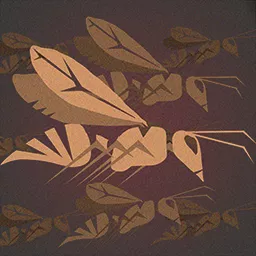

# Swarms

A **Swarm** represents a single Adversary which is in truth a coordinated mass of many smaller creatures — a cloud of bats, a carpet of rats, or a churning column of insects — that fights and dies as one entity.

 Swarms are typically modeled by assigning the specific [[Swarm]] Archetype alongside any base [[Taxonomy]] that could plausibly make up a Swarm. The Taxonomy supplies the biology of the constituent creature; the Swarm Archetype reframes that taxonomy as a swarming throng and grants the [[Swarm]] Talent.

       ## Swarm

    This adversary is a group of many identical creatures that operate as a single swarming throng of foes.

- Maximum **Health** is doubled.
- Against any single-target source of damage, the swarm gains additional **Resistance** equal to its **Toughness**.
- The swarm's **Size** decreases as its Health is depleted until reaching a minimum Size of 2.

   As the Gamemaster, deploying a Swarm challenges the players to adapt and shift their tactical approach. As with other Adversaries, swarms can have different **Threat** tiers to create different types of challenges ranging from minor swarms of **Minion** enemies to a single mega-swarm that is treated as a **Boss**-tier opponent.
