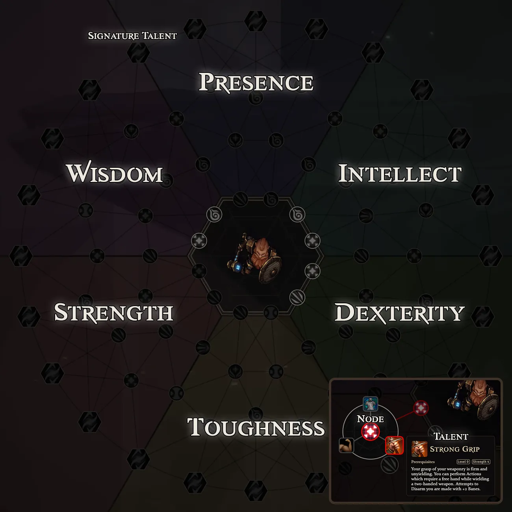

# Talents

Talents represent unique combinations of abilities a particular character may have, and provide a level of customization and progression beyond skill advancement. Talents allow characters to define their role more clearly as they advance, growing steadily in power. Newly created characters begin with a small number of Talent Points, gaining more points at each level.

Outside of the [[Character Creation]] process, you can access the Talent Tree for a character at any time by opening the Talents tab and clicking the "Open Talent Tree" button.

Interaction with the talent tree is similar to interaction with Scenes in ordinary Foundry VTT usage. Pan the tree using right-click and drag, and use mouse-wheel to zoom in and out. Left clicking any Node will expand it to reveal the Talents it may contain.

Left-clicking a Talent purchases that talent if you have points available, while right-clicking it will remove that talent from your character.

You may reset your purchases on the Talent Tree at any time by clicking the Reset button at the bottom.

## Tree Layout

Crucible's Talent Tree is divided into six sections, with each section representing a different [[Ability Scores]] which affects scaling and other aspects of those talents.

The Talent Tree is divided into sextants based on Abilities.

The Talent Tree is composed of several subcomponents which help you plot growth and progression for your character.

## Nodes

Each sextant of the Talent tree is composed of a number of **Nodes** which can contain one or more **Talents**. A Node which lie closer to the border between two sextants will often feature abilities which relate to the themes of both ability scores.

Starting Nodes occur at the inner-most ring, and contain talents that are often prerequisites for later talents in the tree. These starter talents are best thought of as the first steps in defining what makes your character different from another in terms of their specific set of special abilities.

Each Node has a categorical type which indicates general style of talents that it contains. The current node types are: Attack, Defense, Healing, Magic, Melee, Movement, Ranged, Skill, Spellcraft, and Utility. This type determines both the node's visual appearance on the tree as well as suggests the functionality of talents that it offers. Some nodes are also categorized as "Passive", meaning the talents offered at that node provide automatic benefits without requiring the usage of any specific action.

## Talents

Talents are the smallest unit of the talent tree. Each talent grants your character-specific abilities or bonuses. Many Talents have requirements which must be met before they can be purchased, such as attaining a certain level of Ability score or degree of training in a Skill.

## Training Talents

Training talents are specific types of talent nodes that grant advancements to Skills, or progress Weapon or Tradecraft training. Weapon or Tradecraft Training Talents authorize your character to use particular weapons or to craft particular types of schematics, Skill Training Talents award the following benefits:

| Bonus | Rank | Scale |
| --- | --- | --- |
| -4 | Untrained | You are decidedly as good at this skill as the average person who has absolutely no education or professional training related to it. |
| 0 | Novice | You have received training in the basic practices common across all parts of that skill. |
| +1 | Journeyman | You've reached some degree of advanced training and know some of the less common principles of that particular skill. |
| +2 | Adept | You have exceeded all the bounds of professional training. There is nothing more about your skills that you can learn from others. All that is left is to perfect your understanding. |
| +3 | Master | You have mastered this skill. There is nothing more to learn about it. |

## Signature Talents

Talent nodes at the outer edges of the Talent Tree contain **Signature Talents**, powerful bonuses that "Spellblade" or "Dread Lord" which offer iconic abilities. Signature Talents represent the culmination of the abilities required to select them, and are mirrored across two ability scores. Taking a Signature Talent forms a bridge to its paired ability score, allowing you to continue your path of progression into that sextant regardless of whether you have already purchased lower-tier Talents.
