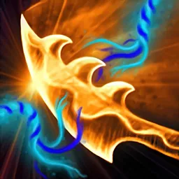

# Countermagic

Countermagic is the art of magical defence, weaving opposing spellcraft to negate the spell being cast by an opponent. Constructing a proper [[Counterspell]] requires a degree of magical knowledge and an ability to process that knowledge in an asymmetric way, as you may not always have all the information needed to build your opposition correctly. Someone with a deep understanding of magic may be able to easily identify the telltale signs of specific Runes being used, identify a gesture, or interpret an inflection and glean the purpose of a spell. Someone practiced in Countermagic may find unique ways to disrupt a spell being cast, including sapping the magical energies from it at inception.

## Counterspell

*Presence 2 · Intellect 2*

You immediately react to a spell being cast and compose a rune and gesture designed to unravel and negate the spellcraft of an enemy mage.

### Playtest Notes

This action can now be used in playtesting, but it is not yet *fully automated*. The Counterspell can be performed, but it is up to the Gamemaster to manually reverse a previously applied spell and to manually deduct its **Action** and **Focus** cost. These steps of the overall Counterspell workflow *will be automated* in a subsequent update such that a confirmed Counterspell will also confirm the spell that was countered, but with its effects removed.

### Actions

#### Counterspell

*Single · 30 / 1A / 1F / 1 Hand · Reaction · Harmless · Intellect/Dexterity*

**Condition:** *Another creature which you can see is casting a spell.*

You form arcane energy into a countervailing spellcraft, targeting a spellcaster you can see within 30 feet.

Designate a **Rune** and **Gesture** which you know to attempt to counter the spell. Choosing a Rune which is opposed to one used in the spell grants **+2 Boons** to your attempt. Selecting the identical Gesture as the one being cast also adds **+2 Boons** to your attempt.

Perform a harmless Spell Attack against your target's **Willpower** defense. If your roll exceeds their defense, the spell is countered and its magic is nullified, producing no effects.
