# Gestures

Gestures are the physical, somatic components required to invoke a rune for Spellcraft purposes. Gestures determine the shape a spell will take as it is translated from the raw magical energies governed by a Rune into a manifestation of that power. Gestures set particular properties of a magical spell, usually the cost in Action and Focus points, range (or size), targeting type, and shape. Gestures also determine one-half of the scaling damage formula, with Rune as the other half.

## Starting Gesture

Any spellcaster who knows any Rune automatically has access to the Touch gesture which provides a basic capability to use that Rune. More advanced usages of that Rune require incorporating more advanced Gestures.

**Touch**

You empower the arcane energy of a Rune into a hand-to-hand attack. The Touch gesture scales using **Dexterity** and targets a single creature at a range of 1 foot, dealing **6 Base Damage** to targets which fail to Resist the spell. This gesture requires **1 Hand** to cast and has a base cost of **2 Action** and **1 Focus**.

## Tier 1 Gestures

Tier 1 gestures (character levels 1-5) provide wide-ranging fundamentals of spellcraft composition that allows shaping Runes into a variety of offensive or defensive forms.

   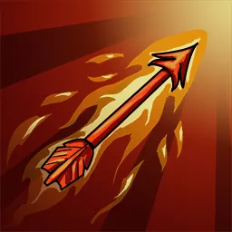   ## Gesture: Arrow

  Intellect 3    You hurl a projectile imbued with the magical power of a Rune at a distant target.

The Arrow gesture scales using **Intellect** and targets a single creature up to a distance of 60 feet, dealing **8 Base Damage** to targets which fail to Resist the spell. This gesture requires **1 Hand** to cast and has a base cost of **3 Action** and **1 Focus**.

     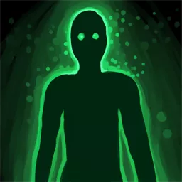   ## Gesture: Aspect

  Presence 3    You infuse the essence of a Rune into your body, empowering your own physical form or psyche.

When you assume a certain Aspect, you become more closely attuned to the damage type of the Rune used in your spell. You gain **+2 Resistance** to that damage type, and deal an additional **+2 Damage** whenever dealing damage of that type.

Your Aspect lasts for **6 Rounds**. You may only have one active Aspect, casting another spell using the Aspect gesture replaces the previous effect. This gesture requires **1 Hand** to cast and has a base cost of **2 Action** and **1 Focus**.

        ## Gesture: Create

  Wisdom 3    You coalesce arcane power into tangible form, manifesting a **Sprite** which appears within 10 feet and joins Combat at Initiative 1. Your Sprite is a **Minion** of half your own Level.

The Create gesture scales with **Wisdom** and the Sprite survives for **6 Rounds**. You may only have one active Sprite, casting another spell using the Create gesture replaces your previous Sprite. This gesture requires **2 Hands** to cast and has a base cost of **4 Action** and **1 Focus**.

### Playtest Notes

Not all Runes have a Sprite actor defined yet. Runes that do not yet have a defined Creation will — for now — manifest a **Flame Sprite**.

     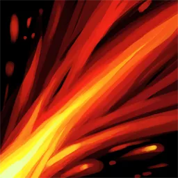   ## Gesture: Fan

  Intellect 3    You shape the essence of a Rune into a sweeping or splintered arc to strike multiple targets in close proximity.

The Fan gesture scales using **Intellect** and targets a 120 degree arc with 6 foot radius. It deals **6 Base Damage** to targets which fail to Resist the spell. This gesture requires **1 Hand** to cast and has a base cost of **3 Action** and **1 Focus**.

     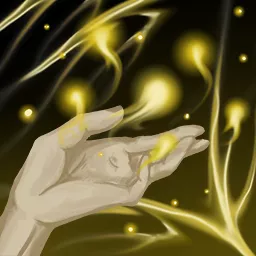   ## Gesture: Influence

  Presence 3    You intensify the arcane power of a Rune into a concentrated direct contact which is generally a more powerful evolution of the basic Touch gesture.

The Influence gesture scales using **Presence** and targets a single adjacent creature. It deals **10 Base Damage** to targets which fail to Resist the spell. This gesture requires **1 Hand** to cast and has a base cost of **3 Action** and **1 Focus**.

     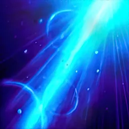   ## Gesture: Ray

  Wisdom 3    You funnel the arcane power of a Rune into a point and project it outwards in a beam.

The Ray gesture scales using **Wisdom** and produces a line that is 1 foot wide and 30 feet long originating from the spellcaster, dealing **6 Base Damage** to targets which fail to Resist the spell. The gesture requires **1 Hand** to cast and has a base cost of **4 Action** and **1 Focus**.

     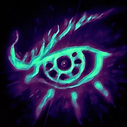   ## Gesture: Sense

  Presence 3    You attune your mind to the arcane power of a Rune to sense nearby sources of energy.

The Sense gesture scales with **Presence** and produces an emanation with 30 feet radius and position that remains centered upon the spellcaster. This gesture requires **1 Hand** to cast and has a base cost of **3 Action** and **1 Focus**. It may optionally be **Maintained** at the additional cost of **1 Focus** every subsequent round.

This spell allows the caster to detect the presence of spellcraft using the same Rune as the one incorporated in this spell. The sense will also momentarily detect the presence of creatures according to their type.

- **Control**: Fiends
- **Death**: Undead
- **Earth**: Oozes and Earth Elementals
- **Flame**: Dragons and Fire Elementals
- **Frost**: Giants and Frost Elementals
- **Illumination**: Celestials
- **Illusion**: Fey
- **Kinesis**: Monstrosities
- **Life**: Plants and Beasts
- **Lightning**: Constructs and Storm Elementals
- **Oblivion**: Outsiders
- **Soul**: Humanoids

        ## Gesture: Step

  Level 2 Dexterity 4    You infuse runic power into a movement, crossing physical and spatial boundaries.

The Step gesture scales with **Dexterity** and allows you to move up to 20 feet in a straight line with width equal to your **Size**. It deals **2 Base Damage** to targets along that line which fail to Resist the spell. This gesture does not require any free hands to cast and has a base cost of **3 Action** and **1 Focus**.

### Playtest Notes

The movement aspect of this talent is not yet automated and must be manually performed as a consequence of the spell.

     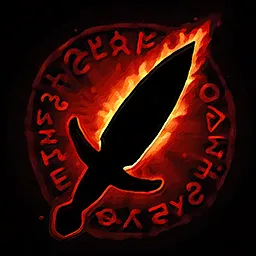   ## Gesture: Strike

  Level 2 Strength 4    You empower a direct close-range attack with the arcane essence of a Rune, performing a Strike with your equipped weapon.

The Strike gesture scales using **Strength** and deal damage based on your used weapon but with the damage type of the incorporated Rune. This gesture does not require any free hand and has a base cost of **1 Focus** in addition to the cost of your weapon Strike.

     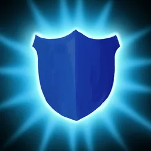   ## Gesture: Ward

  Level 2 Toughness 4    You shape the arcane power of a Rune into a protective barrier used to shield yourself from harm.

The Ward gesture scales using **Toughness** and provides **+6 Resistance** against the damage type of the Rune used in the spell. This resistance lasts for **1 Round** and you may only have a single Ward at a time. Casting another spell using the Ward gesture replaces your prior Ward. This gesture requires **1 Hand** to cast and has a base cost of **2 Action** and **1 Focus**.

  ## Tier 2 Gestures

Tier 2 gestures (character levels 6-11) provide advanced capabilities that improve or expand upon fundamental Tier 1 gestures.

      ## Gesture: Aura

  Level 4 Presence 5    You concentrate the arcane power of a Rune to create a maintained field of energy that washes over allies and enemies near to you.

The Aura gesture scales with **Presence** and produces an emanation with 20 feet radius centered on the spellcaster. The center of this Aura moves with the spellcaster.

Depending on the Rune used, the Aura deals damage or provides healing to any creature which begins its turn inside the Aura. This gesture requires **2 Hands** to cast, has a base cost of **5 Action** and **1 Focus**, and must be **Maintained** costing an additional **1 Focus** every subsequent round.

### Playtest Notes

This talent is currently placed at a **Tier 4** node. It will eventually only be attainable at a higher level (probably Level 6 required). It is currently available "early" for testing.

Emanation templates which are linked to the Token and move when the Token moves are a feature coming in Foundry VTT version 14. Automation of the Aura gesture will occur once Crucible depends on Foundry VTT version 14.

     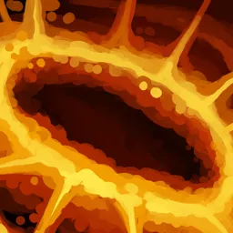   ## Gesture: Blast

  Level 4 Intellect 5    You hurl the arcane power of a Rune into an intense explosion of energy at a nearby point you can see.

The Blast gesture scales with **Intellect** and produces a blast with 6 feet radius centered on a point within 60 feet of the spellcaster. The blast deals **8 Base Damage** to targets which fail to Resist the spell. This gesture requires **2 Hands** to cast and has a base cost of **5 Action** and **2 Focus**.

### Playtest Notes

This talent is currently placed at a **Tier 4** node. It will eventually only be attainable at a higher level (probably Level 6 required). It is currently available "early" for testing.

     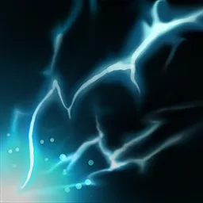   ## Gesture: Cone

  Level 4 Intellect 5    You focus the arcane power of a Rune into a narrow cone that projects outwards from your location.

The Cone gesture scales with **Intellect** and produces a 60 degree cone with a 30 foot radius originating from the spellcaster. The Cone deals **8 Base Damage** to targets which fail to Resist the spell. This gesture requires **2 Hands** to cast and has a base cost of **5 Action** and **2 Focus**.

### Playtest Notes

This talent is currently placed at a **Tier 4** node. It will eventually only be attainable at a higher level (probably Level 6 required). It is currently available "early" for testing.

     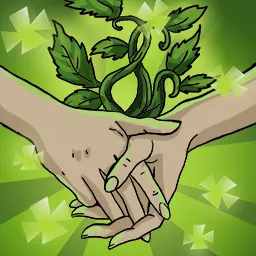   ## Gesture: Conjure

  Level 4 Wisdom 5    You coalesce arcane power into a superior form, manifesting a **Visitor** which appears within 30 feet and joins Combat at **Initiative** 1. Your Visitor is a Minion equal to your own Level.

The Conjure gesture scales with **Wisdom** and the Visitor survives for **12 Rounds**. You may only have one active Visitor. Casting another spell using the Conjure gesture replaces your previous Visitor. This gesture requires **2 Hands** to cast and has a base cost of **5 Action** and **2 Focus**.

### Playtest Notes

This talent is currently placed at a **Tier 4** node. It will eventually only be attainable at a higher level (probably Level 6 required). It is currently available "early" for testing.

Not all Runes have a Visitor actor defined yet. Runes that do not yet have a defined Conjuration will — for now — manifest a **Flame Visitor**.

        ## Gesture: Pulse

  Level 4 Presence 5    Expel the arcane power of a Rune in a radius that travels outward with you at its center.

The Pulse gesture scales using **Presence** and produces an emanation with 10 foot radius, dealing **8 Base Damage** to targets which fail to Resist the spell. The gesture requires **2 Hands** to cast and has a base cost of **5 Action** and **2 Focus**.

### Playtest Notes

This talent is currently placed at a **Tier 4** node. It will eventually only be attainable at a higher level (probably Level 6 required). It is currently available "early" for testing.

        ## Gesture: Surge

  Level 4 Wisdom 5    You channel the arcane power of a Rune into a rushing wave of energy that surges forward from your current position.

The Surge gesture scales with **Wisdom** and produces a line that is 10 feet wide and 15 feet long originating from the spellcaster, dealing **8 Base Damage** to targets which fail to Resist the spell. The gesture requires **2 Hands** to cast and has a base cost of **5 Action** and **2 Focus**.

### Playtest Notes

This talent is currently placed at a **Tier 4** node. It will eventually only be attainable at a higher level (probably Level 6 required). It is currently available "early" for testing.
