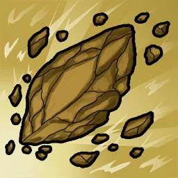

# Runes

Runes are the most basic metaphysical concept of magic. They are forces of nature, the building blocks of reality as we understand it. Understanding the Runes and their place in the way the world functions allows those with sufficient training to exert a level of influence over the Runes, using [[Gestures]] to manifest powerful displays of magical prowess.

There are six Chaotic Runes and six Orderly Runes, forming a natural opposition to one another. The following table summarizes all twelve runes in the Crucible system.

| Intellect Runes | Axiom | Damage Type | Target Defense | Opposition |
| --- | --- | --- | --- | --- |
| Flame | Chaotic | Fire | Reflex | Frost |
| Illusion | Chaotic | Psychic | Willpower | Illumination |
| Lightning | Chaotic | Electricity | Fortitude | Earth |
| Oblivion | Chaotic | Void | Willpower | Soul |
| Presence Runes | Axiom | Damage Type | Target Defense | Opposition |
| Death | Orderly | Corruption | Fortitude | Life |
| Illumination | Orderly | Radiant | Reflex | Illusion |
| Kinesis | Chaotic | Physical | Physical | Control |
| Soul | Orderly | Psychic* | Willpower | Oblivion |
| Wisdom Runes | Axiom | Damage Type | Target Defense | Opposition |
| Control | Orderly | Psychic | Willpower | Kinesis |
| Earth | Orderly | Acid | Reflex | Lightning |
| Frost | Orderly | Cold | Fortitude | Flame |
| Life | Chaotic | Poison* | Fortitude | Death |
| * - Rune is used primarily for Restoration rather than for Damage. |  |  |  |  |

The choice of Rune used in the casting of a spell affects or determines a variety of aspects of the resulting spellcraft.

- The conceptual essence of the magic.
- Which other Rune is in opposition to this Spell.
- One [[Ability Scores]] which defines half of the Spell Attack scaling formula.
- The [[Defenses]] against which the spell is tested.
- A [[Resources]] the spell affects.
- The [[Resistances and Vulnerability]] that is dealt by the spell.

## Available Runes

The mechanics for each of the twelve runes are embedded below:

## Rune: Control

*Wisdom 2*

The orderly force of discipline and permanence. The Control rune governs thought, reason, and persistence.

The Control rune scales using **Wisdom**, targets **Willpower**, and deals **Psychic** damage to **Morale**. It is opposed by the chaotic rune of **Kinesis**.

### Actions

#### Motivate

*Single · 1 / 3A / 1F / 1 Hand · Spell · Harmless*

Your command of the Rune of Control allows you to affect the decision making of others in basic ways, producing one of the following effects:

- Moderately intensify or dampen the primary emotion being felt by a creature you touch. If the creature is intelligent enough to be aware of the laws governing spellcraft, they are aware of your actions.
- Understand the abstract motivations of another living creature which allows you to touch it. You are able to intuit their immediate goals expressed in the form of a single verb.
- Intensely focus on your current objective and the means of achieving it. You receive a brief hint or reminder from the Gamemaster about that objective containing only information which you have previously learned.

Motivate may only affect a creature or object which you can physically touch. You may attempt other uses similar those above, the effectiveness of which is decided by the Gamemaster.

## Rune: Death

*Presence 2*

The orderly force of destruction, responsible for the corruption of all biological matter. The Death rune governs decay and destruction.

The Death rune scales using **Presence**, targets **Fortitude**, and deals **Corruption** damage to **Health**. It is opposed by the chaotic rune of **Life**.

### Actions

#### Ennervate

*Single · 1 / 3A / 1F / 1 Hand · Spell · Harmless*

Your command of the Rune of Death allows for basic communion with the dead and for rudimentary manipulation of unholy forces, producing one of the following effects:

- Spread decay over an object no larger than a 1-foot cube, causing plants to wither, metallic objects to rust, wood to become rotten, food to grow foul, or a corpse to rapidly decompose. Magical objects are typically unaffected.
- Cause a corpse which has been dead for less than seven days or otherwise preserved to perform a lifeless reenactment of its final moments. Its movements imitate those that occurred during the creature's final 30 seconds of life. You have no control over the creature nor can it communicate in any other way.
- Hasten the death of a willing creature that is currently dying, causing it to pass swiftly and peacefully.

Ennervate may only affect a creature or object you can physically touch. You may attempt other uses similar those above, the effectiveness of which is decided by the Gamemaster.

## Rune: Earth

*Wisdom 2*

The orderly force of elemental earth, responsible for physical matter. The Earth rune governs minerals, metals, soils, and other physical compounds.

The Earth rune scales using **Wisdom**, targets **Reflex**, and deals **Acid** damage to **Health**. It is opposed by the chaotic rune of **Lightning**.

### Actions

#### Mould

*Single · 1 / 3A / 1 Hand · Spell · Harmless*

Your command of the Rune of Earth allows you to manipulate raw forces of rock, mineral, and soil in basic ways, producing one of the following effects:

- Quickly shape up to one cubic foot of available material into a simple geometric form like a cuboid, ellipsoid, or polyhedron.
- Precisely copy the physical shape of a held object that is smaller than a 6-inch cube, reproducing it from available clay, stone, or metal. The replica retains no useful properties except for its physical form.
- Separate and collect earthen particles from the surface of an object, creature, or liquid that you touch, rendering the subject completely cleaned or purified in moments.

Mould may only affect a creature or object you can physically touch. You may attempt other uses similar those above, the effectiveness of which is decided by the Gamemaster.

## Rune: Flame

*Intellect 2*

The chaotic force of elemental, thermal energy. The Flame rune governs fire and heat.

The Flame rune scales using **Intellect**, targets **Reflex**, and deals **Fire** damage to **Health**. It is opposed by the orderly rune of **Frost**.

### Actions

#### Enkindle

*Single · 1 / 3A / 1F / 1 Hand · Spell · Harmless*

Your command of the Rune of Flame allows you to manipulate fire and thermal energy in creative ways, producing one of the following effects:

- Manifest a burst of elemental flame in one inch sphere which can ignite a candle, torch, or other flammable materials.
- Imbue your body with momentary thermal shielding which provides you with immunity to fire damage on an immediately subsequent action that costs **1 Action** or less.
- Control the movement of flames within a small area, causing them to flicker, dance, or shift in an animated performance of light and shadow.

Enkindle may only affect a creature or object you can physically touch. You may attempt other uses similar those above, the effectiveness of which is decided by the Gamemaster.

## Rune: Frost

*Wisdom 2*

The orderly force of water and cold. The Frost rune governs the creation of water or other fluids and their transfer between liquid and frozen states.

The Frost rune scales using **Wisdom**, targets **Fortitude**, and deals **Cold** damage to **Health**. It is opposed by the chaotic rune of **Flame**.

### Actions

#### Condense

*Single · 1 / 3A / 1F / 1 Hand · Spell · Harmless*

Your command of the Rune of Frost allows you to manipulate liquids and their thermal properties, producing one of the following effects:

- Draw up to one quarter gallon of fresh water from the atmosphere into a container or upon a surface you touch. The created water may be affected by relevant atmospheric properties of your current location.
- Manipulate the temperature of up to 1 gallon of water, causing it to immediately freeze or thaw. The water need not be in a container; this technique can be used to coat a surface or join two objects together via regelation. Ice created in this way remains frozen for as long as the ambient temperature of the environment allows.
- Gather up to a six-foot cube of nearby snow, forming it into a solidified sculpture, shape, or shelter.

Condense may only affect a creature or object you can physically touch. You may attempt other uses similar those above, the effectiveness of which is decided by the Gamemaster.

## Rune: Illumination

*Presence 2*

The orderly force of light and energy. The Illumination rune governs light and radiance.

The Illumination rune scales using **Presence**, targets **Reflex**, and deals **Radiant** damage to **Health**. It is opposed by the chaotic rune of **Illusion**.

### Actions

#### Reveal

*Single · 1 / 3A / 1F / 1 Hand · Spell · Harmless*

Your command of the Rune of Illumination allows you to create light and exert basic control over its radiance, producing one of the following effects:

- Create a ball of light called a "tosslight" which sheds bright light in a 20 foot radius and dim light in a 40 foot radius. The light can hover near your body, be affixed to an item or surface, or be thrown up to a distance of 30 feet. You may dismiss your tosslight at any time and may only have a single tosslight at a time, casting this spell again causes your previous tosslight to disappear.
- Inscribe up to 200 words of invisible text into paper like a scroll, page, or book. The text is written from light itself and hidden from non-magical detection. It can be made visible by yourself or another through use of this spell combined with a spoken passphrase that you define at the time of inscription.
- Touch a physical object that produces dim light, causing it to become bright light for as long as you maintain physical contact. Only one light source may be intensified in this way at a given time.

Reveal may only affect a creature or object you can physically touch. You may attempt other uses similar those above, the effectiveness of which is decided by the Gamemaster.

## Rune: Illusion

*Intellect 2*

The chaotic force of trickery and whimsy. The illusion rune governs magical manifestations of falsehood or misdirection.

The Illusion rune scales using **Intellect**, targets **Willpower** defense, and deals **Psychic** damage to **Morale**. It is opposed by the orderly rune of **Illumination**.

### Actions

#### Seeming

*Single · 3A / 1F / 1 Hand · Spell · Harmless*

Your command of the Rune of Illusion allows you to fabricate perception in various simple ways and to manipulate shadow and light to create distraction or entertainment, producing one of the following effects:

- Modify a single aspect of your own physical appearance. Such alterations might include adjusting the sound of your voice, changing the color of your eyes, gaining illusory horns, or appearing slightly taller or shorter. The alteration persists until you Rest or enact a different alteration and can be verified as illusory by physical inspection.
- Manifest a convincing recreation of a short sound or single scent that you can clearly recall. The illusion originates from your position and lasts for 10 seconds. You can control the volume of the sound or odorousness of the scent to be perceptible up to a range of 60 feet or shorter.
- Decouple your shadow from your form, specifically controlling its movements separately from your own. You can maintain this illusion as long as you do not perform any other action that consumes **Focus**.

Seeming may only affect a creature or object you can physically touch. You may attempt other uses similar those above, the effectiveness of which is decided by the Gamemaster.

## Rune: Kinesis

*Presence 2*

The chaotic force of space and physical movement. The Kinesis rune governs all things related to the act of movement and physicality.

The Kinesis rune scales using **Presence**, targets **Physical** defense, and deals **Bludgeoning**, **Piercing**, or **Slashing** damage to **Health**. It is opposed by the orderly rune of **Control**.

### Actions

#### Propel

*Single · 1 / 3A / 1F / 1 Hand · Spell · Harmless*

Your command of the Rune of Kinesis allows you to exert local control over gravitational forces to perform basic telekinetic manipulations, producing one of the following effects:

- Pull an unsecured object within 15 feet and with weight no greater than 1 towards you and catch it. An object that is equipped or possessed by a creature is never treated as unsecured unless that creature is willing to release it.
- Flick an object that you hold with weight no greater than 1 towards a target up to 30 feet away. The object flies unerringly in a straight line towards that target at a moderate speed. Any creature along the object's path can react to catch it as long as they have a free hand with which to do so.
- Suspend in midair an object or willing creature that you touch with weight less than or equal to 10 times your **Presence**, altering its position up to 20 feet in any direction from its original location. You can maintain this suspension indefinitely as long as you take no further Action and are not **Incapacitated**.

Propel may only affect a creature or object you can physically touch unless otherwise specified. You may attempt other uses similar those above, the effectiveness of which is decided by the Gamemaster.

## Rune: Life

*Wisdom 2*

A chaotic force of creation, responsible for living matter. The Life rune governs health and matters relating to biological growth.

The Life rune scales using **Wisdom** and provides **Restoration** of **Health**. In special circumstances it may be used to inflict **Poison** damage opposed by **Fortitude**. It is opposed by the orderly rune of **Death**.

### Actions

#### Bloom

*Single · 1 / 3A / 1F / 1 Hand · Spell · Harmless*

Your command of the Rune of Life allows you to stimulate biological growth and nourish physical health, producing one of the following effects:

- Cultivate 1 cubic foot of existing plants or fungus to rapidly grow to a healthy, blossoming, or harvestable state.
- Identify a negative physical condition that is affecting a creature such as **Diseased**, **Poisoned**, **Bleeding**, or **Weakened**.
- Verify whether a portion of food or drink is free of contamination from bacteria, parasites, or poison.

Bloom may only affect a creature or object you can physically touch. You may attempt other uses similar those above, the effectiveness of which is decided by the Gamemaster.

## Rune: Lightning

*Intellect 2*

The chaotic force of raw electrical energy. The Lightning rune governs sources of electrical charge and discharge.

The Lightning rune scales using **Intellect**, targets **Reflex**, and deals **Electrical** damage to **Health**. It is opposed by the orderly rune of **Earth**.

### Actions

#### Energize

*Single · 1 / 3A / 1F / 1 Hand · Spell · Harmless*

Your command of the Rune of Lightning allows you to conduct the flow of both air and electricity, manipulating charge and aerodynamics to produce one of the following effects:

- Instill an electromagnetic charge into a metallic object that you touch no larger than a one-foot cube, causing it to strongly adhere to other metals. Only one object can be charged in this way at a given time, casting this spell on a different object causes the prior object to lose its magnetic effect.
- Gather a squall of wind at your current location in a six-foot radius which blows either as a gust in a single controlled direction or as a cyclone with centripetal force in all directions. Airborne effects in the immediate area are dispersed and unsecured objects with weight less than 1 are flung in the direction of the gust.
- Produce the concussive sound of a thunderclap at a location you can see within 15 feet of your current position.

Energize may only affect a creature or object you can physically touch. You may attempt other uses similar those above, the effectiveness of which is decided by the Gamemaster.

## Rune: Oblivion

*Intellect 2*

A chaotic force of destruction and annihilation of existence. The Oblivion rune governs unmaking of matter or decoherence of spirit.

The Oblivion rune scales using **Intellect**, targets **Willpower**, and deals **Void** damage to **Morale**. It is opposed by the orderly rune of **Soul**.

### Actions

#### Erase

*Single · 1 / 3A / 1F / 1 Hand · Spell · Harmless*

Your command of the Rune of Oblivion allows you to unravel tiny holes in the fabric of existence, producing one of the following effects:

- Disintegrate a non-magical object you hold smaller than a 6-inch cube, sundering it to a fine particulate dust of its component elements.
- Anesthetize the ability to feel emotion from yourself or a willing target that you touch, causing it to enter a placid, stoic, or dispassionate state. This effect can be maintained as long as you make no further **Action**.
- Subdue the potency of a light source, causing its visible radius to be reduced by half for as long as you maintain physical contact with it. Only one light source may be dampened in this way at a given time.

Erase may only affect a creature or object you can physically touch. You may attempt other uses similar those above, the effectiveness of which is decided by the Gamemaster.

## Rune: Soul

*Presence 2*

An orderly force of creation and spiritual essence. The Soul rune governs the fundamental procession of souls through life and death and relates to matters of sapience, personality, and mental health.

The Soul rune scales using **Presence** and provides **Restoration** of **Morale**. In special circumstances it may be used to inflict **Psychic** damage opposed by **Willpower**. It is opposed by the chaotic rune of **Oblivion**.

### Actions

#### Evoke

*Self · 1 / 3A / 1F / 1 Hand · Spell · Harmless*

Your command of the Rune of Soul allows you to facilitate basic forms of spiritual influence, producing one of the following effects:

- Enable yourself or another willing person to revisit a core memory of a moment from their past up to one minute in duration as if it happened recently.
- Identify a negative spiritual condition that is affecting a person such as **Broken**, **Frightened**, **Confused**, or **Insane**.
- Create a momentary spiritual connection with another willing creature that allows them to recognize an idea which can be expressed as a single word.

Uses of Evoke may only affect yourself or another creature which you can physically touch. You may attempt other uses similar those above, the effectiveness of which is decided by the Gamemaster.

## Creature Types

Certain magical runes are inherently and indirectly related to different creature types within the universe. Those associations are as follows:

| Control | Fiends |
| --- | --- |
| Death | Undead |
| Earth | Oozes and Earth Elementals |
| Flame | Dragons and Fire Elementals |
| Frost | Giants and Frost Elementals |
| Illumination | Celestials |
| Illusion | Fey |
| Kinesis | Monstrosities |
| Life | Plants and Beasts |
| Lightning | Constructs and Storm Elementals |
| Oblivion | Outsiders |
| Soul | Humanoids |
