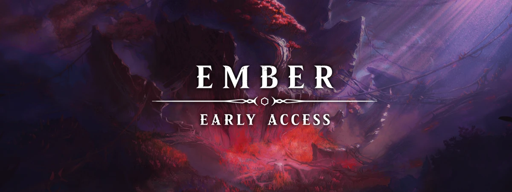
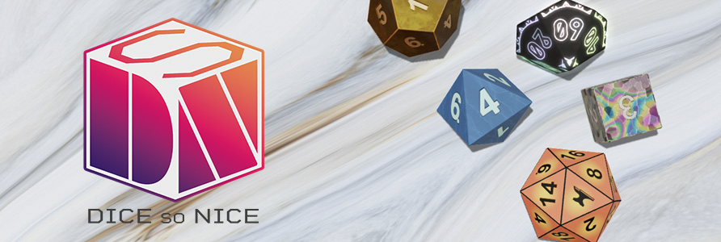

# Module Recommendations

As with any game system in Foundry Virtual Tabletop, Modules can enhance and augment the quality of gameplay experience. We do, however, recommend playing Crucible in a module-light environment in order to ensure that your experience and any feedback you provide is specific to the functionality of the Crucible system.

## Ember

There is far more Crucible content available as part of our original setting and epic adventure [Ember](https://foundryvtt.com/ember), a digital roleplaying game from the creators of Foundry Virtual Tabletop. Ember is available now in Early Access and features an immersive open-world campaign for Crucible spanning several years of gameplay, taking your party from character level 1 to 12 (or beyond).

Ember, now in Early Access, is the definitive way to experience the Crucible game system.## Dice So Nice

The Crucible game system is designed with use of the [Dice So Nice](https://foundryvtt.com/packages/dice-so-nice/) module in mind. When rolling, Crucible leverages the features of Dice So Nice to give a positive glow effect to any roll which contain Boons, and similarly a negative glow effect to any rolls which have Banes.

We strongly recommend the use of Dice So Nice when playing Crucible.
