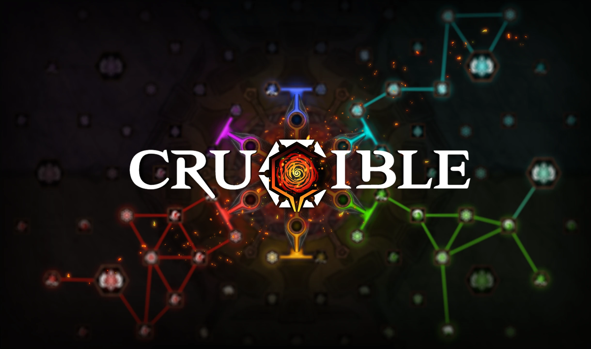

# What is Crucible

**Crucible** is an innovative and modern role-playing game (RPG) system built exclusively for **Foundry Virtual Tabletop** as a digital platform.

 Crucible is designed from the ground up to leverage the unique capabilities of Foundry Virtual Tabletop to create exciting and fast-paced gameplay that allow gamemasters and players to focus on what matters most: *telling a compelling story*.

 At the heart of Crucible is meaningful and empowering character advancement through a class-less system with multiple pillars of character progression. The system’s dice mechanics allow for crunchy and tactically rich encounters featuring combat, exploration, or social challenges.

 Crucible is both a role-playing game and a software engine. The game system offers a deep level of mechanical sophistication, but its rules are entirely encoded to be applied with consistency and automation. The system is built intentionally to eliminate the cumbersome bookkeeping that is prevalent in high-crunch pen-and-paper systems.

## Development Status

 Crucible is currently under development and available as a **playtest**, providing the community with an opportunity to experience the system, its design pillars, and intended direction. The system is functional in many areas, but still a work in progress. Some areas are not yet developed at all. This playtest offers a chance for us to collect early feedback and share our work with the community. Please approach it with an open mind and an understanding that what you are seeing is not yet a finished product.

  Blocks like this one in the system documentation highlight areas of the system that still require substantial development. These are intended to make you aware of areas that are intentionally unfinished at this time.

  Development of Crucible is two-pronged with an equal focus on developing the system mechanics of the roleplaying game and the software implementation of those mechanics simultaneously. As the game mechanics evolve, new developments of the game system will enable those features for use in testing. The playtest process allows us to solicit and benefit from feedback that helps us iterate on the game rules and the user experience in Foundry Virtual Tabletop.

## Current Playtest

 The [[Playtest 1 - The Ring of Valor]] adventure is included with the Crucible game system and provides an introduction to [[Character Creation]] and [[Combat]]. This playtest covers character creation, dice mechanics, combat encounters, and level advancement. It begins at level 1 and advances characters through level 6, allowing them to evolve and advance between each challenge.

  Please note that the rules and mechanics featured in the Crucible playtest are not final and will continue to be refined during ongoing development.

## Ember

 There is far more Crucible content available as part of our original setting and epic adventure [Ember](https://foundryvtt.com/ember), a digital roleplaying game from the creators of Foundry Virtual Tabletop. Ember is available now in Early Access and features an immersive open-world campaign for Crucible spanning several years of gameplay, taking your party from character level 1 to 12 (or beyond).
