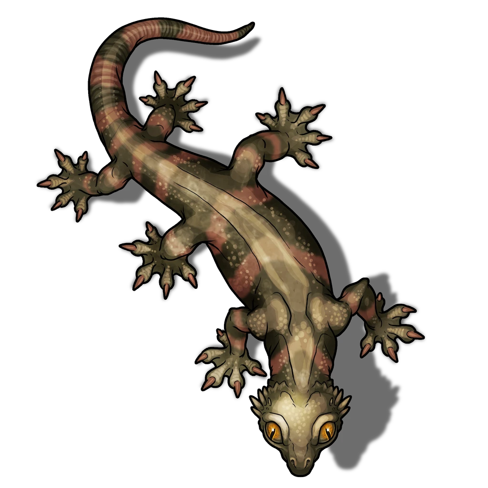

# Hob Korell's Unconventional Steeds

> [!quote] Read Aloud
> Soft ambient music surrounds you as you enter this lavishly decorated stable. The musty but welcoming space is inhabited by a trio of large, companionable reptiles, attended by a stable-hand who casually prepares them a meal of assorted fruits and meats.

While Hob Korell sells a variety of uncommon steeds throughout the city, this location primarily caters to the large lizards known as [[Jobri]].

The stables are a point of pride and are decorated somewhat opulently: magically infused stones play music, the desk is decorated with several books about magical and mundane reptile care (including one called "The Lizard Life"), and there are a number of peculiar grooming tools scattered throughout.

> [!abstract] Jobri
> **[[Jobri]]**
>
> Level 1 · Jobri Pack Member
>
> 
>
> The eyes of this large reptilian beast are remarkably big, and the padded five-toed feet that accompany its six muscular legs only accentuate the creature's charming awkwardness. Fitted with tack and bridle, this riding lizard lurks with a measure of domesticated calm, absentmindedly hunting for insects with each flick of its prehensile tongue.

At any given point in time, **Hob Korell** (Waerd Keth, he/him) can be found working here alongside his stable-hands **Kaol** (Arcturian Human, he/him) or **Jann** (Arcturian Nir'ae, she/her). Treat Hob and the stable-hands as though they are [[Arcturian]].

> [!info] Social
> #### The Lizard Trade
>
> Characters can purchase [[Jobri]] as mounts. Jobri cost 100 gp each and have a carrying capacity of 480 lb.

### [[Unwelcome Diversions]]

During the [[Unwelcome Diversions]] Event, the party can investigate the stables for what has been troubling the Jobri mounts. Refer to the Event text for more details.

### [[Scene of the Crime]]

During the [[Scene of the Crime]] Event, the party can speak with Hob Korell about a recent accident and the Silver Beam Consortium. Refer to the Event text for more details.
