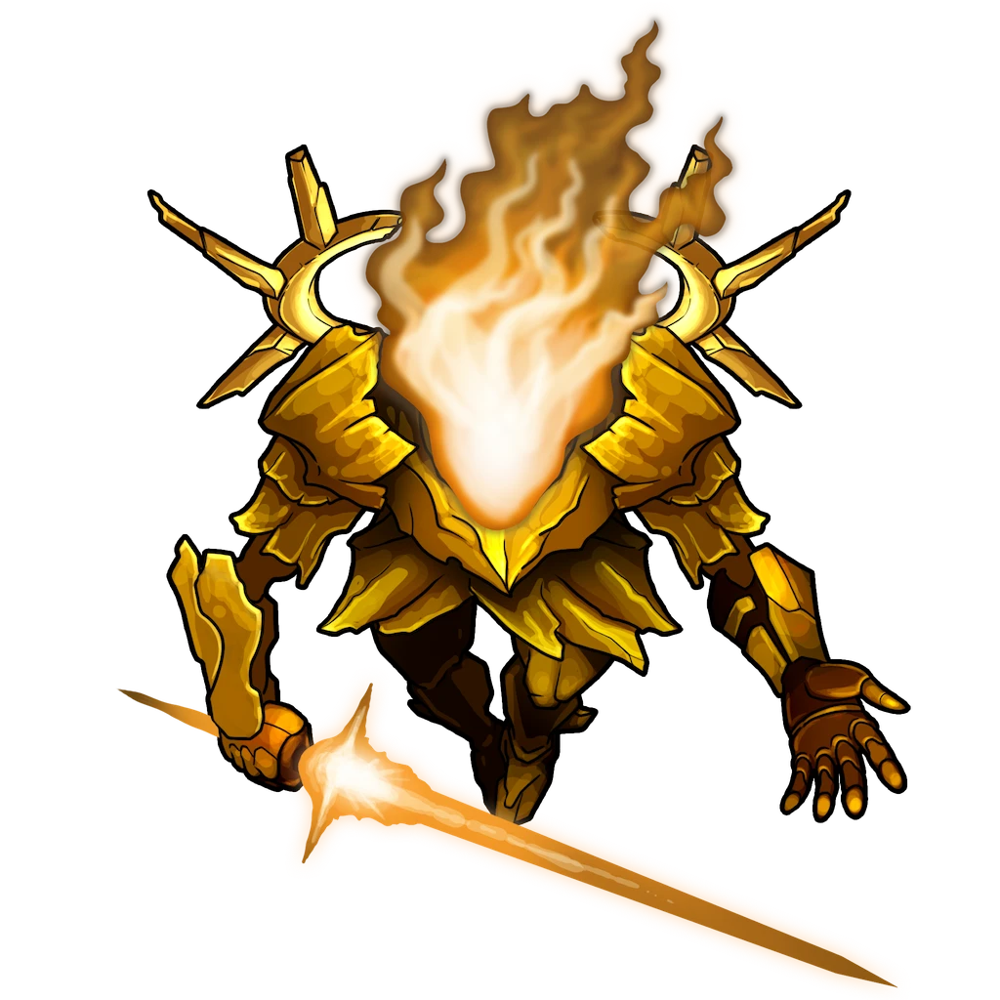

# The Last Pit

> [!quote] Read Aloud
> In the center of the vast cavern before you, a radiant figure stands with a face of yellow light and a form composed of alien-looking metal bands. It appears to have its head lowered, gazing down at a desk, tapping its gauntleted hand against the wood. A long sword, crafted from concentrated light, rests against the desk, easily within reach at any moment.
>
> After a moment, it jerks its head up and immediately grabs its sword, its face flaring with what you assume is an expression of anger or intense emotion. Its voice then rings out like a deep musical instrument, whistling slightly as if the words themselves are hard to pronounce.
>
> > Why aren't you dead yet?
>
> The figure appears to enunciate each syllable clearly, then steps away from behind the desk and twirls its blade around with practiced skill.
>
> > Never mind. Soon enough.

> [!danger] Hazard
> #### The Device
>
> While **Powered**, the Device creates a [[Lower Arcturel Mine Effects]] at the end of each round of combat. Once all results of this table have been drawn, reset the table.

> [!danger] Hazard
> #### Vorg Nest
>
> When the characters enter this area or cause a lot of noise, roll `[[/gmroll 1d20]]`. On a result of 10 or higher, all [[Vorg]] on the Area Map move as far as possible toward the characters. Then, if one or more Vorg are within 10 feet of a character, they emerge from the earth and attack.
>
> Refer to [[Area Overview]] for the Vorgs' tactics.

> [!abstract] Aburyx
> **[[Aburyx]]**
>
> Level 6 (Elite) · Tyraphem Aburyx
>
> 
>
> With a head of radiant yellow flame and the golden plate armor of a warrior, the Aburyx floats up from the ground it stands on, swiveling to face with you with a flare of light. Within moments, it it is hovering in front of you, a sword of light suddenly emerging from its hands as it readies to attack.

> [!danger] Hazard
> #### Aburyx Tactics
>
> At the start of combat, the [[Aburyx]] will use its [[Call Skither]] action and fortify itself with **Aspect of Illumination**.
>
> Over the course of combat, the Aburyx will prioritize the following actions and abilities:
>
> - In melee, the Aburyx will use its **Illuminated Strike**.
> - From range, the Aburyx will use its **Illuminated Ray**.
> - It relies on its [[Radiant Absorption]] feature to restore Health whenever a nearby Skither uses its [[Radiant Death Burst]] action.
>
> The battle ends when the Aburyx and its minions are slain. When the Aburyx dies, its carapace condenses into a molten pile of an unknown metal.

Once the Aburyx and its minions are defeated, the characters can explore the area.

> [!tip] Exploration
> #### Exploring the Last Pit
>
> A simple search of the area reveals the following:
>
> - A large bottle of ink.
> - A map of The Dives and the Level 3 Mine.
> - Broken [[Lazing Lamp]].
> - A [[Inkaro Pearl, Blue]].
> - Metal tools.
> - A jobri skull.
>
> Any character who examines the bottle of ink and makes a successful **Arcana (DC 15)** check can identify it as [[Shifting Ink]].
>
> - **Knowledge: Alchemy**: The character automatically succeeds on this check.
>
> Alternatively, the ink can be identified by [[Arvoda's Elixirs]].
>
> #### The Aburyx's Map
>
> Any character who examines the map of Lower Arcturel sees that every marked location has a symbol on it:
>
> - The Distillery: The skull and crossbones symbol and a red X.
> - Hob's Steeds: A picture of a lizard splayed on its side, a flame, and a red X.
> - Zodi Trask's House: A piece of crystal. There is no other symbol.
> - Wrestful Repairs: A broken machine and a red X.
> - Arvoda's Elixirs: A question mark.
>
> The mine also has symbols:
>
> - The Hub: A picture of a cylinder surrounded by smaller orbs.
> - The Last Pit: A flaming sword.
> - A room to the left of the Last Pit: Bookshelves.
> - A room to the southwest of the room with the bookshelves: Test tubes.
>
> Any character who makes a successful **Awareness (DC 14)** check concludes that the map was a tracker of actions taken by the Aburyx against the local businesses, and that there is a room with papers or books to the west.
>
> #### The Hidden Room
>
> Any character who examines the southwest corner of the area and makes a successful **Awareness (DC 14)** check discovers a false wall.
>
> - **The Aburyx's Map:** The character automatically succeeds on this check if they consult the Aburyx's map of Lower Arcturel.
>
> The false wall swings open when shoved, revealing the hidden room.
>
> A simple search of the hidden room reveals the following:
>
> - A [[Cloak of Kindly Visage]] hanging from a coat rack against the wall.
> - [[Kilner Notes]] on the desk.
> - A pile of correspondence.
>
> Any character who examines the [[Cloak of Kindly Visage]] finds a deep seam in the fabric; inside this seam is [[A Message To Tantrin]].
>
> Any character who reads through the pile of correspondence discovers the following:
>
> - The Aburyx that they just defeated was sent here by someone referred to in the correspondence only as "Bright Lord."
> - There are several references to House Wandren in the correspondence; the correspondence does not necessarily suggest they are behind the disruptions and creatures here in the mine, but rather that the Aburyx was tracking some of their movements and receiving goods from a Wandren contact.
> - The words "For Other Fortunes" appear on one of the documents.
