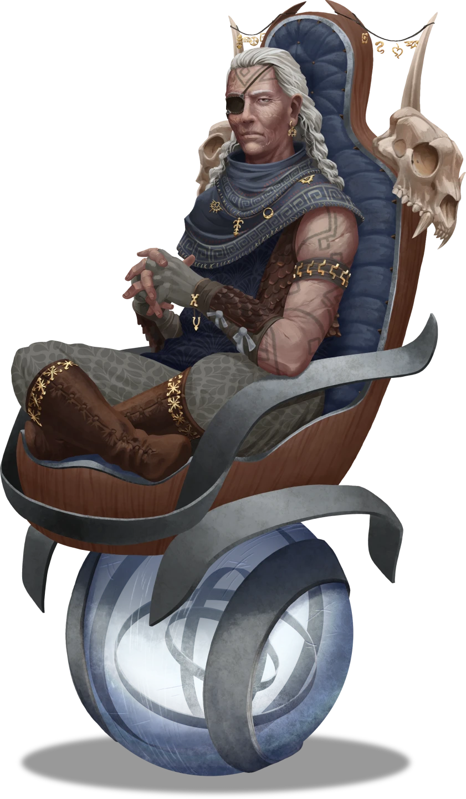

# Exterior

> [!quote] Read Aloud
> The front stoop of this wayward dig site is decorated with an array of scattered equipment and debris. Most of the gear — which includes boxes, crates, barrels, and chests crammed full of various tools and provisions — is stamped with the familiar symbol of the Anachraenum. This assortment of equipment, and the smooth stone pillars it rests upon, flanks a large door made of glyph-covered sandstone to the north. A cursory examination of the area suggests this threshold was excavated by humanoid hands, and signs of a well-worn path lead to and fro.

The exterior facade of Jekeroka Villa is a modestly-sized area where the terrain has been excavated enough to provide ingress to the facility within, an ancient [[Aedir]] structure that has laid here undiscovered for centuries.

This stoop is currently adorned with inbound supplies and outbound antiquities, and [[Anachraenum]] loremistress [[Adelyne Goss]] is stationed here for the current stage of The Expedition Challenge. The front door to the villa is currently unlocked, thanks to the [[Jekeroka Villa Key]] in Adelyne's possession and her active stewardship of the location.

Refer to the [[Manufactured Trial]] Event text for additional details about the preliminary encounter with Adelyne Goss.

> [!abstract] Adelyne Goss
> **[[Adelyne Goss]]**
>
> Level 1 · Unknown Unknown
>
> 

> [!tip] Exploration
> #### Inspecting the Digsite
>
> Characters who take a moment to search the area can easily identify the nature of most of the tools, antiques, and provisions that have been temporarily stowed on the villa stoop, and are able to locate the following:
>
> - Various pieces of equipment, including [[Carpenter's Tools]], [[Mason's Tools]], [[Potter's Tools]], and a [[Scholar's Pack]] among them.
> - An assortment of antique curios and trinkets, stored in a variety of [[Barrels]], [[Chests]], [[Sacks]], and crates.
> - Several gallons of potable [[Water]] and a two-week supply of [[Rations]], including rice, dried and canned fruits, nuts, and salted meat.
>
> Despite the relatively convenient access to these items, they are under the watchful eye of Adelyne Goss, and she does not abide any tampering with the Anachraenum supplies or salvage here (and will physically intervene, if necessary).
>
> Any character who makes a successful **Society (DC 13)** check while examining the area is able to recognize that the structure was built by craftspeople of the ancient [[Aedir]] Empire. The nature of the stonework is clearly Aedir in character, as it appears smooth, timeless, and made of a material that seems to have grown and been molded rather than hewn and placed. The villa itself is ancient but in remarkably good condition, hinting at some sort of arcane preservation throughout the years.
>
> - **Knowledge: Aedir**: The character automatically succeeds on this check.
> - **Attunement: Cora**: The character gains **+2 Boons** on this check.
> - **Knowledge: Cosmology**: The character gains **+2 Boons** on this check.
> - **Critical Success**: The character also notices that the door of the structure was once sealed with a magical ward of some kind, though its lingering effects have long since disappeared. The metal alloy seems to resonate with energies from the earth moon [[Cora]].
>
> Any character who makes a successful **Awareness (DC 12)** or **Wilderness (DC 13)** check can confirm that the entrance to the villa was buried at some point, either intentionally or during a landslide, and that it has been unearthed by careful excavation. The door and the threshold seem relatively untouched by time and the elements, unlike the earthen ledge near the perimeter of the overhang.
>
> - **Knowledge: Subterranea**: The character gains **+2 Boons** on this check.
