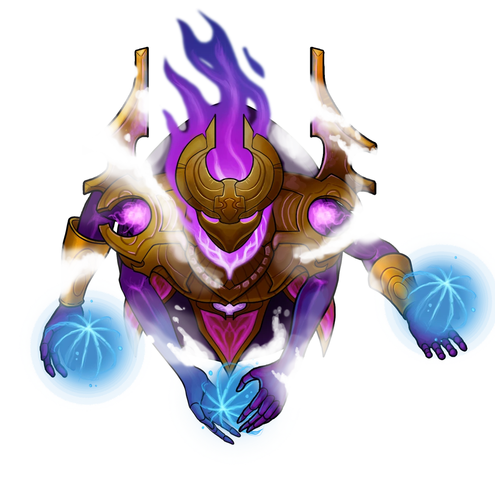

# Main Chamber

> [!quote] Read Aloud
> This massive hall is illuminated by several arcane lanterns that line the perimeter, along with a brilliant blue light that shines up from three trench-like pits that span most of the chamber's central length. The domed ceiling is tall and out of sight, bathed in shadow that has hung here for centuries. The stale air is cool, and the sound of a faint vibration thrums with constant regularity throughout the whole place. Drawing closer to the pits, you can see the source of the curious azure light that bathes the entire hall …
>
> Ten feet down in each trench, an immeasurable volume of some strange elemental matter roils with a perpetual and gentle upheaval. This lava-like substance shimmers with deepest blues and darkest blacks, draped in a lattice of bright galvanic energy.
>
> The ancient Aedir craftsmanship on display in this facility is astonishing, and it’s also clear that the villa has been well-preserved and duly-maintained by the Anachraenum since they found it.

The main chamber here once served a variety of purposes for Jekeroka, but many of those specifics have been lost to time. Now, this large hall serves as the location of the climax of the Keystone Challenge here, during which time a quartet of [[Anachraenum Aetherial]] will appear from out of nowhere to fight the party — but only once the characters have activated a switch located in each of the villa's three satellite rooms.

The main chamber's most prominent feature is its arcane lava pits, which roil with potent elemental magic conjured by Jekeroka long ago.

> [!danger] Hazard
> #### Arcane Lava Pits
>
> The blue lava-like substance in the pits is magical in nature, and counts as a solid surface made of &Reference[difficultTerrain].
>
> When a creature moves into a space containing the arcane lava for the first time or starts its turn there, the creature is engulfed in magical flame and must succeed on a `[[/save constitution 18]]` save, taking `[[/damage 3d10 fire]]` damage on a failure and half as much on a success.

> [!tip] Exploration
> #### Examining the Pits
>
> Any character who makes a successful `[[/check arcana 14]]` check while examining the pits can recognize that the strange lava-like substance within is some kind of novel elemental essence, and is responsible for powering the perpetual magical effects throughout this place.
>
> - **Knowledge: Elementals**: The character automatically succeeds on this check.
> - **Knowledge: Aedir**: The character gains **+2 Boons** on this check.
> - **Knowledge: Rituals**: The character gains **+2 Boons** on this check.
> - **Critical Success**: The character recalls other research about [[Aedir]] ruins that corroborates the ubiquity of similar materials and substances during the [[Age of the Tower]]. There is a likely connection between this "arcane lava" and Ember's elemental moons.
>
> Additionally, a character who casts the [[Detect Magic]] Spell is able to detect a powerful aura of Evocation magic around the arcane lava, along with faint traces of Conjuration and Transmutation magic.
>
> #### Examining the Stonework
>
> Any character with a `[[/skill prc 12 passive format=long]]` or who makes a successful **Awareness (DC 10)** check quickly notices that the interior stonework is in substantially better condition than the exterior. A few dirty footprints can be seen near the front entrance, no doubt left by a previous group of Anachraenum hopefuls.
>
> - **Knowledge: Rituals**: The character gains **+2 Boons** on this check.
> - **Knowledge: Subterranea**: The character gains **+2 Boons** on this check.
> - **Critical Success**: The character also notices that the stonework here has been refurbished, and appears to be polished with regularity.
>
> Any character who makes a successful `[[/check arcana 14]]` check while examining the stonework can readily tell that the stone has been treated with some kind of magic to both strengthen and preserve it.
>
> Additionally, a character who casts the [[Detect Magic]] Spell is able to detect a powerful aura of Transmutation magic around all of the stone and hardware here.

## Collapsed Earth

The two short corridors on the western side of the main chamber that lead to the [[Meditation Room]] are currently obstructed by piles of rubble, which appear to be collapsed earth from some seismic activity like an earthquake or landslide.

This collapsed earth here is actually an additional (if simple) challenge added to the villa by the Anachraenum, and is reset each time a party manages to clear it during the Keystone Challenge. It serves to both obscure the Meditation Room and simulate a subterranean excavation effort.

> [!tip] Exploration
> #### Deliberate Challenge
>
> Any character who makes a successful `[[/check inv 12]]` check can discover that the stone has been stacked together deliberately, and seems to be held together by a glue or binding agent of some kind.
>
> - **Knowledge: Subterranea**: The character automatically succeeds on this check.
> - **Knowledge: Crafts**: The character gains **+2 Boons** on this check.
> - **Knowledge: Forensics**: The character gains **+2 Boons** on this check.
>
> Any character who makes a successful `[[/check str 14]]` check can break apart the rocky rubble, and the glue will crumble, revealing the room ahead.

## Mechanized Trial

Once the party returns to the Main Chamber after flipping the switches in the [[Meditation Room]], [[Librarium]], and [[Workshop]], read the following:

> [!quote] Read Aloud
> The strange sound of mechanical whirring accompanies four flashes of scattered light that materialize in the main chamber here. You watch with amazement as a quartet of small purple constructs appears out of nowhere, each of them affixing their solitary purple eye on you with a frenzied mechanical malice.

> [!abstract] Anachraenum Aetherial
> **[[Anachraenum Aetherial]]**
>
> Level 1 · Unknown Unknown
>
> 

> [!danger] Hazard
> #### **Anachraenum Aetherial** **Tactics**
>
> 4 [[Anachraenum Aetherial]] lurk here, and are currently &Reference[invisible] thanks to the artifice of [[Adelyne Goss]]. This invisibility ends as soon as all three of the following switches have been activated:
>
> - The hidden dais switch in the [[Meditation Room]].
> - The concealed ceiling switch in the [[Librarium]].
> - The obvious switch at the southern end of the [[Workshop]].
>
> Roll initiative as soon as one or more of the characters enter the Main Chamber after all three switches have been activated. If a character manages to somehow detect the aetherials prior to this and targets one or more of them with an Attack or Spell, combat will begin immediately.
>
> #### **Anachraenum Aetherial** **Tactics**
>
> At the start of combat, all four aetherials will begin by targeting different enemy characters with their ranged [[Laser]] attacks.
>
> Over the course of combat, the aetherials will prioritize the following actions and abilities:
>
> - Each aetherial will target a random character with their [[Laser]], deliberately alternating attacks between different party members each round.
> - If an aetherial is engaged by an enemy with melee attacks, the aetherial will move away as quickly as possible in an effort to maintain a minimum distance of 40 feet from the enemy.
>
> The anachraenum aetherials are programmed to fight to the death as part of their primary function for the guild. They are little more than remote sparring partners for simulated combat and related scenarios, and there are always more aetherials where these came from.

Whether during the course of the combat encounter or after it, the characters may attempt to glean some insights from the aetherials with a quick examination of them.

> [!tip] Exploration
> #### Examining the **Aetherial****s**
>
> Any character who makes a successful `[[/check arcana 12]]`, `[[/check nature 13]]`, or `[[/check perception 15]]` check while studying an aetherial can determine that each of these constructs is powered by a magically-infused [[Iolite]] gemstone, which can be pried out of the metallic chassis once the aetherial is killed.
>
> - **Knowledge: Machines**: The character gains **+2 Boons** on this check.
> - **Knowledge: Subterranea**: The character gains **+2 Boons** on this check.

## Claiming the Key

Once the party has defeated all four of the [[Anachraenum Aetherial]], the characters can claim the [[Trial Challenge Key]], which is revealed to them via the magic of Jekeroka.

> [!quote] Read Aloud
> A glittering key shimmers into existence before your very eyes, conjured out of thin air and hovering idly above the chest.

> [!warning] Gamemaster
> #### Completing the Challenge
>
> The [[Trial Challenge Key]] magically appears in front of the party at this time, and the Keystone Challenge is concluded.
