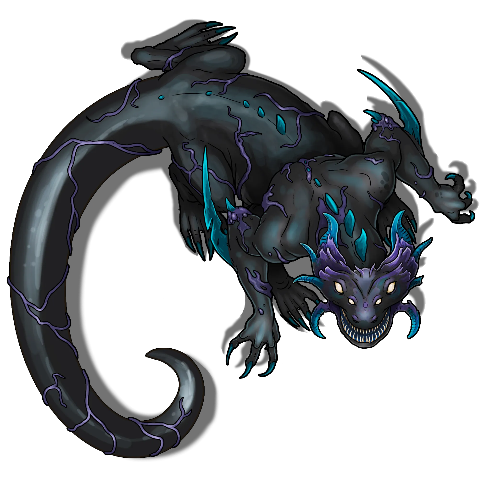

# Ancient Lunar Shrine

> [!quote] Read Aloud
> You come upon a circle of six large standing stones, each of them adorned with markings that evoke imagery of one of Ember's six moons. At the center of this circle of menhirs sits a huge stone dais, overgrown with grass and fractured by time and the elements. There is a welcoming tranquility here unlike any you've known, as if the standing stones themselves were waiting for the very moment of your arrival.

### The Lunar Shrine

The island’s eponymous shrine is its most notable feature, and is a famed landmark region-wide (whether despite, or because of, the mystery that enshrouds it). The menhirs that comprise the Shrine’s circle of standing stones correspond to each of Ember's six moons and are laced with their own peculiar veins of crystal or ore (rumored to have been hewn from the very moons themselves). Whatever the substances, these rare elements serve to focus potent magical energies both arcane and divine, and invite strangers the world over to come and behold their enigmatic splendor.

> [!tip] Exploration
> #### Exploring the Shrine
>
> The Lunar Shrine is comprised of six standing stone menhirs and a circular stone dais that sits between them, overgrown and forgotten by time. Each of the menhirs corresponds to one of Ember's six moons — [[Akon]], [[Aura]], [[Cora]], [[Mayis]], [[Orbis]], and [[Ragen]] — and is laced with a small amount of ore that hails from is respective lunar body.
>
> Any haracter with **Awareness (DC 12, Passive)** while examining the menhirs is able to notice the curious ore woven into the stone.
>
> Subsequent to this discovery, any character who makes a successful **Wilderness (DC 15)** check while examining the menhirs can confirm the lunar nature of the respective ores.
>
> - **Knowledge: Cosmology**: The character gains **+2 Boons** on this check.
>
> Any character who makes a successful **Society (DC 13)** check can identify the standing stones as ancient [[Arcturian]] in origin, with trace elements of [[Shent]] design.
>
> Any character who succeeds on a **Arcana (DC 13)** is able to realize the purpose of the Lunar Shrine: to serve as a potent spellcasting focus for arcane, divine, or druidic rituals that harness the power of Abjuration, Divination, and Transmutation magic. Characters who succeed on this check can decipher and understand the Shrine's potential as outlined below in "The Shrine's Enchantments."
>
> - **Culture: Kithil**: The character automatically succeeds on this check.
> - **Knowledge: Artifacts**: The character gains **+2 Boons** on this check.
> - **Knowledge: Rituals**: The character gains **+2 Boons** on this check.
>
> #### The Shrine's Enchantments
>
> All manner of spellcasters can use the Lunar Shrine to enhance their spells, provided they are within the circumference of the six menhirs when the spell is cast. Doing so adds **+1 Boons** to any composed spell cast.
>
> The Lunar Shrine has additional properties, which can only be activated simultaneously once per week:
>
> - Until the character completes a Rest, attempts to Counterspell the character with this effect are made with **-2 Banes**.
> - After they complete a Long Rest, characters who utilize the Lunar Shrine's enchanted properties add one point of Lunar Attunement to their current Lunar Attunement level. A character cannot benefit from this effect more than once. See [[The Moon Child of Lake Jinro]] for additional information and rewards.
>
> Additionally, the first character to use the Lunar Shrine to enhance the spells and succeed on an additional **Arcana (DC 13)** gains a temporary, one-time use ability to divine until they complete a Rest. As part of a downtime action during a period of Recovery, they may read the omens and divine the future, to know the outcome of a plan they propose to undertake. The answer to their question comes in the form of omens and signs that they interpret as either: positive, negative, both, or neither.

### Garganthus Attack!

As the party lingers for Amalthea's ritual, they must survive an attack from a [[Juvenile Garganthus]] — a savage subterranean predator that has recently emerged from the [[Pathways]] below the island, instinctively drawn to the magic of the Shrine.

Once the party has had sufficient time to conduct an initial survey of the Shrine and its features, read the following aloud:

> [!quote] Read Aloud
> Just now, the earth below your feet rumbles and the trees nearby shudder in response. Before you can blink, a huge creature leaps from below to take its own place on the island's grassy precipice …

> [!abstract] Juvenile Garganthus
> **[[Juvenile Garganthus]]**
>
> Level 10 (Elite) · Garganthus Deep Behemoth
>
> 
>
> You behold the hulking form of a quadrupedal reptilian creature with a long prehensile tail and tenebrous skin. Its agile saurian head is marked by multiple sets of bulbous pearlescent eyes, two fan-shaped ears of prodigious length, and a mouth lined with spear-like fangs. The creature's massive arms end in three-fingered hands with formidable claws, and its muscular legs look as though they could mount the toughest terrain with ease.

> [!danger] Hazard
> #### The Thing from the Pathways
>
> The fight begins as the Juvenile Garganthus appears. Before the first round of combat, the juvenile garganthus will take a single Movement to jump up onto the southwestern ledge of the hill's precipice — just outside the circle of menhirs.
>
> #### Juvenile Garganthus Tactics
>
> At the start of combat, the juvenile garganthus will attempt to use its [[Pouncing Strike]] to engage with the nearest enemy, and will continue to use it while bounding around the Area Map during the rest of the battle.
>
> Over the course of combat, the garganthus will prioritize the following actions and abilities:
>
> As soon as possible, the garganthus will position itself to make the most of its [[Maddening Shriek]] on the largest possible number of enemies, including spellcasters and any allied NPCs that might be present.
>
> If any allied NPCs are left unattended, the garganthus will move towards them and engage one or more allies in melee combat. The garganthus will redirect its attention to any other attacking party members or characters when and if they join the fray.
>
> The garganthus will fight to the death, and is ecologically out of place here. Once slain, it's extremely unlikely that another garganthus or similar predator of the [[Pathways]] would inhabit the area.

> [!tip] Exploration
> #### Looting the Garganthus Corpse
>
> Once the [[Juvenile Garganthus]] is slain, a few Items of interest can be found on its corpse or harvested from its remains:
>
> The stomach of the juvenile garganthus can be searched for undigested loot. Any character who searches the corpse can roll `[[/roll 1d2+1]]` times on the [[Corpse Loot]] table to reveal what they find in the monster's distended belly.
>
> Any character who makes a successful **Wilderness (DC 13)** is able to harvest one [[Garganthus Hide]], which can be used to fashion a dark leather armor that absorbs light.
>
> - **Knowledge: Crafts**: The character gains **+2 Boons** on this check.
> - **Critical Success**: The character is able to harvest an additional Garganthus Hide.
