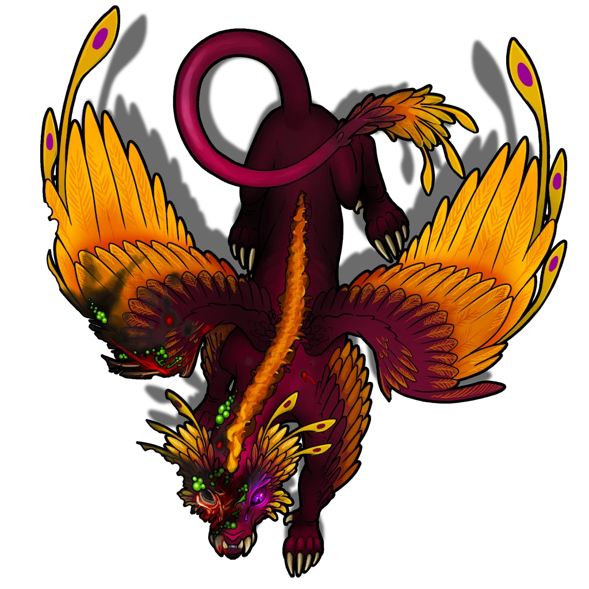

# Central Room

> [!quote] Read Aloud
> This massive space is round, and broken into two levels, with oversized stairs bridging them. Along the curve of the upper level are numerous glowing gems in bronze cages, suspended over the floor by unseen magic, but anchored in place with heavy bronze chains.
>
> The central space of this area is spattered with blood and the shredded remains of multiple humanoids. Each body is rent into pieces, limbs detached from torsos, and heads from necks, yet horribly, these corpses still squirm and move as though not quite dead.
>
> At the center of this space is a large winged being with luminous dust falling from its wings. Its eyes burn with anger, and that ire is directed at you.

## Meeting The Guardian

Once the party moves down into the lower area they will be confronted by the guardian. Until then, the Guardian remains out of sight and observes the party, preparing to strike. This guardian is a Vanexis, as depicted in the [[Tower Descent]]

> [!abstract] Mythspire Guardian
> **[[Mythspire Guardian]]**
>
> Level 8 (Elite) · Vanexis Primordial Guardian
>
> 
>
> This luminescent creature moves with predatory grace, each step leaving a faint radiant trail. Its large, glowing eyes seem to peer into the very essence of what it observes. Streaks of radiant color pulse rhythmically through its partially feathered fur, and up its two sets of wings.
>
> The first pair extends from its forelegs, connecting to its sides, while the second, larger set fans out from its back. Both sets of wings are intricately patterned with luminous feathers that ripple like living stardust with the slightest motion.
>
> This is a creature also appears to have been wounded, with raw burns cast across its face, neck and shoulders. The wounds are covered in swollen pustules and the fur and feature has been burned way to show raw, bubbled flesh.

> [!quote] Read Aloud
> The being speaks, its pained voice betraying the agony its wounds inflict.
>
> > You corpses should know better than to rise again. How many times must I put you down?
>
> It winces in pain, and shakes its head. For a moment it seems confused, but composes itself, finding its anger anew.
>
> > You come bearing false pretense, lying about your motives, I smell the lies, the falsehoods. You are not Shent, or Anachaenum, you are interlopers, enemies! You walk hallowed ground without leave! The passage shall remain closed, and your bodies shall join those of your allies at my feet!
>
> The being crouches down, preparing its assault, but is overtaken by a fit of hacking coughs and shudders of pain no doubt caused by the wounds it bears.

> [!warning] Gamemaster
> #### Optional Combat Encounter
>
> This encounter can be avoided by attempting to placate the guardian, and convince them that the party is not their enemy. In its current state it is mistrustful and volatile, readily finding enemies where they may not be any, but it is not beyond reason.

## Placating the Guardian

The ancient Mythspire Guardian is clearly unwell. The burns and scars on its face and neck are covered in weeping boils. It seems out of sorts, confused and easily agitated. Parties interacting with it should take care.

The party may attempt to engage the guardian in conversation rather than attacking it outright, doing so is initially simple, but grows harder over time. Placating the guardian may allow them to befriend the creature, but any slip up could prove fatal.

> [!info] Social
> #### A Dangerous Conversation
>
> It is possible to placate the creature, though it is not easy.
>
> A successful **Diplomacy (DC 12)** or **Deception (DC 12)**check to either soothe or trick the guardian into believing the party isn't hostile will give it pause. Attempting to use Intimidate will not work, inciting to violence immediately.
>
> This success is brief, allowing the party to ask questions, or examine the creature without risk. The window is brief though, and the guardian quickly becomes suspicious and agitated again.
>
> Each new attempt to placate the guardian suffers a cumulative +2 DC increase whether it succeeds or fails, and after a total of three failures the guardian attacks the party.
>
> Optionally, critical failure while trying to placate the guardian can count as two failures, at your discretion. We only recommend this if your party has especially strong social skill and the risk of failure is inherently lower or you want to make the encounter more tenuous.

With some concerted effort, it is possible to completely mollify the guardian.

> [!warning] Gamemaster
> #### Successful Defusal
>
> If the party manages to successfully delay combat by placating the guardian 4 times, then it will calm down enough that it can be convinced the party is not a threat at all, and will begin to fully relax.

## Examining the Guardian

> [!tip] Exploration
> #### The Ancient Guardian
>
> A successful **Awareness (DC 13)** check reveals that the guardian is deeply unwell, easily agitated, and seems unable to tell friend from foe. It likely views all visitors as possible enemies, perhaps the same as those that attacked it.
>
> Examining the guardian with a successful **Medicine (DC 13)** check reveals that they have suffered wounds from some alchemical attack and are likely poisoned by contact with the toxin. However, given the creature is not a terrestrial beast, it is impossibly to render proper medical aide to the being.
>
> - **Critical Success** (or a further**Medicine (DC 16)** check) leads you to believe this creature is dying from whatever the attackers hit it with. It is likely growing weaker by the day, and won't live much longer.
>
> Examining the Guardian is possible, but only while it is placated. See the rules in the following section for how that might be accomplished. If the guardian is examined, the party can learn:
>
> - **Vital Sense** or [[Rune: Life]] reveals the presence of a powerful lethal toxin in the creature, and suggests its progression has advanced beyond the point where intervention will be successful.
> - Curative items like [[Antitoxin]] and similar healing or curative spells prove ineffective at combating the toxin.
> - However, use of magics can **reduce** the potency of the poison long enough for the guardian to regain some of its mind. This grants **+2 Boons** on attempts to placate the guardian (see below) as long as the effect lasts.

> [!warning] Gamemaster
> #### The Fate Of The Guardian
>
> If the party doesn't kill the Guardian, and lingers long enough, it will rest somewhat peacefully, and then eventually die. When this occurs, the creature's form crumbles into swirls of light and energy in brilliant reds, pinks, purples, and blues. These ribbons of light fade away to nothing, with only a few guardian feathers remaining.
>
> If the party leaves before this occurs, they will return to an empty Mythspire Observatory, and a few guardian feathers left where they last saw it.

## Fighting the Guardian

> [!danger] Hazard
> #### Guardian Tactics
>
> If the Mythspire Guardian enters combat with the party it immediately casts [[Protective Mirage]] to improve its defense.
>
> The guardian prefers to utilize speed and its flight to reposition itself and take advantage of its [[Ferocious Leap]] , [[Swooping Strike]], and [[Pouncing Strike]] in order to maneuver swiftly between targets.
>
> Once in melee range it savages enemies with its [[Bite]] and [[Claw]],
>
> At range, the guardian can resort to its powerful [[Luminous Sting]], but only does so if it must.
>
> If facing spellcasters it relies on counterspell spells to limit the effectiveness of their spells.
>
> #### Cosmic Gems
>
> The area features seven cosmic gems that represent important bodies in the cosmos of Ember: Lantyr, Akon, Orbis, Ragen, Mayis, Cora, and Aura. The Vanexis can use its [[Cosmic Gems]] action to direct a beam of light into one of these gems, charging it with light.
>
> Once a gem is charged, place its measured template in the scene (if it has one). The gem's effect will activate at the end of the round. When a gem's effect activates, the gem stops being charged.
>
> It is possible to disable a charged gem before its effect is activated by interacting with the stone and pressing the runes on the floor in the correct sequence. This requires an action and a successful **Awareness (DC 12)** check to spot and match the sequence that the runes are pulsing in. Failing this check has no repercussions.
>
> #### Inescapable Fate
>
> The Vanexis has been poisoned fatally and as a result its [[Nearing Death]] talent, it takes ongoing damage at the beginning of each of its turns. This effect will eventually kill it if the fight lasts long enough.

## Speaking with the Guardian

> [!info] Social
> #### About the Dead Adventurers
>
> The Vanexis views the dead adventurers as fallen foes, enemies, and has this to say about them if asked:
>
> > The corpses scattered at my feet were interlopers attempting to open the sacred passage to the Pathways. Only visitors seeking to know the history of the Giants and their path are allowed. Liars, invaders, and killers are not!
> >
> > They said they were of the "Anachraenum" but they were unlike others of that order I have met. They threatened to use acids and tools to carve open the way below if I would not give them access. When I acted to remove them, they turned those implements on me.
>
> The Vanexis can also explain why their remains are mutilated so badly, and why they are wriggling and moving stills: The adventurers kept rising from the dead.
>
> > Bidden to wake again and again by the Sleeper, I put them down countless times. Eventually their remains were savaged so thoroughly so that they could not rise again… but you can see their rotting forms still writhe and wriggle, trying.
>
> If asked about the Sleeper:
>
> > The sleeper wakes. It slumbers in Ember now, but not for much longer. Its voice has been growing louder and louder in my ears. It promises me life after my death, but it does not know that I am beyond its reach. Still… the light of this place has grown more dim.
>
> #### About The Mythspire and Guardian
>
> The Guardian has quite a bit to say about itself and its purpose if asked.
>
> > Primordial Giants built this place when they emerged from the pathways so long ago. They built this place to study the skies which they had never seen before. I was sent here to serve as their guide, to teach them many things about magic and the cosmos, and welcome them to the surface.
>
> The Guardian believes it was forgotten, but it is content with its place in the world.
>
> > The Casia of Primordis put me here, to protect the knowledge of this place, to preserve the memory of its builders and to keep this observatory safe. However, it seems the Casia have forgotten about me, and all who had connection to this place passed into history, I have watched over this crumbling space. One day it will turn to dust, and there will be nothing to protect, and I will return home.
>
> If asked about the builders, the Guardian saw much of it, and can share what it knows:
>
> > I witness the growth of the Shent. Though, they didn't really grow, more they changed, become different as they reached the surface. I watched this place turn from observatory to a place of reverence and history, where Shent came to connect with their cultural heritage. I witnessed them come here in dark times, when the Abyss was destroying them, to gaze at the old mosaics and try to find purpose or solace. I remember when I last saw the Shent, and they told me they would soon be no more. I miss them.
>
> #### About The Pathways Passage
>
> The Vanexis can talk at length about the passage, and is even willing to explain about how to open it, if asked!
>
> > The passage is a great lift that descends to the base of this great tower. Opening it begins with Lantyr, but requires a traveler to reach all the other moons before they can set themselves onto the Pathways proper.
>
> > The passage has been opened a few times by visitors over the last few thousand years, but not often. It leads down into the ancient pathways beneath the surface. I have only seen what lies below a time or two, and it seems a wild place.
>
> If asked to clarify on the solution to open the passage, the Vanexis is somewhat cryptic.
>
> > The ancient mosaics here on the walls hold the secrets you need. You can find the path through the cosmos there. Follow the ancients, they will guide you.

## Examining the Walls

> [!tip] Exploration
> #### Ancient Carvings
>
> Examining the ancient carvings of this lower area you can easily make out the progression, even through the damage: Long ago a people burrowed out of the body of Ember and through the mountains. They peered at the sky overhead, and were awed.
>
> They built a great structure at their emergence point, likely this very building, and in it sat another feline guardian. From this structure many more of their kind ascended to the surface of Ember, each awed by the stars and moons overhead.
>
> The mural further depicts the spread of these people across the mountains, and the construction of many homes high and low.
>
> #### Interpreting the Stone
>
> A successful**Society (DC 14)**check connects some dots: The lack of heavy Shent construction markers means that this structure likely predates the Shent, and as a result this is possibly the emergence point of their precursors. The ancient guardian is possible tens of thousands of years old! Also the presence of the cat-like beings might be reference to the magical Casia, who could have provided them the basis of their magical knowledge.
>
> A successful **Arcana (DC 14)**check connects some dots: The reverence of the sky and moons feels like a classical marker of the Shent. This was likely an ancient and important sight (for the Shent) and served as the starting point of their worship of the heavens. The cat-like beings are possibly Casia, which are known to stem from Primordis. They might have served as guardians and guides to the early Shent.

## Examining the Undead

The party may way to examine the remains of the adventuring party. While they are in a horrible state, a little bit can still be gleaned from them.

> [!tip] Exploration
> #### Undead Remnants
>
> The scattered remnants of the dead here are in rough shape. Limbs have been carved from rotting torso, and heads split open and scattered on stone. Still there is an unseemly life in them as digits twitch and arms curl, trying to grab for anything nearby.
>
> The dead here do not rest, and examining them is made all the more unpleasant for it.
>
> Examining the remains with a successful **Awareness (DC 13)**check allows characters to find interesting details.
>
> - **Success** The corpses all had legitimate looking Anachraenum badges, pins, or crests, making them recognized members of the guild. This is almost certainly the group that Liestra helped in Skybrush.
> - **Critical Success** There are several shattered canisters in the possessions of the deceased, each previously holding noxious alchemical compounds. Though it's impossible to know what the compound was, it is green, and corrosive based on the remnants.
>
> A successful **Medicine (DC 12)**while examining the bodies yields insights into their deaths and current states.
>
> - **Success** The bodies are still relatively fresh, preserved by the cold, dry air of this place. You would estimate they are only about two or three weeks old. However, there is a strange, discolored cast to the skin and muscle, as though something more is tainting it.
> - **Critical Success** The wounds are not all the same age, it appears that these bodies were savaged multiple times to get them into the state they presently hold. If you had to guess, the corpses kept getting up, and the guardian kept cutting them down until they were in a state they could not rise any longer. Several of the dead have old wounds akin to burns, and by the look of them you would guess from contact with corrosive chemicals. While none of them were fatal, all of them seem to have regularly handled dangerous alchemical substances while they lived.
>
> A successful **Arcana (DC 15)**check in regards to the undead yield the following: Undeath is uncommon, and there are no obvious sources or signs of such magic being worked in the area, so whatever is causing the dead to rise is coming from somewhere else. What is concerning about that though, is you're not sure how powerful a being or magical source you're dealing with. It could be nearby but weak, or worst case, miles away and powerful.
