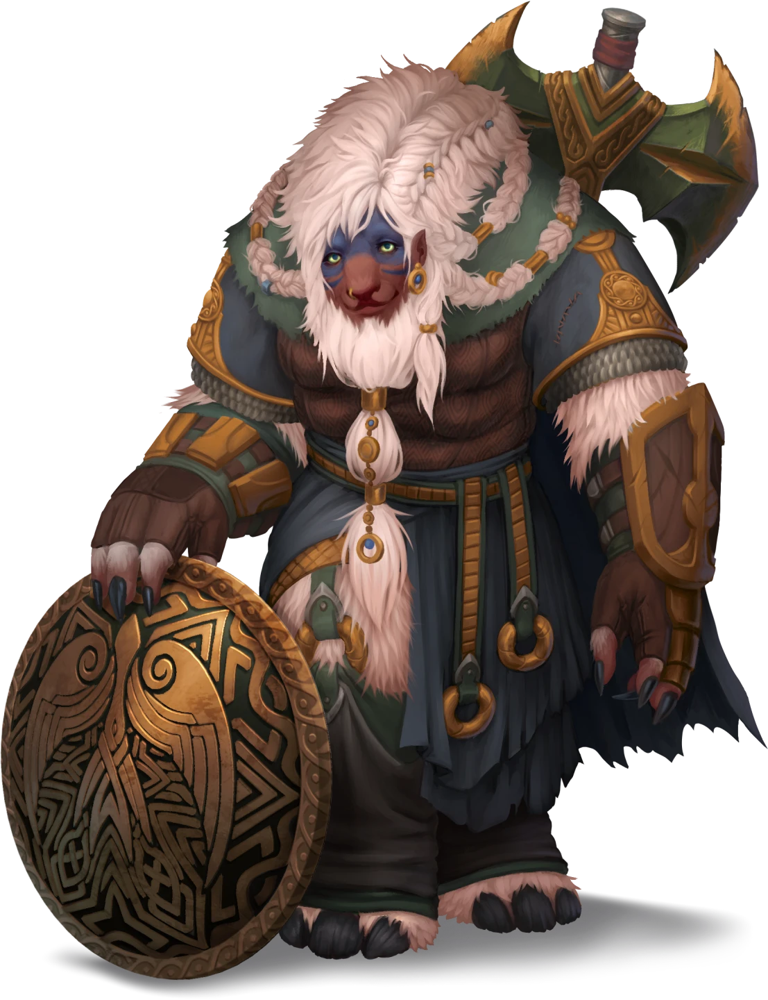

# Entrance Path

> [!quote] Read Aloud
> As you walk along the path to Oldcraft Lodge, you can hear the sounds of bustling campsites nearby — pots clanging, people chatting around campfires, and faint music. The aroma of cooked fish and fresh bread drifts through the air. Ahead, the grand lodge stands prominently at the cliff's edge, overlooking Lake Jinro.

As the party arrives, they are greeted by [[Svala Bronwen]].

> [!abstract] Svala Bronwen
> **[[Svala Bronwen]]**
>
> Level 4 · Vrjnhar Protector
>
> 
>
> The vrjnhar woman is broad shouldered and intensely muscled, carrying herself with a fearless confidence. She sports pale white fur that pours off her chin and turns into a lengthy beard which is split into several braided coils and draped over her shoulders in several places. Each strand is adorned with bronze clasps and rings which contrast richly against her pale hair.
>
> A wickedly sharp looking battle axe is slung across her shoulder, and a heavy wooden shield adorned with ornate, intertwined knots hangs from her hip. What little armor she wears seems to be layers of chain and cloth.

> [!info] Social
> #### Speaking with Svala
>
> Svala Bronwen is a confident Vrjnhar from the [[Oaken]] and a peerless warrior and wanderer. Having endured many trials, she is keen to prove herself in the Arctus Plateau. Instead of trekking across the plateau searching for the "cowardly" bandits, she plans to gather clues from the refugees and stay alert, hoping the bandits might be foolish enough to attack Oldcraft Lodge. Although she typically hunts monsters, after learning of the people's plight in the region, she is taking her duty as a warrior very seriously and plans to rid the plateau of their blight.
>
> She is glad to pause and chat with the party about fighting techniques and her larger goal of traveling the world to encounter deadly monsters, and she sings grand songs about her adventures.
>
> > The tail was hooked, the sting was red,
> > But Svala's axe found the monster’s head.
> > One swoop, one strike, the beast did fall,
> > Now its pelt hangs high in the Kalvard's hall!
>
> If the party wants to talk to Svala specifically about the bandits that attacked Helkas, she has the following to say:
>
> > The bandit group is attacking locations across the Arctus Plateau, apparently at random. They have seemed more organized in their attacks in recent months. A few of the people who have arrived have been calling the bandits a strange name, I think it is "Otherhood." Not that it makes much difference to me, I'll split them apart all the same!
>
> If the party asks about Sigil, she smiles and says:
>
> > Don't let his odd speech fool you; he is one of the most intelligent gods I've ever met—so much knowledge! It has been a pleasure to meet him.

The party can stop to look around outside Oldcraft Lodge; none of the refugees nearby pay them any attention unless approached.

> [!tip] Exploration
> #### Wagon Unloading
>
> Two women are unloading a wagon to the right (see [[The Group of Wagons]]). A young boy sits nearby.
>
> #### Dancing Flames
>
> Two people are sitting around an enchanted campfire to the left (see [[The Dancing Flames]]). The fire has taken on the shape of a group of dancers.
>
> #### Into the Lodge
>
> The doors to the lodge itself are partially open (see [[Sigil's Living Room]]).
