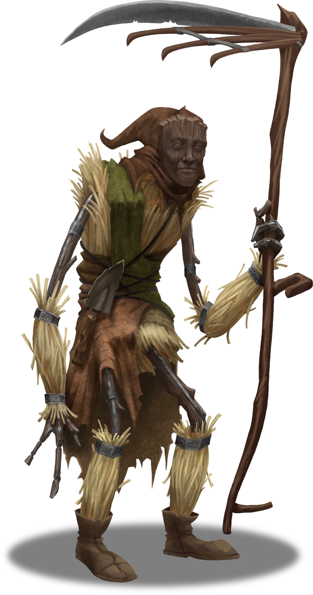

# Steed's Point Fields

> [!warning] Gamemaster
> #### Gamemaster Note
>
> The construct Rattletrap can most often be found in this area. When Rattletrap encounters the party, there are three different potential scenarios:
>
> - If the party is visiting Steed's Point on their own, they are generally limited to the conversation topics below.
> - If the party is on the Book of Tales quest, in addition to the conversation below, they may have additional dialogue as noted in [[The Rickety Man]].
> - If the party is on the Thorny Predicaments quest, in addition to the conversation below, they may have additional dialogue as noted in [[A Dying Art]].
>
> If parties return to Steed's Point after some time away, they can skip the introduction to the character and proceed to [[Speaking with Rattletrap Again]] below.

### Meeting Rattletrap

> [!quote] Read Aloud
> In the midst of all the destruction of Steed's Point, a gangly figure made of wood and straw walks carefully and steadily through the fields, weeding and digging and keeping things orderly, while carrying a large scythe. After a moment it seems to notice you.
>
> > Well that explains it.
>
> The figure says, its voice sounding like wind whipping through a field.
>
> > I thought I heard the gore birds screaming about something, they do get a bit aggravated whenever they see anyone new these days.
>
> The construct starts toward you, but pauses a short distance away, seeming to realize something all of a sudden. It speaks:
>
> > Before I draw closer, let me introduce myself: Rattletrap, pleased to meet you. And yes, I am talking. Part of the magic of Steed's Point. What's left of it, anyway. It's been so long since I've seen anyone come through here, what brings you this way? Not much left to see in old Steed's Point…

> [!abstract] Rattletrap, the Rickety Man
> **[[Rattletrap, the Rickety Man]]**
>
> Level 4 · Automaton Servitor
>
> 
>
> This humanoid figure is crafted from various scraps of wood, its ramshackle limbs held together with a skeleton made of timber and ligatures woven from vine. The masterful carving that comprises its wooden face is fixed in a perpetual look of mirthful stoicism as it labors away at the duteous task of reaping wild grain in a long-forgotten field.

> [!info] Social
> #### A Conversation with Rattletrap
>
> Rattletrap is generally happy to talk about his life at Steed's Point, though he doesn't remember that much of it. Characters who succeed on an **Diplomacy (DC 17)** check can tell that he genuinely doesn't recall much.
>
> - Rattletrap is able to talk, which is rare for a construct, but he doesn't know why.
> - Rattletrap's first clear memories are on the day of Steed's Point's fall to Jurtak, but he has a few snatches of memory from before that.
> - Rattletrap attempts to keep as much of the place up and running as he can, because it feels like home and because he is generally safe from the gore birds (who ignore him) and the Jurtak (who he can hide from).
> - Rattletrap stays away from the eastern side of Steed's Point, as there is a large concentration of Jurtak there and he is worried he would be ripped apart if he faced them alone.
>
> Full responses below.

> [!question] Q&A
> **Q:** Why can you talk?
>
> **A:**
>
> > Good question!
> >
> > No idea.
> >
> > I only know it's weird because a while back a group of hunters came through here and told me so. Apparently my kind normally don't have the ability. Couldn't tell you why I'm different, I just am!

> [!question] Q&A
> **Q:** What happened to Steed's Point?
>
> **A:**
>
> > Couldn't tell you, not precisely anyhow. I want to say there was a battle, since my earliest memory is of the town filled with dead, blood everywhere, buildings burned down, all that. I buried the dead a while ago, and do my best to keep the fields in order, but it's just me out here.
> >
> > Unless you count the birds and lizard people, but I avoid them.

> [!question] Q&A
> **Q:** Why are you here?
>
> **A:**
>
> Rattletrap shrugs, the movement bringing with it the creak of wood and rustling of hay.
>
> > Feels like home. There's bits about the place that are familiar. I woke up here, I think this is where I was made.

> [!question] Q&A
> **Q:** Any Other Memories of Steed's Point?
>
> **A:**
>
> > My memory isn't too good anymore, at least not the way back part of it. I don't remember anything about this place, though… sometimes, when I stare at the ruins, I feel like I can see what this place once was. I get flashes of canopies and banners fluttering in the wind, or hear the steady ringing of a forge hammer.
>
> The construct's shoulders slump suddenly.
>
> > Sometimes… I remember waking up to the death, like it just happened again, or see fresh blood on the ground… or hear people screaming for help.
> >
> > Probably for the best I can't really remember anything anymore.

### Speaking with Rattletrap Again

> [!quote] Read Aloud
> As you make your return to Steed's Point, Rattletrap is once again in the fields, this time harvesting bunches of grain that look not that different from the straw of his own body. He waves a hand in your direction as you walk by, but does not approach, instead simply shouting:
>
> > Welcome back! Just let me know if you need anything!

The party may have additional conversation with Rattletrap about any conversations not covered in their initial meeting above, or as noted in [[A Dying Art]] (while playing the "Thorny Predicaments" quest) or [[The Rickety Man]] (while playing the "Book of Tales" quest).
