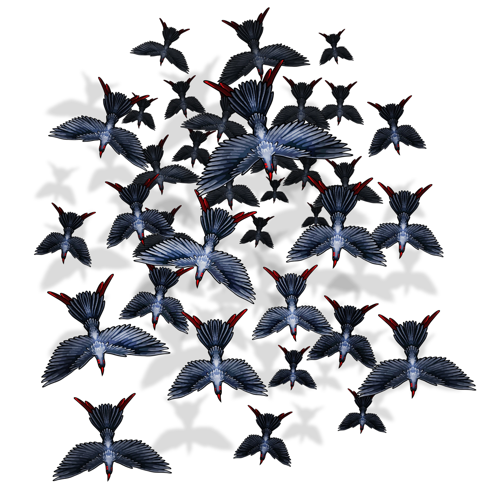

# The Mill

> [!quote] Read Aloud
> At first glance, the clumped dark mass on top of the stone mill could almost be a massive accumulation of hardened dirt, but the hint of red beaks and tails paints a clearer picture – a massive mound of gore birds is perched on top of the building, their bodies so tightly packed together that it is hard to distinguish one from the next. It’s impossible to count how many swarms might be among them, but they all seem focused on a single task – pecking and clawing at the tile roof beneath them. If they note your presence, they do not show it.

The gore bird swarms can be directly engaged in combat or avoided via stealth.

> [!abstract] Gore Bird Ravage
> **[[Gore Bird Ravage]]**
>
> Level 4 · Gore Bird Swarm
>
> 
>
> A large swarm of tiny, keen-eyed birds circles above, their charcoal-colored feathers a stark contrast to their sharp red beaks. It is nearly impossible to see how many of them there are, but as they grow closer, making an unsettling cawing noise and rustling their crimson tailfeathers, you can smell the rot of the putrid flesh they so often feast on.

> [!danger] Hazard
> #### Gore Bird Ravage Tactics
>
> If the gore birds are directly engaged by the party in combat, 2 of the 7 swarms attack (only 4 are placed on the Scene as tokens. The GM should add an additional 3 to the Scene as required). The rest come in waves. Each new wave of gore birds should be added whenever a swarm currently engaged in combat is defeated or after 3 rounds of combat, whichever happens first.
>
> Once engaged in combat, characters can get respite by entering [[The Ruined Home]] or [[The Hedge Maze]] - the gore birds avoid these areas because of Kali's hedges and will fall back, waiting to see if the party emerges. They can also avoid the attack by entering the Mill itself, though this brings them into conflict with the Jurtak inside (see [[Cornered Jurtak Combat]] below).

> [!tip] Exploration
> #### Evading the Gore Birds
>
> Characters can sneak past the gore birds by succeeding on a **Stealth (DC 16, Group)** check. If characters fail their stealth check, a single gore bird will fly toward them to investigate. Characters can placate the bird with a successful **Wilderness (DC 16)** check, kill the bird in a single hit (if it the bird is merely injured, it immediately cries out, triggering the swarm attacks), or convince the bird they are not food using **Talent: Wildspeaker**. If they are unsuccessful, the bird calls out an alarm and 2 swarms attack the party.

If parties enter the Mill, they encounter a single Jurtak warrior, which cowers in the corner.

> [!abstract] Jurtak Warrior
> **[[Jurtak Warrior]]**
>
> Level 4 · Jurtak Berserker
>
> 
>
> You behold a lean, six-eyed saurian creature, its body clad in fragments of bone and its scales glinting in the dim light. The acrid scent of poison tinges the air, dripping from the bone blade held in its clawed hands. Its long, semi-prehensile tail moves with a predator's anticipation, and a forked tongue flicks across twisted lips as its eyes fix upon you with a predatory malice.

> [!quote] Read Aloud
> For a moment, the creature doesn't move. Huddled in the back corner of the mill, its eyes dart from you to the frenzied scratching and tapping from gore bird beaks and claws on the roof above. Hissing at the air, it raises a claw towards you and bares its razor-sharp teeth.

> [!danger] Hazard
> #### Cornered Jurtak Combat
>
> The Jurtak hunter has been cornered in the mill by the gore birds and is angry and hungry — it attacks viciously on sight. The Jurtak will attempt to push members of the party outside of the mill in the hopes that the gore birds will spot them and attack, creating commotion and confusion that it can use to escape.
