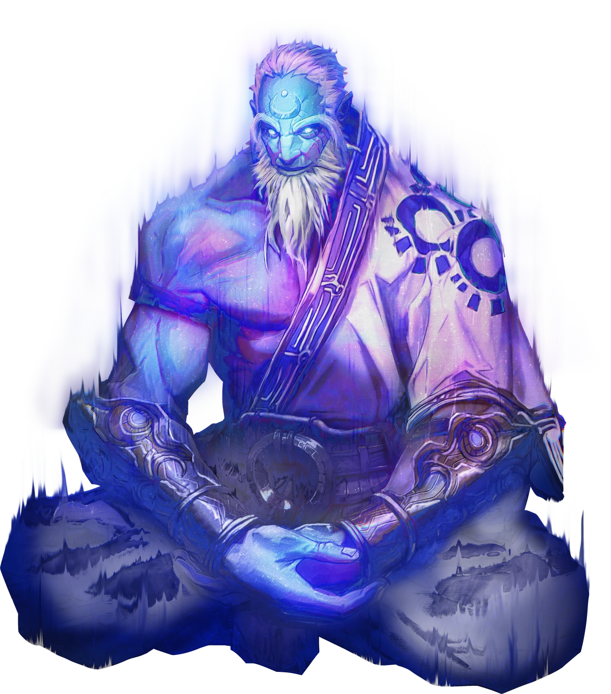
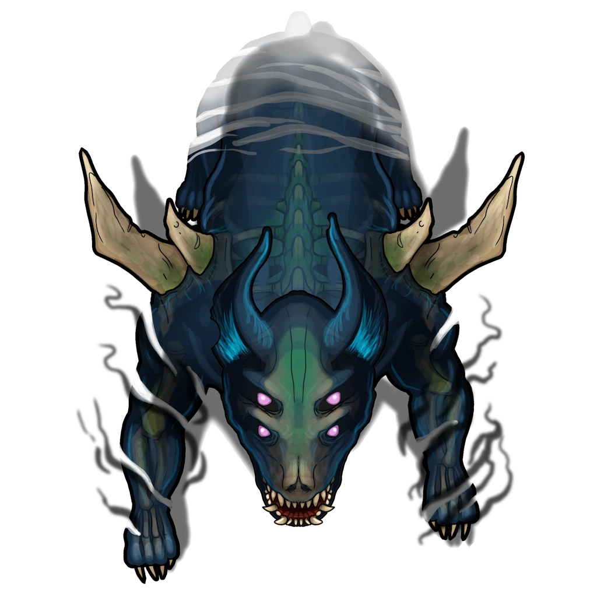

# Main Gallery

> [!quote] Read Aloud
> This sizable gallery is cluttered with an esoteric array of odd antiquities — from clockwork globes and arcane baubles to iron-bound tomes and eldritch trinkets. A thin gray blanket of cobwebs and dust covers the room and all it contains. The air is musty and laden with the acrid scent of ozone.
>
> One feature in particular here commands your attention: the stone statue of a large humanoid on a dais at the northern end of the chamber, which stands behind a wide altar paired with a strange orb at the front and a radiant crystal lens on each side. The orb, hewn from some pale azure crystal, features the indentation or etching of a large five-fingered hand on its surface.

In this area, the characters will discover a dusty vault that serves as a false terminus for would-be plunderers of the Bleak Archive. This gallery contains a variety of esoteric antiquities meant to dissuade invaders pillagers from finding the Archive's real treasures deeper within.

## Antiquities of a Bygone Age

The gallery here is decorated with a dusty array of [[Shent]] antiques and assorted oddities from the [[Age of the Tower]], alongside some minor Abyssal relics. As the party interacts with the reclics stored in this ersatz vault, they'll be visited by an apparition of the Shent Sage known as [[Mioroth]], whom they may have encountered in the [[Forest of Stone]] during [[Lunar Awakenings]] in [[Over The Moon]].

Assorted crates, jugs, barrels, and boxes are stored throughout this large chamber, all covered in a blanket of cobweb and dust. Most of these vessels are curiously empty, or their ancient (and often rotted) contents are altogether unremarkable.

- Nine stone plinths etched with runic Pathward markings stand out from the rest, each of them bearing a Shent relic of particular interest upon it. Any character who attempts to examine the various [[Bleak Archive Relic]] stored on these plinths can spend an Action to inspect one of the relics. These relics may include (listed clockwise from the Antechamber door): Alloyed Circlet, Alloyed Necklace, Scale-Bound Tome, Alloyed Jug, Alloyed Manacles, Alloyed Clockwork, Crystal-Faced Tome, Crystal-Lensed Spyglass, Crystal-Lensed Microscope.
- A tenth plinth in the northeast corner of the chamber stands empty. A dusty blanket is draped off of one side, suggesting that whatever once sat here was removed long ago.

> [!tip] Exploration
> #### Searching the Room
>
> Any character who makes a successful **Arcana (DC 13)** check while inspecting the items confidently suspects that each of the nine Bleak Archive Relics has been tainted by its presence in the Bleak Archive or by [[The Abyss]] itself, and is cursed with a tenebrous sickness of the endless void. Removing these items will likely come with a hidden price.

## Mioroth the Sage

Whenever a character interacts with or closely inspects one of the Crystal Relics or the Alloyed Clockwork, the spectral memory of Mioroth appears.

> [!quote] Read Aloud
> As you inspect the odd crystalline relic, it releases a brilliant flash of arcane light. The semi-spectral form of some large apparition begins to appear before your very eyes …

> [!abstract] Mioroth
> **[[Mioroth]]**
>
> Level 18 (Boss) · Memory Shent Seer
>
> 
>
> Appearing as if from legends, a ghostly, semi-transparent, colossal figure looms over you even as he sits with his legs crossed. He is serene, calm, and intangible, as if made of pure energy and flickering strands of light. Shadows and motes of magic constantly evaporate from his body, and his only constant is his wise and gentle smiling expression. He looks faintly like a Kivahr, but as if carved from stone, with heavy brows, long limbs, and a muscular frame. The clothing he wears matches no recognizable style.

> [!warning] Gamemaster
> #### Old Acquaintances
>
> The party may have met Mioroth previously, potentially multiple times. Mioroth's projection is aware of and remembers the party from those prior encounters, so be sure to adapt the dialog accordingly depending on whether the party is already familiar with the Shent sage or whether this is a first encounter.
>
> Reference other Mioroth encounters in:
>
> - [[Lunar Awakenings]]
> - [[Shining Obelisk]]

Mioroth addresses the party immediately:

> [!quote] Read Aloud
> > Hark, travelers. You find yourself among the vaults of Ebbok Zhùr. Whatever has brought you here, I hope your intentions are pure. This is a hallowed place, where the evils that lurk beyond this world are restrained by the work of our most honorable artificers.
> >
> > The allure of precious metal and glimmering stone may tempt you, but beware the call of The Abyss and its minions, lest you fall to its insidious sway. Turn back now, or proceed with the truest of purposes.

The characters have a few moments to beseech the Sage's memory before they continue.

> [!info] Social
> #### A Conversation with Mioroth
>
> Mioroth can readily offer the party information on a variety of topics, with several examples in the dialogue below.
>
> Characters who make a successful **Diplomacy (DC 16)** check are able to convince Mioroth of the veracity of their cause, and may elicit some additional help from the Sage (at the Gamemaster's discretion).
>
> Meanwhile, any character who makes a successful **Diplomacy (DC 10)** check can tell that Miorith has no interest in lying to the party; this is an earnest warning.
>
> Once the characters have completed their exchange with Mioroth, he bids them farewell before his apparition dissipates with a fluttering of arcane light.
>
> > Moons guide you.

> [!question] Q&A
> **Q:** On the Bleak Archive?
>
> **A:** Known as Ebbok Zhùr by the ancient Shent artificers who built it prior to the Shattering, this trap-laden vault was originally constructed to contain a volatile repository of Abyssal artifacts and eldritch curiosities.

> [!question] Q&A
> **Q:** Regarding the vault's hazards?
>
> **A:** Beware the blade traps that protect the far eastern and western corridors. And take care when navigating the vault's darker chambers — the minions of The Abyss have strange relationships with the shadows.

> [!question] Q&A
> **Q:** About the relics?
>
> **A:** The Shent and Varùn relics that reside here are all corrupted with the eldritch taint of The Abyss. Embrace them at your own peril.

> [!question] Q&A
> **Q:** On the Shent?
>
> **A:** The Shent were members an enlightened and wise society that met its end during the events of the Abyssal Shear two and a half thousand years ago. Shent sages foretold this cataclysm that came to Ember, and were paragons of lunar and runic magic.

> [!warning] Gamemaster
> #### "A Brush With Death" Quest Progression: A Departing Word
>
> If and when the party defeats [[Tethra Shùl]] in the [[Unknown]] then departs the Bleak Archive through the Main Gallery, Mioroth will reappear here to offer them parting words. The contents of that conversation can be found in the [[Where Evil Lurks]] section of [[Where Evil Lurks]] inside the [[A Brush With Death]] Quest.

## The Statue's Contraptions

When the characters examine the stone statue on the dais, read the following aloud:

> [!quote] Read Aloud
> The statue here is made of the same ashen gray slate that comprises the rest of the vault, and features the likeness of a large, wizened humanoid with a mane of jagged hair, a magnificent beard to match, and two prodigiously curved horns atop his stony head. The statue's fingers are tipped in sharp claws, and his outstretched hands appear to be caught up in some kind of dramatic gesticulation that's been frozen in time.

> [!tip] Exploration
> #### Examining the Statue
>
> The crystal orb in front of the statue altar generates the beams of light necessary to control the room's pair of retractable walls (one wall located to the east and the other to the west).
>
> - A living humanoid creature must place their left hand on the orb to correspond with the large handprint etched upon it in order to activate the beams of light.
> - Simultaneously, when the beams of light appear, both of the retractable walls are activated and lower into the ground.
>
> Any character who makes a successful **Society (DC 15)** check recognizes the subject of the statue as a Shent artificer from the Age of the Tower.
>
> A character who makes a successful **Arcana (DC 15)** check comprehends the design of the statue's altar, the purpose of the arcane beams of light that emanate from the crystals to each side, how the beams of light relate to the mirrors, and how the front-facing orb interacts with the receding walls.

> [!warning] Gamemaster
> #### Retractable Walls
>
> The crystal orb located in front of the statue is capable of lowering the retractable walls here. A character can place their hand upon the crystal orb as part of their Move Action.
>
> The retractable wall located to the north of the [[Unknown]] can only be opened by the completion of the mirror array puzzle throughout the Bleak Archive that redirects these two beams of arcane light. The key to opening the [[Unknown]] begins here.
>
> #### Rotating Mirrors
>
> Using the mirrors to redirect the beam of arcane light using the rules described in[[Mirrors & Walls]], the party can gain access to the [[Unknown]] to the west and the [[Unknown]] to the east.

## Corrupted Guardians

Two Corrupted Cadrithor, the abyssally twisted and deathless remnants of once-noble guardian beasts, stand watch here on the opposite side of the retractable walls to the east and west of this chamber.

> [!abstract] Corrupted Cadrithor
> **[[Corrupted Cadrithor]]**
>
> Level 4 · Corrupted Cadrithor Guardian Beast
>
> 
>
> You behold a quadruped creature made of pure shadow. The curves of its tenebrous form unmistakably resemble the grotesque skeleton of some vaguely canine monstrosity, shrouded in a black and purple cloak of abyssal fire. It's cruel eyes shine with a ghostly radiance, and its otherworldly growl reeks of grave nitre.

> [!danger] Hazard
> #### Alerting the Guardians
>
> As soon as the retractable walls recede into the floor and reveal the Cadrithor behind them, these guardians immediately engage the characters in melee combat.
>
> #### Corrupted Cadrithor Tactics
>
> During combat, the Cadrithor:
>
> - Frequently use [[Shadow Gait]] to navigate the dimly-lit environment and close on a vulnerable character.
> - Dedicatedly target these vulnerable characters with [[Necrotic Bite]].
> - Pursue repeated brutal attacks with their claws and bites to take **+2 Boons** of [[Grave Mark]].
> - While in dim light or darkness, the Cadrithor benefit from [[Abyssal Protection]], and conversely suffer from [[Sunlight Weakness]], the effects of either can be easily toggled using an Active Effect on their character sheet.
>
> The Cadrithor lack any sense of self-preservation and will always fight to the death.
>
> #### The Power of Light
>
> The Cadrithor have a notable vulnerability to Radiant damage, and especially the concentrated radiance of the light beams reflected by Shent mirrors throughout the complex. A Cadrithor will never voluntarily walk through these beams. If they are struck directly by a beam they are instantly destroyed as described in [[Mirrors & Walls]].
>
> - Any character with **Diplomacy (DC 16, Passive)** recognizes these creatures' extreme aversion to these beams and can intuit that the beams might be used to harm the Cadrithor.
