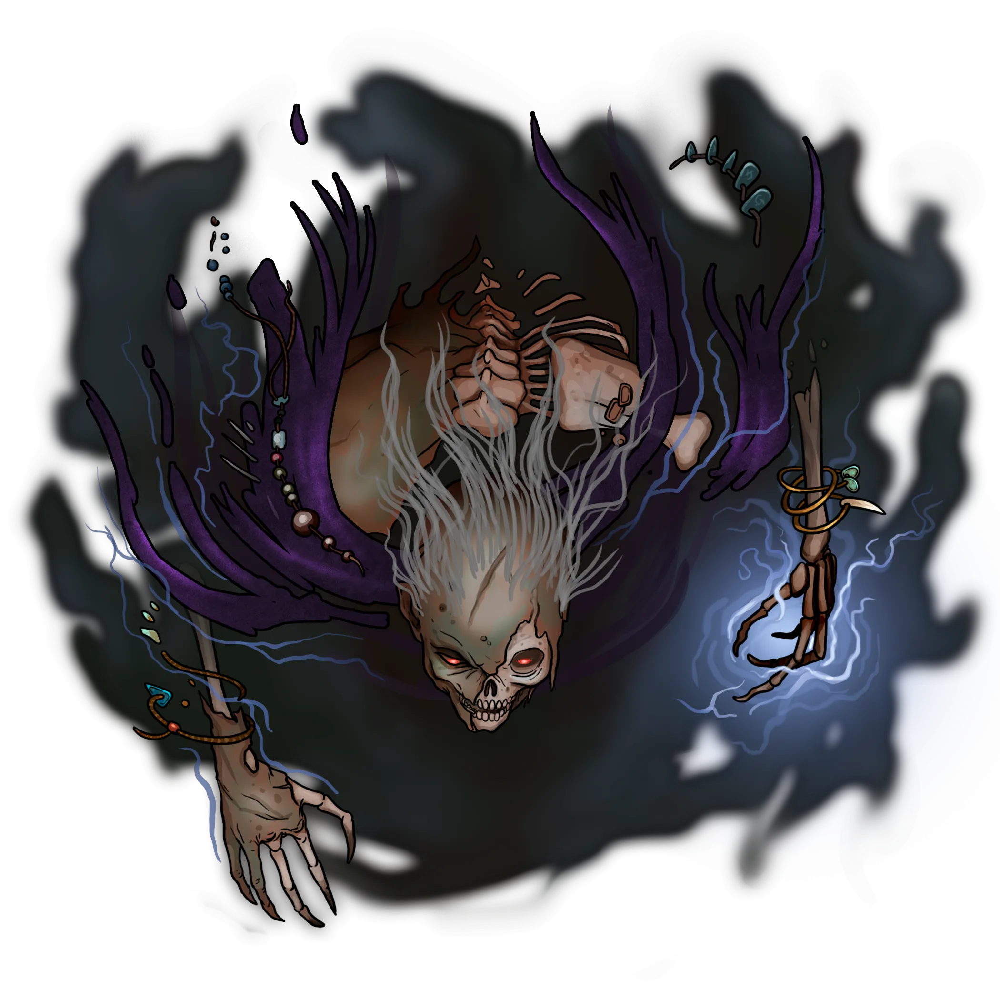

# True Vault

> [!quote] Read Aloud
> This large octagonal chamber is marked by a central platform surrounded by a ten-foot-wide bottomless pit. Upon this platform, a large figure cloaked in shadow appears to be caressing a statuette made of dark stone. A raspy femme voice thick with an unfamiliar accent cuts through the air like a blade made of grim whispers.
>
> > I've been waiting a very long time for you, my lambs. Welcome to the slaughter.

This area is the Bleak Archive's most hallowed repository. Before exploring it the party must survive combat with the wraithlike [[Varún]] warlock Tethra Shùl, the eldritch villain behind the accursed maladies in [[Skybrush]]. Combat with Tethra Shùl begins as soon as the players discover the room and hear the readaloud text above.

> [!abstract] Tethra Shùl
> **[[Tethra Shùl]]**
>
> Level 6 (Boss) · Wraith Necromancer
>
> 
>
> You see the umbral apparition of a long-dead giant clad in the ancient, esoteric robes of a soothsayer. Her rotten form is draped in ever-flowing shadow, and from the depths of her grim countenance shine two motes of eerie crimson light, unholy eyes which regard you with a cruel malice the likes of which you've never seen.

Read the following aloud at the start of Tethra Shùl's first turn:

> [!quote] Read Aloud
> The spectral giantess holds forth a dark wand, which resembles the large desiccated finger of some hideous otherworldly creature. An opalescent sheen shimmers across its dusky surface, and the wraith utters something beneath her breath … A plume of tenebrous vapor pours out of the hand before coalescing into the awful form of another dusk hound.
>
> > And now, a pet for you to play with, my precious things … Devour these tender morsels!

> [!danger] Hazard
> #### Tethra Shùl Tactics
>
> Upon her first turn of combat, Tethra Shùl uses the [[Finger of Nethehepticas]] to summon a [[Corrupted Cadrithor]].
>
> Throughout combat, Tethra Shùl will rely upon her [[Amorphous]] nature and [[Shadow Gait]] to navigate the battlefield with ease and avoid danger.
>
> On subsequent turns (after she summons the Corrupted Cadrithor) Tethra Shùl will rely upon the following Spells and Abilities:
>
> - [[Engulfing Darkness]] to deny visibility to the party and to take advantage of her own [[Gloom Sight]] talent.
> - [[Curse of Delusion]], and [[Curse of Atrophy]] to burden party members with difficult to overcome curses.
> - [[Finger of Nethehepticas]] to draw additional life from those she harms with magic, and she will ruthlessly Counterspell party attempts at magic if she is able.
>
> In addition to these abilities, Tethra Shul will utilize:
>
> - The [[Finger of Nethehepticas]] ability of the Finger of Nethehepticas.
> - Additional composed spells from the Death, Control, and Oblivion Runes as required.
>
> Tethra Shùl does not fear death and believes rather firmly that she cannot be defeated, and as a result her arrogance will encourage her to fight to the death. Perhaps justified by her nature as one of the [[Restless Dead]].
>
> #### Combat Taunts
>
> During combat, Tethra Shùl will taunt the party with a variety of threats and insults featured below.

> [!question] Q&A
> **Q:** When she casts a powerful spell:
>
> **A:**
>
> > Behold the horrors of Tethra Shùl, and embrace your unmaking!

> [!question] Q&A
> **Q:** A general threat:
>
> **A:**
>
> > Your cadavers will join me in this tomb, and your souls will succumb to the Bleak Seed. Till the ends of eternity.

> [!question] Q&A
> **Q:** If a character attacks Tethra Shùl with a nonmagical weapon:
>
> **A:**
>
> > Your pitiful weapons have no power here.

> [!question] Q&A
> **Q:** If one of the characters mentions the Night Terrors:
>
> **A:**
>
> > You were summoned to Ebbok Zùr by the whispers of our great and terrible master. I’m so glad you can hear them, my little lamb. Your destiny has been waiting for you … longing for you. And here you are.

> [!question] Q&A
> **Q:** If one of the characters is already attuned to the Abyss:
>
> **A:**
>
> > If you lay down to die in service of our master, I may spare your pitiful souls. But if you choose to fight, your false hope and primal fear will taste all the more succulent to my hounds.

Once Tethra Shùl has been defeated, read the following aloud:

> [!quote] Read Aloud
> With a shriek horrible enough to pierce the Weave, the wraithlike warlock is rent asunder. The two motes of crimson light that lurked inside her umbral eye sockets drift slowly to the ground, where they settle as bright gemstones next to her tattered robes and bony remains.
>
> Furthermore, the warlock's tenebrous wand sits beside her naked skull, which appears to seethe with latent eldritch magic. As you behold the warlock's worldly remains, you can almost hear her raspy voice taunting you from beyond the grave …

> [!tip] Exploration
> #### Treasures of Tethra Shùl
>
> The two motes of crimson light inside Tethra Shùl's umbral eye sockets slowly drift to the ground once she's slain, becoming a [[Gem of Illumination]] and an [[Unknown]].

> [!warning] Gamemaster
> #### "A Brush With Death" Quest Progression: Tethra Shùl's Remains
>
> If the party wishes to dispel the lingering effects of [[The Bewilderment]] in Skybrush, as encountered in the [[A Brush With Death]] Quest, Tethra Shùl's remains must be destroyed with brute force or consecrated by divine magic. Full details of this procedure are detailed in the [[Where Evil Lurks]] section of [[Where Evil Lurks]].
>
> Note that if her remains are not destroyed, the Abyssal magic that has corrupted the Bleak Archive will continue to seep necromantic energy into the nearby hinterlands of the [[Rustvar Valleys]] and [[Wedgelands]] peaks — and the cursed citizens of Skybrush will remain afflicted by the Bewilderment in the days, weeks, and months to come.

> [!info] Social
> #### Speaking with the Dead
>
> Should the party be brave or foolish enough to try to communicate with the dead using Tethra Shùl's remains, the former wraith has but one response:
>
> > A horrible, raspy voice seeps out of the wraith's loathsome skull.
> >
> > "I’m so glad you found a way to speak with me, my pretty little lamb. I’ve one last reminder for your sweet little head to ponder … there will never come a day when you do not live in fear of my enduring shadow, and the adumbration of my liege Nethehepticas — the Bleak Seed that grows even now within the naive confines of your fragile, mortal minds. Despair! And know that your souls will never be cleansed of this immortal stain. I have foreseen it … Or do you doubt the testament of Tethra Shùl?"
> >
> > The formless wraith laughs a terrible, tenebrous laugh as her voice trails off into oblivion.

## Relics of the Inner Sanctum

A few items of import are scattered throughout this chamber, the most notable of which — the Finger of Nethehepticas — has already been procured by Tethra Shùl for her own insidious purposes. The rest lurk in shadow, waiting to be discovered.

> [!tip] Exploration
> #### Eldritch Antiquities of the Abyss
>
> Plinths etched with runic Pathward markings line the chamber, bearing [[Shent]] relics of particular interest upon them. Any character who attempts to examine the various [[Bleak Archive Relic]] stored on these plinths can spend an Action to inspect one of the relics. These relics may include (listed clockwise from the retractable wall): Broken Mirror, Sundered Shield, Alloyed Spyglass, Druid's Mantle, Alloyed Scroll Tube, and Crystal Orb.
>
> #### Accursed Treasures
>
> Items stored in the True Vault are ancient relics that predate [[The Shattering]], from a time when [[The Abyss]] first began its incursions upon the face of Ember.
>
> Any character who makes a successful **Arcana (DC 13)** check while inspecting the items is able to confidently suspect that each of the Bleak Archive Relics here has been tainted by its presence in the Bleak Archive or by The Abyss itself, and is cursed with a tenebrous sickness of the endless void. Removing these items will likely come with a hidden price.
>
> #### The Finger of Nethehepticas
>
> The [[Finger of Nethehepticas]] also lies next to Tethra Shùl's remains, and the party must also decide whether or not to take possession of it. Their decision to loot this accursed relic will have a noteworthy effect on gameplay to come.
>
> Any character who makes a successful **Arcana (DC 13)** check is able to determine the magical nature of the Finger of Nethehepticas without the need for **Talent: Recognize Spellcraft**. They can tell it is clearly an item of great power and that it is accursed in nature, but the actual effects and properties of the curse remain inscrutable.
>
> - **Critical Success**: The character recognizes the Abyssal nature of the wand, but its properties remain inscrutable.
>
> Any character who succeeds on a **Society (DC 17)** check has heard a handful of legends and rumors regarding ancient artifacts crafted from the remains of godlike beings, and this strange eldritch relic seems a likely candidate.
>
> Alternatively, any character who succeeds on a **Wilderness (DC 15)** check is able to determine the otherworldly nature of the wand's origin, but its specifically Abyssal identity remains elusive.

> [!warning] Gamemaster
> #### "A Brush With Death" Quest Progression: The Finger of Nethehepticas
>
> The choice to take The Finger of Nethehepticas is one with consequence. If the party chooses to take it, consult the [[Where Evil Lurks]] section of [[Where Evil Lurks]] in the [[A Brush With Death]] Quest for the most immediate of those consequences.

## [[A Brush With Death]]
