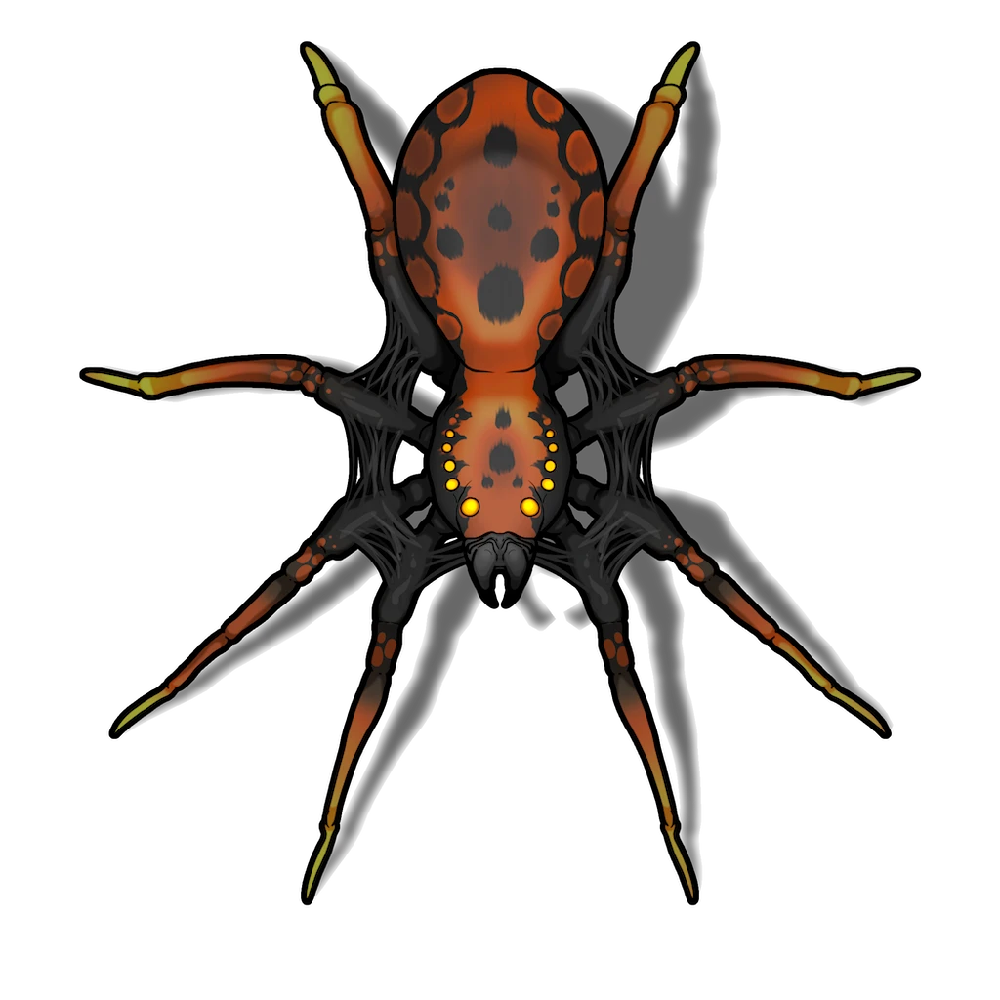

# Webbed Mausoleum

> [!quote] Read Aloud
> Dusty layers of crisscrossing spiderwebs diffuse the azure light of the arcane lantern that illuminates this irregular chamber, and you notice the distinct bulge of egg sacs scattered here and there throughout the viscid, semitranslucent lattice.

In this area, the party will traverse an aged mausoleum that has become the ersatz lair of a giant spider.

## The Arachnid Interloper

A devious [[Sitherian]] has taken residence in this irregularly-shaped chamber after discovering the [[Unknown]], and has managed to capture a handful of would-be tomb robbers throughout the years who crawled into its webs. The creature is initially hidden from view perched upon the ceiling and concealed among thick webs.

> [!danger] Hazard
> #### Navigating the Web
>
> Any character who moves throughout the webbed sections of the chamber will unavoidably make the Sitherian aware of their presence.
>
> Moreover, characters who move through the webbed area must face a **Entangling Webs (Hazard 6, Reflex, Morale, Harmless)** or become **Restrained** by the webbing.
>
> The restrained target can escape by making a successful **Athletics (DC 12)** check.
>
> The webbing can also be attacked and destroyed using Slashing weapons or fire.
>
> #### Lurking Danger
>
> The Sitherian will attempt to remain hidden from the party until one of them is caught in the nearby webbing or until all characters have crossed to a far end of the room. It lurks in the center of the chamber on the ceiling amidst webs, 30 feet above.
>
> Any character with **Awareness (DC 15, Passive)** is able to detect the Sitherian in its hiding place. Otherwise, the Sitherian benefits from surprise when attacking. Once the creature is detected, or once it chooses to attack the party, combat begins!

> [!abstract] Sitherian
> **[[Sitherian]]**
>
> Level 1 · Arachnid Sitherian
>
> 
>
> This large eight-legged creature boasts two fanged chelicerae that appear to drip a viscous green venom. Its ten reflective eyes regard you with a keen animal maliciousness as it crawls forth from its web-shrouded hiding place.

> [!danger] Hazard
> #### Sitherian Tactics
>
> Once combat begins, the Sitherian will immediately use its [[Web Spinner]] Action before engaging the character with the lowest Health in melee. The creature is relatively intelligent, using its [[Clinging Grip]] and the webbing throughout its lair to gain situational advantages against restrained characters.
>
> The creature has an instinct for self-preservation and will attempt to escape if **Broken** or **Weakened**.

After combat has concluded, the party may wish to investigate the area further.

> [!tip] Exploration
> #### Victims of the Venomous Steward
>
> The first four characters who attempt to search the corpses and egg sacs wrapped up in the webbing here can roll twice on the [[Corpse Loot]] table.
>
> Additionally, the first character to succeed on a **Awareness (DC 13)** check locates a [[Rallying Elixir]] concealed among the webbed detritus.
>
> Any character with **Awareness (DC 14, Passive)** check notices a concealed control lever covered in webbing upon the north wall of the room.

> [!warning] Gamemaster
> #### Retractable Column
>
> In order to progress the light beam from the mirror puzzle (described in [[Mirrors & Walls]]) through this section of the dungeon, the party must find and activate a hidden lever which causes pillars in this room to alternate in height.
