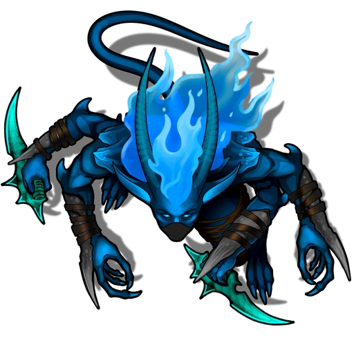

# Workshop

> [!quote] Read Aloud
> The chamber here seems to be some kind of study or storage room, as suggested by the expanse of shelves that line the western wall, along with another smaller shelf to the northeast — all of them stocked with a dusty array of books and jars full of dried goods. Most of the floor here appears to be made of glass, and the azure glow of Signara below shines up into the room through its pellucid surface.

This L-shaped corner chamber serves as Corvana Vortest's arcane workshop, and hosts three smaller rooms and a wedge-shaped storage closet within its walls. These smaller rooms include a front room stocked with tomes and components, a workstation equipped with esoteric accoutrements, and a forge fitted with an anvil and blacksmith's tools.

Once the characters open the doors to this area, they'll be attacked by a total of three [[Jahud Assassin]], one of which lurks unseen in the forge. Unfortunately for the jahud, the chamber's temporal trap has incapacitated them, and they remain in a state of suspended animation.

As with the [[Living Quarters]], the party's timely arrival to the chamber inadvertently deactivates the temporal trap, and releases the jahud — who leap into action and attack.

> [!tip] Exploration
> #### Opening the Energy Doors
>
> The two energy doors that lead to the Workshop are closed and locked, and can be opened via the following methods in addition to those described in [[Vortest Tower]].
>
> An exterior control panel is located on the rightmost column next to these doors, which features a luminous touch pad in the shape of a five-fingered humanoid hand. Any character who is an ally to Corvana Vortest, including the party members, can gain entry by placing their hand upon the touch pad and speaking the House Vortest creed as featured in the [[Tower Antechamber]]: "Enlightenment and Beyond.
>
> Any character who succeeds on an **Awareness (DC 14)** check while surveying the Workshop exterior is able to locate an extremely narrow flume on the rooftop above the forge that is large enough to allow a a size 2 or less creature to enter. Larger creatures cannot squeeze through this crack, but characters capable of some form of teleportation may be able to pass through it to the other side.
>
> #### Spotting the Assassins
>
> Any character who makes a successful **Awareness (DC 17)** check while peering through the lapis translucence of the closed energy door is able to notice 2 of the Jahud assassins lurking inside, who were attempting to furtively sneak through the front room when the temporal trap captured them. The 3rd jahud is well out of sight, and can only be perceived by supernatural means from outside the workshop.

> [!abstract] Jahud Assassin
> **[[Jahud Assassin]]**
>
> Level 5 · Jahud Assassin
>
> 
>
> A four-armed, blue-skinned cutthroat stands before you, armed with two viridian daggers and an array of bladed bracers crafted from dark gray bone. A black half-mask obscures most of the creature's face, exposing its pale blue eyes, a pair of wicked horns, and a mane of bright azure hair that roils like arcane fire. The rogue's strappy leather armor is wrapped tightly around its muscular flesh, and its shoulders boast overlapping plates of cerulean chitin like primeval pauldrons. A pointed tale lashes with ferocious cruelty behind this otherworldly menace, who looks ready to slay anything that moves.

> [!danger] Hazard
> #### Suspended Animation
>
> 3 [[Jahud Assassin]] lurk here, caught in a state of suspended animation caused by the magic of a temporal trap located in the Workshop. The trap has already been triggered and cannot be reset by the characters. 2 of these jahud are located in the front room of the workshop, while the other lurks unseen in the rearmost chamber near the forge.
>
> This state of suspended animation ends as soon as the doors to the chamber are opened, releasing the jahud — who emerge from the temporal suspension relatively ignorant of the reason for party's arrival, but generally aware of the threat they pose to the mission for [[Kerastes]].
>
> #### Jahud Tactics
>
> At the start of combat, both jahud will begin by targeting characters with their [[Plasma Ray]] attacks before closing in to engage the party in melee.
>
> Over the course of combat, the jahud will prioritize the following actions and abilities:
>
> - In melee, each Jahud makes use of its [[Signaran Dagger]] and [[Bladed Bracer]] attacks against an individual target until that target is rendered unconscious.
> - If one or more characters target the jahud from afar with ranged attacks, the jahud will attack the offending enemy characters with [[Plasma Ray]] before repositioning themselves to gain cover.
> - If a Jahud manages to break line of sight, it will try to activate its [[Natural Invisibility]] and position for a [[Backstab]]
>
> The jahud assassins will fight to the death in service of their interplanar mission for Kerastes, biologically programmed to continue their relentless pursuit of Corvana Vortest and the Orphic Reliquary.

> [!tip] Exploration
> #### Examining the Workshop
>
> Characters who take a moment to search the workshop will be able to discover the following:
>
> - The doors to the workstation and forge areas are unlocked.
> - The bookshelves in the front room are lined with a variety of encyclopedic tomes and dried goods. Any character who spends at least 5 minutes to search the shelves more extensively will find `[[/roll 2d2]]` books of lore related to [[Signara]] and the arcane.
> - The dried goods on the shelves in the front room include a variety of materials, including jars of desiccated insects, vials of granulated mineral ore, and everything in between.
> - The two desks in the workstation area are bedecked with several projects in various stages of examination or completion. The majority of these tools and components are inscrutable to anyone other than Corvana Vortest, but any character who spends a few moments to search the area finds a [[Repair Kit (smith)]] and a [[Terra Tree Leaves]] from the tree. After the leaves are harvested, it takes 30 days for them to regrow.
>   - **Knowledge: Plants**: The character gains **+2 Boons** on this check.
