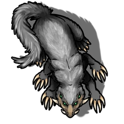

# Equipment Storage

> [!quote] Read Aloud
> The floor ahead of you is littered with damp crates, covered in a blanket of mold and dusty spiderwebs. A half-dozen tiny creatures skitter and scuffle across the floor between them, squeaking as they go. Catching sight of you, these six-legged rodents flee to the west, scampering into an alcove behind a curtain of overlapping cobwebs.

## Scurrying Critters

Before the characters have time to react, the 6 [[Crevvet]] located here scurry away into the [[Western Storage Alcove]], quickly disappearing from the party's view. The characters won't be able to interact with these creatures directly, but they have just enough time to catch a meaningful glimpse.

> [!abstract] Crevvet
> **[[Crevvet]]**
>
> Level 0.25 (Minion) · Rodent Crevvet
>
> 
>
> This tiny, six-legged rodent is covered in light gray fur and has four beady eyes the color of glittering emeralds. Its front limbs end in rather prodigious claws (especially for its size), which it apparently uses to burrow to and fro through the crumbling earth.

There are four separate alcoves within this larger storage area:

- [[Western Storage Alcove]]
- [[Center-West Storage Alcove]]
- [[Center-East Storage Alcove]]
- [[Eastern Storage Alcove]]
