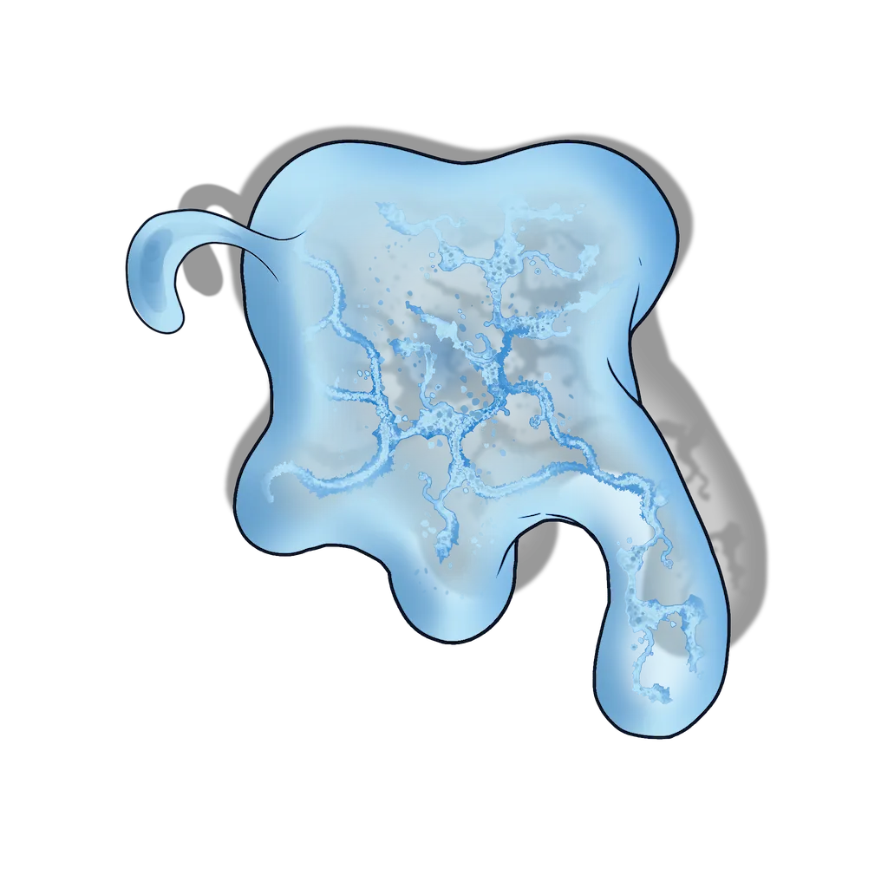

# Suarrok Nest

> [!quote] Read Aloud
> A large nest of straw, branches, and paper sits in the far corner, sparkling with the reflection of light on gem and glass and metal. The creature is nowhere to be seen, but it has not gone far. Just then, you hear a shrill cry as a shadow passes overhead, and you can even feel the breeze upon your face from the beating of massive wings.

The nest here is perched 40 feet above the surface of the [[Lookout Post]]. The party can carefully search for the missing [[Elevator Glyphstone]] in the suarrok's nest without calling attention to themselves.

> [!tip] Exploration
> #### Inspecting the Nest
>
> Any character who makes a successful **Wilderness (DC 13)** check identifies the nest as likely belonging to a suarrok; these creatures are known to tuck their treasures against the back wall of their nest, underneath piles of straw.
>
> Any character with **Awareness (DC 12, Passive)** can spot the glint of metal within the nest, and knows precisely where to search.
>
> #### Searching the Nest
>
> To adequately search the ramshackle nest, the party must sneak into the nest, locate the disc, and pull it out without attracting attention.
>
> If the party fails any of the following checks, the Suarrok Juvenile immediately notices them and lands, initiating combat.
>
> - To enter the nest without being detected, a character must make a successful**Stealth (DC 15)** check.
> - To find the disc, a character must make a successful **Awareness (DC 14)** check while searching the nest. This step can be bypassed if the party already knows precisely where it is from the previous check described in "Inspecting the Nest" above.
> - To remove the disc, a character must make a successful **Performance (DC 15)** check to remove it without disturbing other nearby items.
>
> Any character who takes the search action to survey the nest is able to find the following:
>
> - The [[Elevator Glyphstone]].
> - A shoddy [[Chain Mail]] covered in moss and mildew.

## Fighting the Suarrok

If at any time while exploring the Lookout Post the party makes loud noise or is detected while investigating the suarrok nest, the creature itself swoops down and attacks.

> [!abstract] Suarrok Juvenile
> **[[Suarrok Juvenile]]**
>
> Level 4 (Elite) · Winged Terror Suarrok
>
> 
>
> This creature is an unsettling thing, a strange mixture of bird and lizard, with massive, bat-like wings fringed with trailing feathers. A long, sinuous neck that coils and moves like a serpent holds a massive head with menacing, serrated beak that's perfectly designed for tearing through flesh. On this head rests a single, enormous eye that glows ominously, and as its gaze sweeps over you, a wash of stinging heat can be felt.

> [!danger] Hazard
> #### Suarrok Juvenile Tactics
>
> At the start of combat, the Suarrok Juvenile will use its [[Searing Stare]] to inflict the most threatening enemy with the **Broken** condition.
>
> Over the course of combat, the Suarrok Juvenile will prioritize the following actions and abilities:
>
> - In melee, the Suarrok Juvenile will use its [[Swooping Strike]] and [[Raking Talons]] actions.
> - The Suarrok Juvenile uses its [[Elusive Flight]] talent to make hit-and-run attacks.
>
> The Suarrok Juvenile will fight aggressively until **Broken**, at which point it will attempt to flee toward the distant clouds. If it escapes, combat ends and the creature does not return until the following day.
