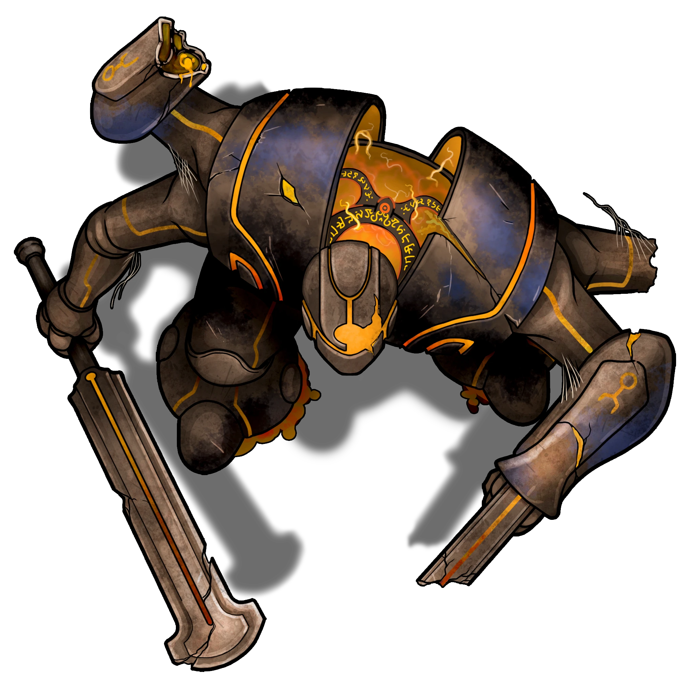

# Underforge

> [!quote] Read Aloud
> A large metallic humanoid stands in the center of the room, and the room is filled with large metal vats. Several have begun to leak fluid, creating patches of bubbling liquid. As you enter the room from the staircase, the metal figure jerks as if startling to life, and the orange fluid within its body begins to glow.

The humanoid is a Broken Aedir Sentinel. Though it is partially destroyed, it maintains and adheres strictly to its designated instructions of defending the Underforge and defeating any who enter.

> [!abstract] Broken Aedir Sentinel
> **[[Broken Aedir Sentinel]]**
>
> Level 4 (Boss) · War Machine Aedir Sentinel
>
> 
>
> This large metal creature once had four arms, but two have eroded, leaving them as crumbling stumps. The remaining arms hold a broad swordlike weapons, one whole and one broken, Both swat at the air in front of the creature as it staggers forward., leaking viscous orange fluid from within its body with every shaky step.

> [!danger] Hazard
> #### Broken Aedir Sentinel Tactics
>
> The [[Broken Aedir Sentinel]] uses its Focus to fuel three abilities: [[Powered Spin]], [[Enhanced Shielding]], and [[Self-Repair]].
>
> When its Focus is expended, the Broken Aedir Construct will attempt to move to a Recharge Station and use its [[Alchemical Recharge]].
>
> At the start of combat, the Broken Aedir Construct will engage as many enemies as possible and use its [[Powered Spin]] action.
>
> Over the course of combat, the Broken Aedir Construct will prioritize the following actions and abilities:
>
> - In melee, the Broken Aedir Construct will use its [[Greatsword]] if its Focus is 0. Otherwise, it will use its [[Powered Spin]] action.
> - Whenever able, the Broken Aedir Construct will use its [[Enhanced Shielding]] to protect itself.
> - When the Broken Aedir Construct is **Weakened**, it will use its [[Self-Repair]] action.
>
> The battle ends when the construct is destroyed.

The spills on the floor of Construct Fluid have no effect on the Sentinel, but pose a hazard to the party, as noted below.

> [!danger] Hazard
> #### Caustic Spill
>
> Any character who passes through a pool of construct fluid must make a **Athletics (DC 13)** check to avoid getting some on their feet or clothing.
>
> Those who fail become coated in the slick and caustic substance. If such a character moves more than half their speed on their turn or as a single action, they immediately slip and fall **Prone**. To remove the viscous coating from equipment requires spending 1 minute cleaning and is impractical to do within the context of a Combat encounter.

The party can eliminate the construct's access to Alchemical Fluid by turning off the valves at each of the [[Recharge Stations]].

> [!tip] Exploration
> #### Cutting Off the Supply
>
> If the party can reach the valves located at each of the alchemical recharge stations in the room, they can turn them off, giving the construct no way to recharge.
>
> To find the valves before they are used by the construct, characters must make a successful **Awareness (DC 15)** check.
>
> - **Sketch of Underforge:** The character automatically succeeds on this check if they studied the sketch of the Underforge found in Remel's Room.
> - **Translated Reminder Notes:** The character gains **+2 Boons** on this check if they translated Golarne's reminder notes found in the Basement.
>
> Once one valve has been located or once they have witnessed the Sentinel using one of the charging stations first-hand, they can locate other valves without a check.
>
> Turning the valves requires a successful **Athletics (DC 13)** check. However, the valves are heated — see the hazard block below.
>
> Once a valve is turned off, the recharge stations on that side of the room are no longer supplied with fluid.

> [!danger] Hazard
> #### Heated Valves
>
> If a valve is touched without protective equipment (for example, thick gloves), the character who turns it must make a successful **Athletics (DC 13)** check or suffer a **Minor Steam Burn (Hazard 4, Fortitude, Health)**.

Once the construct has been defeated, the party can explore the rest of the room.

> [!quote] Read Aloud
> The puddles of orange alchemical fluid soaking into the ground have only gotten deeper over the course of the battle, slowly seeping their way into the groundwater and down to Yakoshta Mine. Collecting a sample would be easy here, but stopping the leak as the miners requested is a job for more than a mop and broom. The parts, labor, and understanding of ancient Aedir mechanisms that would be required to fully repair the leak make repair seem prohibitively difficult — some other way to address the leaking fluid will need to be found if the miners' troubles are to be solved.

> [!warning] Gamemaster
> #### Quest Event
>
> For details on cleaning, decontaminating, or collecting samples from the tower, refer to the "Resolving the Contamination" section of the [[Traversing the Tower]] Event.
