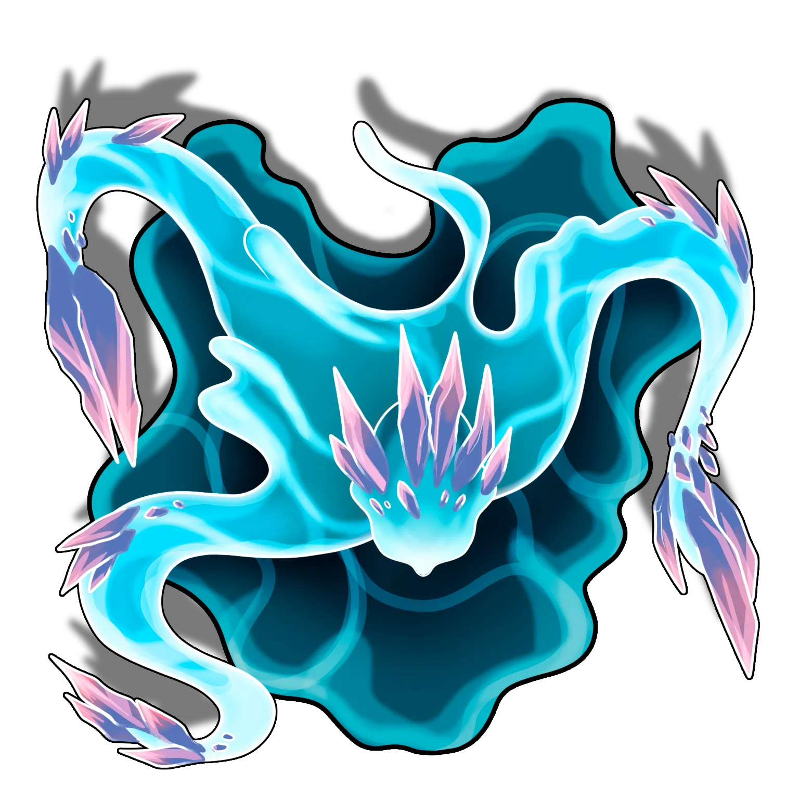

# Temple Interior

> [!warning] Gamemaster
> #### Encounter Overview
>
> There is a major encounter with the [[Temple Invader]] that takes place in this area, designed to occur in two phases.
>
> #### Phase One
>
> The first phase is a trial of endurance. The Temple Invader begins combat shielded from all harm by a protective barrier that is powered by six elemental orbs. The Temple Invader will deplete one orb every round of combat in order to empower dangerous abilities which threaten the party while the creature itself remains invulnerable. Assuming the Temple Invader depletes one orb every round of combat, this phase should last 6 rounds.
>
> #### Phase Two
>
> The second phase of the fight begins once the Temple Invader depletes the sixth and final orb, causing its protective shield to disperse. This allows the Temple Invader to join the battle directly, but also leaves it vulnerable to harm. It is also at the beginning of this phase that the [[Fulgurite Blades]] arrive to join the battle as impromptu allies of the party.
>
> #### Summoning Elementals
>
> During both phases, the Temple Invader relies on the ability to summon additional elementals into the arena, conjuring either a [[Water Sprite]] or a [[Water Visitor]].
>
> #### Water Temple Interactivity
>
> Each time the Temple Invader uses its [[Elemental Surge]] action, one of the six overhead elemental orbs is depleted, resulting in its visual removal from the Scene. After the sixth and final orb is depleted, the shield effect protecting the Temple Invader from harm becomes automatically deactivated.
>
> If you need to manually control the number of elemental orbs which remain in play, you can do so by interacting (using the ​ **Interaction Tool**) with the pedestal of the Lunarium in the center of the area. Note that the Temple Invader is formed around and on top of this pedestal, so it is not initially visible, but you can still interact with it by pressing the ALT key to display its ​ control icon.
>
> For more details on Interactable Objects and how they work, review the [[Area Maps]] section of the Player's Guide.

> [!quote] Read Aloud
> Inside the temple, a massive well of swirling water churns under a central platform; the water is propelled by a mass of gears and cogs that scythe around the central platform, a death trap. Flowing into the well at each of its corners are smaller basins of water, each fed from channels of water rushing from large fonts on the walls.
>
> Four bridges reach across the central basin to a slightly elevated platform surrounded by a glowing shell of energy being fed from unstable swirls and beams of energy which originate from a massive, clattering array of machinery overhead.
>
> Six orbs race around the temple interior on rails, propelled by machinery with an unknown power source. Above it all, a flickering, half-realized projection of Ember and its cosmos hangs in the air. The projection flickers in and out of view, as the majority of the energy meant for it is being siphoned into the shield formed around the elemental on the central platform.

## The Temple Invader

The large elemental in the center of the area has no name other than the "Temple Invader," and is an elementally overcharged variant of a [[Water Wanderer]].

> [!abstract] Temple Invader
> **[[Temple Invader]]**
>
> Level 3 (Boss) · Frost Elemental Elemental Wanderer
>
> 
>
> Towering over its peers, and even that of lesser wanderers, this invader's form is both graceful and intimidating. Enhanced by energy flowing through an ancient stone machine, this elemental appears much more powerful and cunning than most. Its movements are fluid and deliberate, exuding an air of lethal precision and purpose.

It is reinforced by the presence of three lesser sprites who patrol about the area.

> [!abstract] Water Sprite
> **[[Water Sprite]]**
>
> Level 1 · Frost Elemental Elemental Sprite
>
> 
>
> This small, energetic elemental is a cohesive globule form with small orbiting teardrops of water that it seems to control. It is surprisingly agile, moving in quick bursts and leaps that are graceful yet unpredictable. They shimmer with an inner luminescence that gives them an almost ethereal appearance, and they are constantly in motion.

The elementals are hostile toward any intruders. They automatically notice the opening of temple doors — however, they may not notice the party immediately if every character makes a successful **Stealth (DC 15)**check. If any character in the party is detected, combat begins immediately.

> [!danger] Hazard
> #### Temple Invader Tactics (Phase One)
>
> The [[Temple Invader]] is aggressive in its desire to protect its domain and hoard the elemental energy that coalesces here. It is sealed, however, behind its [[Impenetrable Shield]]. While shielded, it is immune to all damage types except **Psychic** or **Void** and has a significant bonus to its **Physical Defense**. During this phase, the Invader is **Restrained** and cannot attack normally; instead it can perform only the limited set of actions described below.
>
> The Invader will begin each turn by drawing upon the power of an elemental orb using **Deplete Orb**. Each usage destroys one of the orbs, but immediately grants the Invader a point of **Heroism** which it can expend in one of the following ways:
>
> - **Tidal Wave** to push characters out of the temple or slam them against obstacles.
> - **Freezing Fog** to slow characters' movement and make them more vulnerable to attack.
> - **Summon Visitor** to conjure a powerful [[Water Visitor]] servant.
>
> The Invader will prioritize summoning a Water Visitor — however, it can only have one such elemental summoned at a given time. Once a Water Visitor is already present, the Invader will also use **Summon Sprite** to conjure a lesser minion.
>
> #### Water Sprite Tactics
>
> [[Water Sprite]] are weak, but numerous and single-minded in their search for nearby targets.
>
> - Sprites use **Aqueous Transmission** to quickly relocate into position to Strike.
> - Sprites spend remaining focus on **Fan of Frost** if multiple targets are adjacent.
>
> #### Water Visitor Tactics
>
> [[Water Visitor]] are smarter, tougher, and more dangerous elementals than their lesser sprite kin. They have a stronger grasp of combat tactics, using sprites as a frontline screen while attacking from a distance.
>
> - Visitors prefer to maintain distance and Strike from afar using [[Frigid Projection]].
> - Visitors can empower their Cold damage using **Aspect of Frost**.
> - They will protectively use **Aqueous Transmission** to reposition, taking advantage of opportunities to flank enemies or elude attackers.
> - Visitors spend remaining focus on **Fan of Frost** if multiple targets are adjacent.

Once the Invader has depleted the sixth and final elemental orb, narrate the following development:

> [!quote] Read Aloud
> The whole structure shudders as vibrations travel through the floor and walls of the temple from the dying machine. The screeching, roaring sound of the machine coming to a halt is terrible but brief, and leaves your ears ringing.
>
> On the central platform over the well itself, the shimmering shield loses cohesion and comes apart, the strands of magical energy vaporizing like mist in the air.
>
> The elemental in the center of the platform writhes in an abstract expression of anger and rears upwards, swelling to fill the space with a mass of frigid malice.

## Fulgurite Arrival

Before the beginning of the next combat round, introduce the sudden arrival of the [[Fulgurite Blades]] who join the battle as impromptu allies of the party.

> [!quote] Read Aloud
> As you brace for the impending attack of the now liberated and palpably enraged elemental, the far doors of the temple grind open, drawing the attention of both elemental and heroes alike.
>
> A group of well-armed figures come charging up the steps into the temple and you immediately recognize the familiar faces of the "Fulgurite Blades". Their leader, Sajor, spots you and calls out:
>
> > Well, well, look who it is! Looks like you owe Kazra a silver, Leeph.
>
> Kazra pipes up:
>
> > I figured they would beat us here. I'll collect after the fight. Be careful, I'll do my best to keep you alive, but I can't be everywhere, and my magic isn't bottomless.
>
> Rorhim grins as he hefts the great sword in his hands.
>
> > You heard the priestess, we can't all be reckless fools. Some of us will have to pretend like we're competent!
>
> Enraged by the appearance of yet more interlopers, the large elemental undulates with what can only be rage, its form frothing and foaming as it surges forward.

Add all four of the Fulgurite Blades to the Combat encounter and to initiative order.

> [!abstract] Sajor Velex
> **[[Sajor Velex]]**
>
> Level 4 · Nir'ae War Mage
>
> 
>
> A bright-eyed woman stands before you with a curious expression, yet the corners of her mouth are turned downwards, as if she is slightly displeased with your presence. She has short black hair with a shock of white at the front, two large downwards-facing ears, and dark olive skin marked with vivid glittering patterns that signify she is either a descendant or a full Nir'ae herself.

> [!abstract] Rorhim Iron-Cask
> **[[Rorhim Iron-Cask]]**
>
> Level 2 · Cor'ak Fighter
>
> 
>
> A burly figure, tall even for Cor'ak, with a thick hornplate above his head and skin in varying shades of tan and brown. His bright blue eyes take in his surroundings with a noticeable lack of interest. He is clearly a warrior of considerable power, given the presence of an oversized sword slung across his back, an accompanying shortsword on his hip, and heavy armor strapped around his stocky frame.

> [!abstract] Kazra Steelshift
> **[[Kazra Steelshift]]**
>
> Level 2 · Kivahr Priest
>
> 
>
> Hooded and wrapped in a vibrant, shimmering shawl, this young Kivahr woman is initially slightly imposing, but her bookish demeanor and obvious curiosity about your presence reveal a true scholar at heart. Looking at the robes and symbols draped across the well-made chain mail armor, she confidently displays her devotion to the Goddess of Magic, Spectra, and appears to be a fanatic member of the Sect of Arcvold. She holds a mace in one hand and keeps her large pack at her side steady, which appears to be bulging with scrolls, tomes, and journals that she carries with her and studies while adventuring.

> [!abstract] Leeph
> **[[Leeph]]**
>
> Level 2 · Thornling Thief
>
> 
>
> A fidgety little radish-looking Thornling with eyes of shimmering pearlescence looks up at you with an unreadable expression. Their overly large leaves like fronds of hair, sweep back from their head, which they are constantly smoothing backwards to no effect, as if trying to calm themselves. They seem to be a restless ball of energy in all other respects, and even when standing still, their hands and eyes dart about in search of something to keep them occupied. They are clad in dark leathers over the top of their thorny barkskin, with a short-sword that appears to be nothing but a large dagger to anyone else hanging at thier side.

With the Temple Invader now free of its shielded enclosure, the battle escalates towards its climax.

> [!danger] Hazard
> #### Temple Invader Tactics (Phase 2)
>
> In the second phase of the battle, the Temple Invader is liberated to engage directly in combat. The Temple Invader will spend any remaining Heroism on the actions described during Phase 1.
>
> - The Invader uses **Aspect of Frost** to increase its own damage-dealing potential and **Aqueous Transmission** to efficiently traverse the battlefield where it can Strike interchangeably from distance or melee.
> - The Invader will continue to use **Summon Sprite** whenever its current minion expires or perishes.
> - The Invader can cast dangerous spells, using **Icy Strike** and **Pulse of Frost** to threaten nearby foes.
>
> The Temple Invader is drunk upon the elemental energy that it has feasted upon for centuries. It craves nothing except the continued torrent of that power. It has no concern for self-preservation and will fight on even if **Broken**.
>
> #### Sajor Tactics
>
> Sajor is the leader of the Fulgurite Blades. She is a capable spellcaster and tactically shrewd, making intelligent choices about which spells will most benefit herself or her allies.
>
> - Sajor will rely primarily on the Arrow gesture, hurling **Arrow of Flame** and **Voltaic Arrow** from afar.
> - If threatened in melee, she can use **Repellent Fan of Flame** to knock multiple adversaries backwards or **Voltaic Step** to escape from harm.
> - Sajor does not know the Rune of Frost, but nevertheless as a War Mage she may attempt to **Counterspell** the Invader if it attempts a dangerous spell.
>
> #### Fulgurite Tactics
>
> The other members of the Fulgurite Blades employ effective teamwork, with each member specializing in different areas.
>
> - Rorhim will wade fearlessly into harm, making active use of **Defend**, **Leg Sweep**, and **Counter Strike**.
> - Kazra will focus on sustaining the resources of her allies using restorative spells like **Ray of Life** and **Soulful Influence**.
> - Leeph will maneuver into advantageous positions, using **Pinning Shot** to hinder foes and **Backstab** to eliminate vulnerable targets.
>
> The Fulgurites will do their best to assist the party and keep them alive, though not at the total expense of their own safety.

## After the Battle

Shortly after the conclusion of the battle, before the party or the Fulgurites have time to begin debriefing or investigating the area, an ancient apparition appears to acknowledge their achievement.

> [!warning] Gamemaster
> #### Mioroth's Appearance
>
> Return to the [[Lunar Awakenings]] section in the [[Lunar Awakenings]] Event and engage in this follow-up social encounter before continuing with other exploration.

After the party has met and conversed with Mioroth, they are free to further investigate the temple. These details are presented in the following page, the [[Central Lunarium]].
