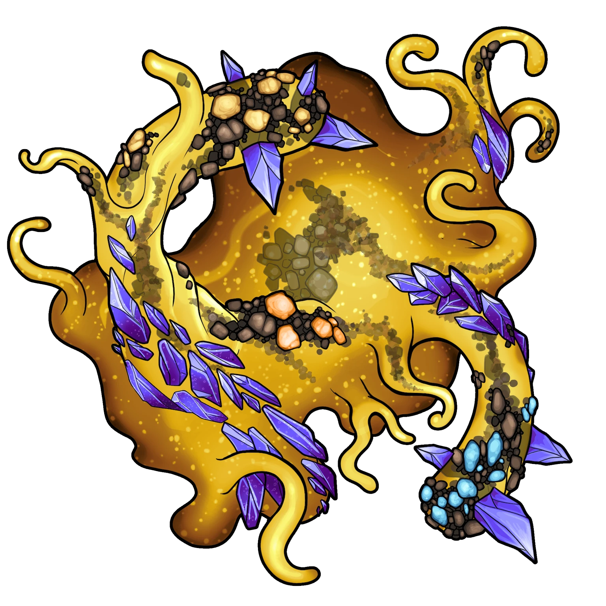

# Excavation Pit

> [!quote] Read Aloud
> A mammoth ooze, bigger than any that you've previously encountered, sits in the center of the railroad track. Nearby, a cart filled with ore is overturned and the walls are cracked with damage — though whether from the creature or the recent earthquake is unclear.
>
> The ooze feasts hungrily upon the unrefined ore spilled from the cart, gathering chunks in with pseudopods that are lined with crystalline spikes. As it gluts itself upon metallic morsels, it pulses and engorges, growing larger in size!
>
> In the distant corner of the room, you see the small hunched shape of a lone miner with their back pressed against the far western wall of the cavern. The figure meets your eyes and wordlessly gestures, exuding an obvious sense of panic.

## Ooze Go Boom!

If the party has enacted a plan to make the [[Ooze Go Boom]], this is the moment to bring that plan to fruition. If the mine cart is successfully laden with explosives, the ooze will hungrily latch upon it and begin feasting — exposing itself fully to the earth-shattering detonation which soon follows.

> [!danger] Hazard
> #### Oozesplosion!
>
> The [[Barrel of Blast Powder]] explodes in a 15-foot radius, requiring any creature in the area to make a**Athletics (DC 17)** check or get caught in **The Explosion (Hazard 60, Fortitude, Health, Fire)**
>
> Any creature within a 40-foot radius of the blast are **Deafened** for 1 hour.
>
> Unless he is already Incapacitated, [[Jasper]] sees the cart coming and successfully dives for cover.

## Ooze Onslaught

Otherwise, as soon as the party enters the Excavation Pit from any direction, they immediately encounter a giant ooze which becomes aware of them and moves to attack!

> [!abstract] Giant Luminous Ooze
> **[[Giant Luminous Ooze]]**
>
> Level 3 (Boss) · Slime Metallic Ooze
>
> 
>
> This amorphous blob of glowing gold seems to have endless numbers of tentacles that shift in shape, size, and number, each studded with bits of metal and pieces of kaleidoscope crystal, their sharp edges catching and reflecting the light.

> [!danger] Hazard
> #### Giant Luminous Ooze Tactics
>
> The [[Giant Luminous Ooze]] begins combat near the northern edge of the room.
>
> At the start of combat, it will advance aggressively toward the party.
>
> Over the course of combat, the Giant Luminous Ooze will prioritize the following actions and abilities:
>
> - In melee, it will strike out with its [[Electrified Pseudopod]] attack whenever it is available.
> - Whenever able, it will use its [[Multiply]] and [[Subdivide]] talents to create copies of itself.
> - In melee, it will use its [[Bewildering Gleam]] action to Disorient enemies.
> - When struck in melee, it will use its [[Magnetic Disarm]] and [[Corrode Weapon]] talents to disarm enemies and reduce the quality of their weapons.
>
> The battle ends when the Giant Luminous Ooze is destroyed.

> [!warning] Gamemaster
> #### Managing the Battle
>
> Because of the giant ooze's ability to gain size and subdivide into smaller threatening parts, the longer this fight goes on, the more likely it is to turn against a low-level party.
>
> If the tide of battle starts turning against the heroes, Jasper will yell and distract the ooze to temporarily gain its attention. He may suggest that the party retreat and get explosives to deal with the ooze instead of taking it on in direct combat.

## Aftermath

> [!abstract] Jasper
> **[[Jasper]]**
>
> Level 1 · Hulg'run Operator
>
> 
>
> The hulg'run man steps carefully, as if he is assessing everything around him with sharp eyes and careful determination. He wears a slight scowl on his face, as if he is above whatever is around him, but the severity of his expression is somewhat undercut by the brilliance of the gems embedded in his face, arms, and legs, which have been carefully polished to a sparkling shine.

After the battle, Jasper briefly steps forward to talk, as described in [[Saving Jasper]]. After a brief exchange, Jasper directs the party to meet him back in Yakoshta to speak further.

> [!tip] Exploration
> #### Clearing the Exit
>
> The back exit to the excavation pit leads back to Yakoshta, but is currently blocked by rubble. The characters can clear it by using the [[Barrel of Blast Powder]] found in the [[Supply Cache]]. If the characters clear the rubble, Jasper thanks the characters for their unexpected help and rewards them with  **25** upon their return to Yakoshta.
>
> Alternatively, the characters can simply backtrack through the mine and exit from the [[Loading Zone]].
