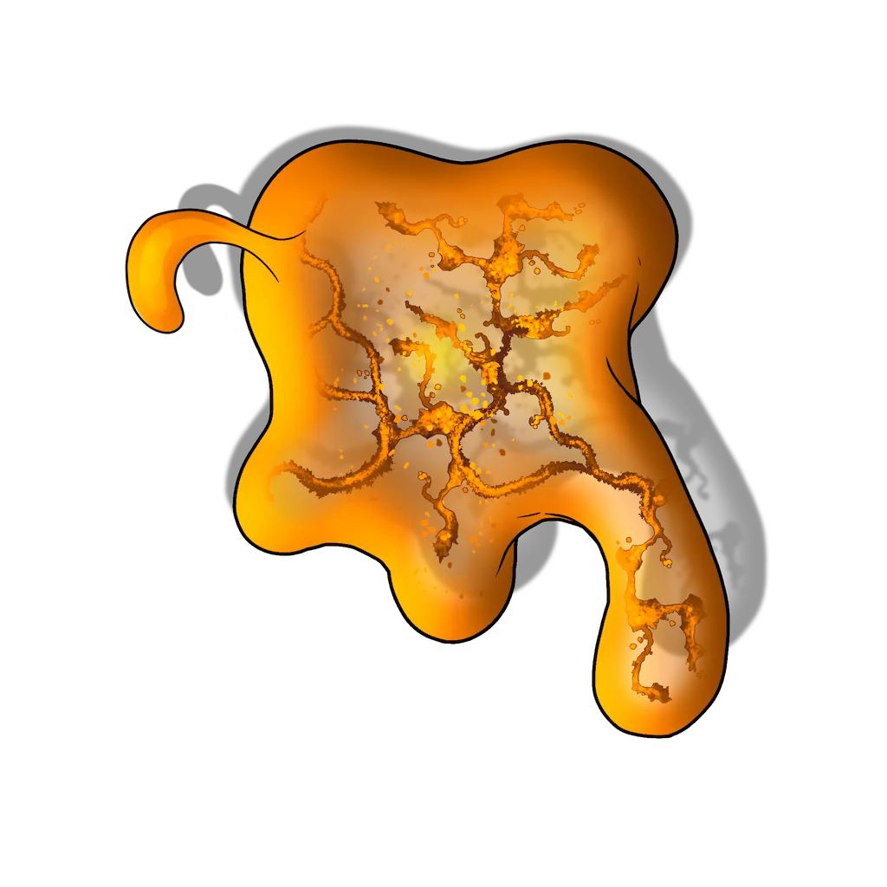
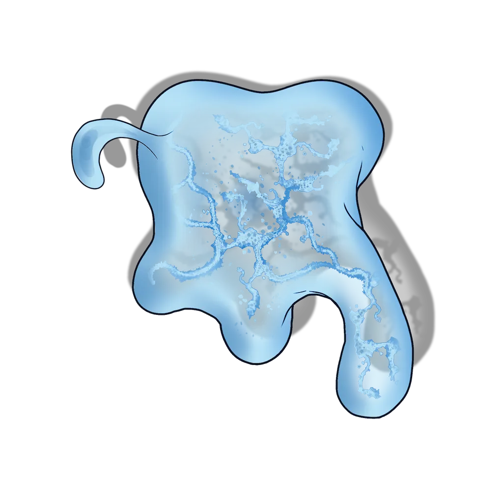
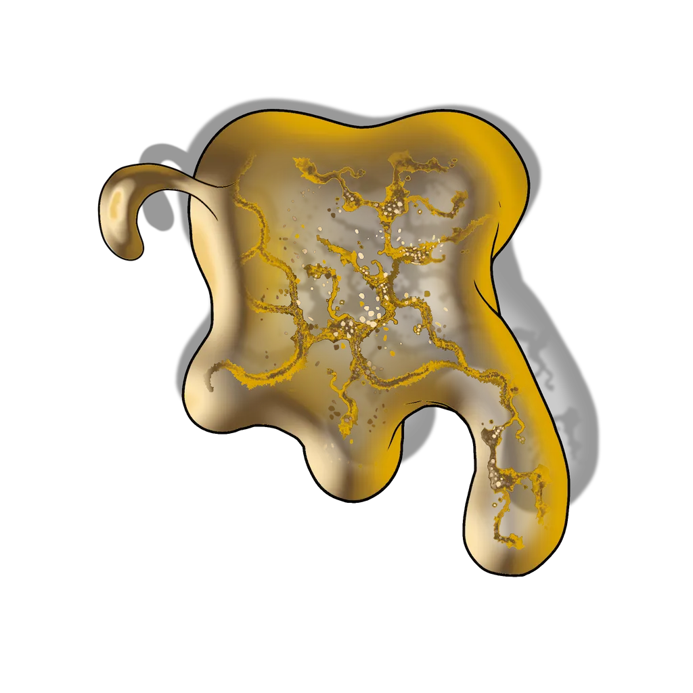

# Glowing Ore Pit

> [!quote] Read Aloud
> The steady sound of dripping echoes through the cavern, as a glowing orange liquid drips from the top corner of one of the stone walls onto a large puddle on an overlook in the corner. Some of the liquid has begun to slowly leak down into the floor of the pit, where two oozes that glow with the same intensity battle a group of rat-like creatures who slip in and out of a crevice in the wall.
>
> When one of the small creatures knocks a piece of kaleidoscope crystal from the wall near the crevice, it breaks. The oozes in the room momentarily pause in their attack and move toward the crystal, giving the rats a chance to dash into the walls and leaving you alone with the two glowing oozes.

The party can enter this pit of glowing ore from three possible directions:

- A ledge 15 feet above, reachable via the [[Cavern Bridge]].
- Ground level, reachable via the [[Blue Track]].
- A ladder up from the wooden platform at the south end of the [[Red Track]].

A [[Luminous Copper Ooze]] and a [[Luminous Iron Ooze]] occupy this chamber. They engage the party in combat as soon as they spot the characters.

## The Overlook

Unless they are directly attacked, the oozes do not notice the party while they are up on the ledge and they can move freely.

A dripping rivulet of pure contaminant can be found here.

> [!danger] Hazard
> #### Pure Contaminant
>
> The flow of contaminant glows orange and bubbles. Any character who makes a successful **Arcana (DC 13)** or **Wilderness (DC 13)** check while examining the contaminant can determine that the substance is not biological or magical — it is more akin to poison, though it appears viscous and rippling with some sort of contained energy.
>
> Anyone who touches the contaminant with their bare hands experiences **Electrochemical Shock (Hazard 6, Fortitude, Health, Electricity)** and is thrown back 10 feet (if this throws them off the ledge, they may take further fall damage and can trigger the ooze fight if the oozes are still present).
>
> The contaminant can be carefully collected in an appropriate container with a successful **Athletics (DC 13)** check; a failure results in contact with the contaminant, causing the effects described above.
>
> - **Kinetic Influence**: The character automatically succeeds on this check.
>
> Successful extraction of the fluid yields a single vial of [[Aedir Construct Fluid]].

## Ground Level

The two oozes will direct their limited attention to the crystal that's fallen here. Whenever a character moves more than 15 feet in a round, they must make a successful **Stealth (DC 12)** check — on a failure, the oozes become aware of the character and move to attack. A third ooze — a [[Luminous Gold Ooze]] — begins hidden in the Scene, and may be added to the combat at the Gamemaster's discretion at the beginning of the second round of combat.

> [!abstract] Luminous Copper Ooze
> **[[Luminous Copper Ooze]]**
>
> Level 0.5 · Slime Metallic Ooze
>
> 
>
> An amorphous slime of a creature slowly oozes forward, dragging bits of flaked copper and the occasional crystal within its gelatinous body. Though it seems formless as it moves, it reaches out in a long tentacle-like arm when confronted with a fight, readying itself to strike.

> [!danger] Hazard
> #### Luminous Copper Ooze Tactics
>
> The [[Luminous Copper Ooze]] begins combat near the fallen crystal.
>
> At the start of combat, it will advance aggressively toward the party.
>
> Over the course of combat, the Luminous Copper Ooze will prioritize the following actions and abilities:
>
> - In melee, the Luminous Copper Ooze will strike out with its [[Pseudopod]] attack.
> - When struck in combat with a metal melee weapon, the Luminous Copper Ooze can use its [[Corrode Weapon]] ability to degrade the weapon's quality.

> [!abstract] Luminous Iron Ooze
> **[[Luminous Iron Ooze]]**
>
> Level 1 · Slime Metallic Ooze
>
> 
>
> The viscous body of the luminous iron ooze is a silvery gray, filled with small fragments of metal and the occasional piece of glittering crystal. As it moves, its body shapes and reshapes itself, stretching and contracting in a viscous pool that extends a single gray-iron tentacle.

> [!danger] Hazard
> #### Luminous Iron Ooze Tactics
>
> The [[Luminous Iron Ooze]] begins combat near the fallen crystal.
>
> At the start of combat, it will advance aggressively toward the party.
>
> Over the course of combat, the Luminous Iron Ooze will prioritize the following actions and abilities:
>
> - In melee, the Luminous Iron Ooze will use its [[Pseudopod]] attack and [[Magnetic Disarm]] reaction to damage and disarm enemies.

> [!abstract] Luminous Gold Ooze
> **[[Luminous Gold Ooze]]**
>
> Level 3 · Slime Metallic Ooze
>
> 
>
> Like a puddle of congealing gold ore in motion, the creature elongates its gelatinous ooze of a body into a single slender viscous arm and pulling itself across the ground. Narrower and more willing to stretch than other luminous oozes, it moves more quickly than the average ooze as it moves in search of prey.

> [!danger] Hazard
> #### Luminous Gold Ooze Tactics
>
> The [[Luminous Gold Ooze]] begins combat inside the contaminant pool on the right side of the room; its Token begins hidden in the Scene, and can be revealed by toggling its visibility state from the Token HUD. This is an optional enemy you may deploy at the start of the second round of combat to increase the encounter's difficulty.
>
> At the start of combat, it advances aggressively toward the party.
>
> Over the course of combat, the Luminous Gold Ooze will prioritize the following actions and abilities:
>
> - In melee, the Luminous Gold Ooze will strike out with its [[Pseudopod]] attack.
> - Whenever able, the Luminous Gold Ooze will use its [[Multiply]] and [[Subdivide]] talents to create copies of itself.

A few small pieces of [[Kaleidoscope Crystal]] are located in this room and can be broken to use against the oozes, though doing so will trigger a [[Kaleidoscope Crystal Effects]].

## Contamination

After the battle, any party member can clearly see that the glowing contaminant is dripping down from somewhere above the mine and pooling in a corner of the room.

> [!tip] Exploration
> #### Identifying the Source
>
> Any character who makes a successful **Wilderness (DC 15)** or **Awareness (DC 15)**check can tell that the leak is coming through cracks in the rocks above the mine, but attempting to block a specific outlet is unlikely to be helpful. The leak must be stopped wherever the source is above.
>
> This contaminant is murkier than the pool on the ledge above or the contaminant dripping down, as it has mixed with the oozes, and only the combined [[Caustic Phial]] can be collected here.
