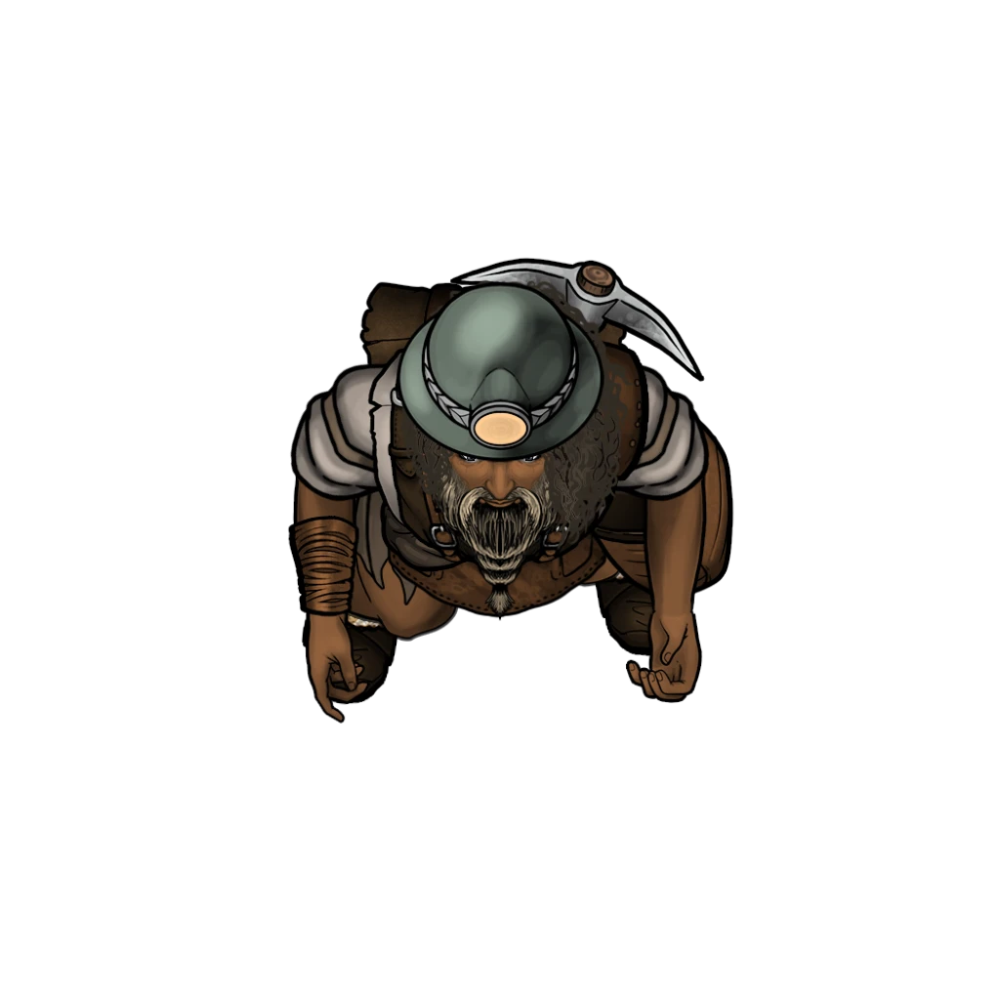

# Loading Zone

## Exploring the Mine

There are four exits from this cavern further into the mine, though not all are usable:

- A passageway leads into further tunnels towards [[Jasper's Office]]
- The upper (blue) mining track is destroyed and the gap cannot be traversed. For more, see [[Blue Track]].
- The lower (red) mining track has a mining cart on it and can be used with or without the cart. For more, see [[Red Track]].
- A bridge leads across to the Excavation Pit, but it has been severely damaged and leads to a rockfall on the other side. For more on player options, see [[Entrance Bridge]].

> [!quote] Read Aloud
> A mining cart has been toppled, spilling its metal ingots on the floor. Three miners are using the cart as an impromptu barricade, as glowing gold and silver oozes advance on them, slowly but relentlessly. As you enter, one of the miners calls out in your direction.
>
> > Sellen, is that you? You have to get us out of here!

Three [[Arcturian Miner]] — Shel, Trianda, and Gravin from [[Saving Jasper]] in [[Saving Jasper]] — are hiding behind the wagons in the corners of the room while a trio of oozes advance on their position.

> [!abstract] Luminous Silver Ooze
> **[[Luminous Silver Ooze]]**
>
> Level 2 · Slime Metallic Ooze
>
> 
>
> Light reflects from what one moment looks like a heap of silver coins and the next moment like a slowly pulsing silver ooze of a creature, with sparkles of light emanating from the bits of metal dust and crystal trapped within its gelatinous center. It shifts shape as it edges forward, crackling with static electricity as it extends a long piece of itself like an arm poised to strike.

> [!danger] Hazard
> #### Luminous Silver Ooze Tactics
>
> The 2 [[Luminous Silver Ooze]] begin combat near the beleaguered miners.
>
> At the start of combat, they advance aggressively toward the party, ignoring the lesser threat of the miners cowering in the corner.
>
> Over the course of combat, the Luminous Silver Oozes will prioritize the following actions and abilities:
>
> - In melee, the Luminous Silver Oozes will strike out with their [[Electrified Pseudopod]] whenever it is available.

> [!abstract] Luminous Gold Ooze
> **[[Luminous Gold Ooze]]**
>
> Level 3 · Slime Metallic Ooze
>
> 
>
> Like a puddle of congealing gold ore in motion, the creature elongates its gelatinous ooze of a body into a single slender viscous arm and pulling itself across the ground. Narrower and more willing to stretch than other luminous oozes, it moves more quickly than the average ooze as it moves in search of prey.

> [!danger] Hazard
> #### Luminous Gold Ooze Tactics
>
> The [[Luminous Gold Ooze]] begins combat near the beleaguered miners.
>
> At the start of combat, it advances aggressively toward the party, ignoring the lesser threat of the miners cowering in the corner.
>
> Over the course of combat, the Luminous Gold Ooze will prioritize the following actions and abilities:
>
> - In melee, the Luminous Gold Ooze will strike out with its [[Pseudopod]] attack.
> - Whenever able, the Luminous Gold Ooze will use its [[Multiply]] and [[Subdivide]] talents to create copies of itself.

> [!abstract] Arcturian Miner
> **[[Arcturian Miner]]**
>
> Level 0.5 (Minion) · Human Miner
>
> 
>
> This miner is covered in the dirt and dust of a hard shift pulling precious materials from the crust of Ember, and wear the protective gear and heavy tools necessary for the task.

> [!danger] Hazard
> #### Miners' Assistance
>
> At the start of combat, the Arcturian Miners are taking cover behind an impromptu barricade. They are not intended to be a part of initiative order, but can be added in as a group if the party needs additional support.
>
> Over the course of combat, the Arcturian Miners will prioritize the following actions and abilities:
>
> - From range, the Arcturian Miners will throw their [[Blast Flask]]; each Arcturian Miner is equipped with a single flask.

## After the Battle

> [!quote] Read Aloud
> The cavern is a mess, full of the aftermath of the battle — wood, metal, and ooze bits spread across the ground, which the surviving miners quickly begin working to set right. The cavern itself is large and open, with a silver symbol painted on one of the walls that vaguely resembles a mining cart.
>
> Archways from the cavern appear to lead deeper into the mine: toward a tunnel in one direction and a creaking bridge in the other. An empty mining cart sits on tracks that wind their way into the mine’s dimly lit depths, while a second set of tracks has been ravaged by someone or something — it is missing a large chunk of its tracks and there is no cart in sight.

> [!warning] Gamemaster
> #### Quest Progression
>
> Refer to the [[Saving Jasper]] section of [[Saving Jasper]] for conversation and information learned from surviving miners.
