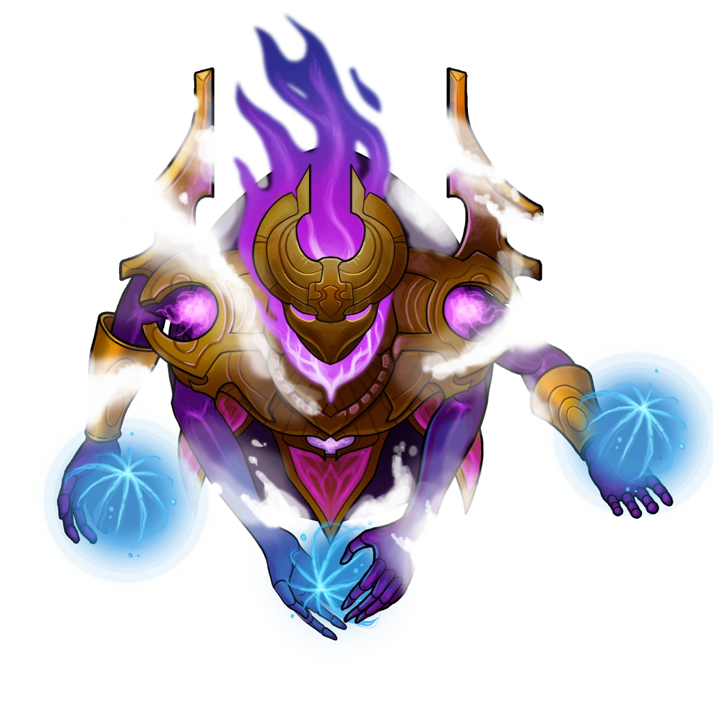

# Acid Challenge

> [!quote] Read Aloud
> The stench coming from the green glowing room ahead is as close to a putrid sulfur mixed with burning dead bodies as you could imagine, and the intense smell begins to burn your eyes and nose before you even enter the room itself. The centerpiece of the room is a massive pool of bubbling acid, its surface shimmering with a sickly green hue. The acid churns and bubbles ominously, sending up occasional wisps of thick gas into the surrounding air.
>
> Surrounding the pool are several platforms made of thick bronze grates and gears elevated above the acid by thick chain wire, strung taut across the gaps and fixed to the ceiling high above.

> [!tip] Exploration
> #### Gem of Curiosity
>
> Under and above the central bronze platform is a circular mechanism that surrounds four bronze arms that carefully hold a large purple gemstone. The colour of the stone is almost completely washed away by the glow coming from the acid, but it remains a tempting target.
>
> Investigating the gem with a `[[/check inv 18]]` check reveals that there is a mechanism under the gem linked to the bronze arms and that triggering something unknown. Only a successful `[[/check slt 20]]` can safely remove the gem without triggering the trap.
>
> If a character casts [[Detect Magic]] and or rolls a `[[/check arcana 17]]`, they discover that the gemstone is linked to hidden arcane runes that are hidden upon the walls. The runes are not decipherable, but anyone with **Knowledge: Rituals** knows that the runes are likely summoning magic.

> [!danger] Hazard
> #### Acid Basin
>
> The pit in this room is 15 feet deep, but 5 feet of its depth contains a violent, intensely glowing green acid, so it appears to be 10 feet deep from above.
>
> Any character who falls into the pit suffers `[[/damage 3d10 acid]]` damage. The acid also counts as difficult terrain if anyone tries to swim or move through it. Characters who find themselves within the pit during combat take an additional `[[/damage 3d10 acid]]` damage each turn they stay in the acid.
>
> Characters can attempt to climb out of the pit with a `[[/check acr 13]]` check. If they fail a check outside of combat, they slip back into the acid and take a further `[[/damage 3d10 acid]]` damage for each attempt.

## Shades of Agaseros

The Shades of Agageros in the room do not technically exist until the party attempts to remove the gem from the central platform. If they decide not to mess with the gem, then the Shades do not appear at all.

> [!abstract] Shade of Agaseros
> **[[Shade of Agaseros]]**
>
> Level 1 · Unknown Unknown
>
> 

> [!warning] Gamemaster
> #### Interactivity
>
> During the fight, the Shades can attempt to unpin the wires holding the four platforms along the walls of the Acid Challenge room. This is controlled by the GM during combat, one per round by rolling a public `[[/roll 1d20]]` and on the result of a 15+ reading the following:
>
> One of the Shades seems to flick the wrist of one of its arms at the wires holding the platforms up. With a loud, cracking sound or metal snapping and shearing, the wire breaks free and the platform collapses into the acid with a heavy splash.
>
> Anyone on the platform that is falling can roll a `[[/check acr 16]]` to jump out of the way and try to land on another platform or reach one of the edges. You can choose a platform at random, or specifically choose to target the platforms holding the PC's.

> [!danger] Hazard
> #### Shades of Agaseros **Tactics**
>
> The Shades are effectively manifestations of the Chamber itself, and they do have a simple kind of intelligence. This means that during combat they recognize that the party members are here to be tested, and killing them is not part of the test (at least most of the time).
>
> Their simple intelligence allows them to target weaker members of the group; however, such as the ones healing or when casting spells, they might target the characters with low resistance ability scores like wisdom. In this combat encounter, they use [[Arcane Beam]] the most and try to move around the room, floating above the acid.
>
> If they are in melee range with a party members, the Shade will move away regardless of attacks of opportunity. Once a Shade is defeated, it disappears and does not leave a body to investigate or study.
