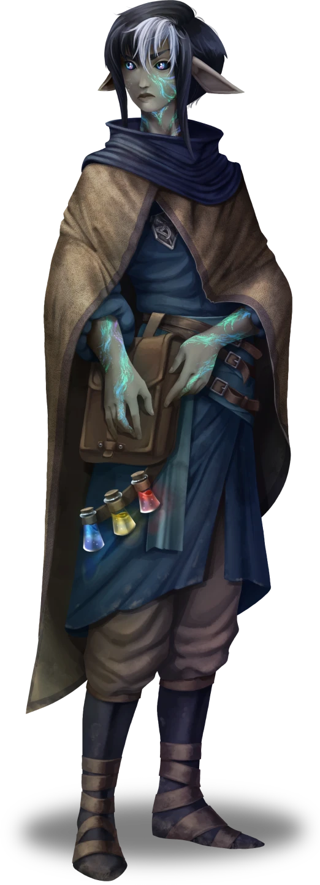
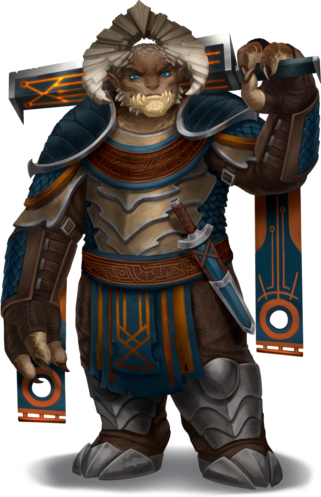
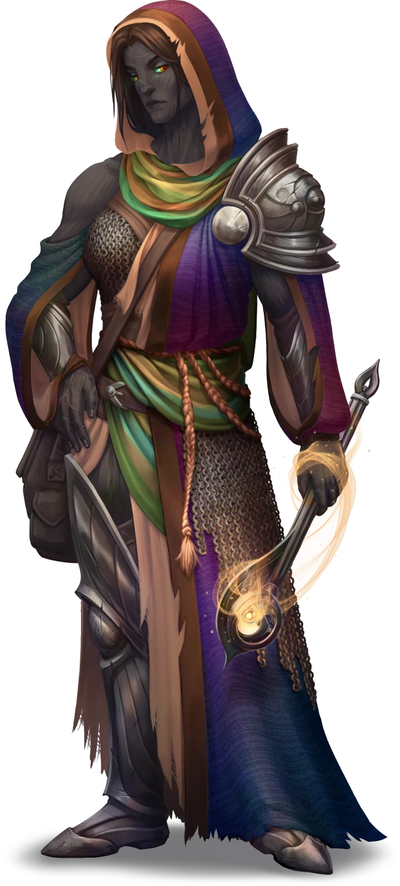
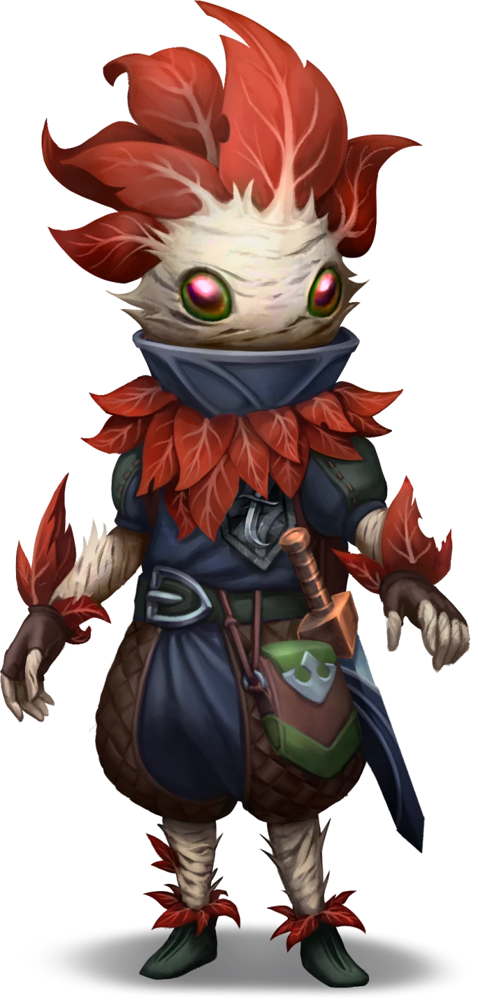

# Arcane Engine

> [!quote] Read Aloud
> As you step through the Blue Runic Door, several aspects of the room strike you at once. The first is that there is a crackling arcane machine at the far end emitting a burst of furious-looking electricity, while the second is that you are not alone in the room, and it would seem the Fulgurite Blades have made it this far into the chamber as well. They have turned to level you with flat stares of surprise.

Inside the room are the four Fulgurite Blades who have made it this far into the chamber but appear to be either stuck on this particular challenge. Once both parties have recovered from the shock of seeing each other here. Read the following:

> [!quote] Read Aloud
> Sajor holds up a hand as if to stop you from coming any closer.
>
> > *Okay, this is just weird. What are YOU doing here?*
>
> The rest of the blades seem to be on high alert with weapons drawn and are starting intently between Sajor and you.

> [!abstract] Sajor Velex
> **[[Sajor Velex]]**
>
> Level 4 · Nir'ae War Mage
>
> 
>
> A bright-eyed woman stands before you with a curious expression, yet the corners of her mouth are turned downwards, as if she is slightly displeased with your presence. She has short black hair with a shock of white at the front, two large downwards-facing ears, and dark olive skin marked with vivid glittering patterns that signify she is either a descendant or a full Nir'ae herself.

> [!abstract] Rorhim Iron-Cask
> **[[Rorhim Iron-Cask]]**
>
> Level 2 · Cor'ak Fighter
>
> 
>
> A burly figure, tall even for Cor'ak, with a thick hornplate above his head and skin in varying shades of tan and brown. His bright blue eyes take in his surroundings with a noticeable lack of interest. He is clearly a warrior of considerable power, given the presence of an oversized sword slung across his back, an accompanying shortsword on his hip, and heavy armor strapped around his stocky frame.

> [!abstract] Kazra Steelshift
> **[[Kazra Steelshift]]**
>
> Level 2 · Kivahr Priest
>
> 
>
> Hooded and wrapped in a vibrant, shimmering shawl, this young Kivahr woman is initially slightly imposing, but her bookish demeanor and obvious curiosity about your presence reveal a true scholar at heart. Looking at the robes and symbols draped across the well-made chain mail armor, she confidently displays her devotion to the Goddess of Magic, Spectra, and appears to be a fanatic member of the Sect of Arcvold. She holds a mace in one hand and keeps her large pack at her side steady, which appears to be bulging with scrolls, tomes, and journals that she carries with her and studies while adventuring.

> [!abstract] Leeph
> **[[Leeph]]**
>
> Level 2 · Thornling Thief
>
> 
>
> A fidgety little radish-looking Thornling with eyes of shimmering pearlescence looks up at you with an unreadable expression. Their overly large leaves like fronds of hair, sweep back from their head, which they are constantly smoothing backwards to no effect, as if trying to calm themselves. They seem to be a restless ball of energy in all other respects, and even when standing still, their hands and eyes dart about in search of something to keep them occupied. They are clad in dark leathers over the top of their thorny barkskin, with a short-sword that appears to be nothing but a large dagger to anyone else hanging at thier side.

### Fighting the Blades

If the party has previously made rivals of the Blades, then combat between the two groups is all but guaranteed. If the party has the New Rivals Outcome from [[Lightning Strikes Twice]] then in the next moment, Sajor shouts:

> [!quote] Read Aloud
> > *Enough of this! Get them!*

> [!danger] Hazard
> #### Fulgurite Blades **Tactics**
>
> The fight between the party and the Blades will likely be very intense, as the Blades are an experienced team that has fought many foes together and are capable of an excellent level of teamwork.
>
> #### Sajor
>
> Is the most deadly of the group and can use a number of high-level spells, including [[Lightning Bolt]] which she will cast on the outset of the fight.
>
> She will also use [[Haste]] on Rorhim in her following turn.
>
> She will use [[Counterspell]] as much as she can stop the player party from casting any high-level spells, as well, and she knows the difference between a low-level and high-level casting.
>
> #### Rorhim
>
> Will not charge headlong into the fray, instead he will guard his teammates and move to a position to block the players' parties' access to his more vulnerable members. On the other hand, once he is engaged with another melee combatant, he loses his cool slightly and begins attacking with fervour.
>
> #### Leeph
>
> Leeph will immediately attempt to hide in the shadows of the room with their [[Cunning Action]] ability. They will use [[Sneak Attack]] over and over again from the shadows using their hand crossbow to attack anyone that can't seem them.
>
> #### Kazra
>
> Is the second most powerful team member, and as the cleric, she will focus on staying back and casting [[Cure Wounds]] and [[Healing Word]] as much as possible on Rorhim.
>
> If she has a moment and Rorhim seems to be in good shape, she will cast [[Spiritual Weapon]] or [[Sacred Flame]].

None of the Blades have so far in the challenge used thier [[Frozen Tear]] item given to them by Eveis the Star Mage. If the party reduces a member to zero hit points, the tear activates, and they are safely enclosed in a frozen shell until Eveis comes to collect them.

> [!warning] Gamemaster
> #### Fulgurite Death
>
> It is not intended that the Blades are killed by the party in this encounter, and the Frozen Tear should protect them from the party. However, it is possible for the party to potentially get around this somehow, if so, make a very large note for the following questline [TBD].

### Working with the Blades

If the party has previously made friends of the Blades then comabt here is unlikely. If the party has the Friends with the Blades Outcome from [[Lightning Strikes Twice]] then in the next moment Sajor Says:

> [!quote] Read Aloud
> > *Okay, okay, let's all calm down. We don't need to be dramatic here.*

> [!info] Social
> #### General Information
>
> The Blades will talk with the party about their experiences with the Challenge so far. Sajor will admit begrudingly that they are not stuck on the current challenge and are in fact tired, and running low on steam. Though it is hard for her to admit to the party, she allows them to go ahead of them to the next room while the rest of the family recoup their energy. A successful `[[/check insight 14]]` check reveals that Sajor is telling the truth and allow she is personally deflated by this result she has made her mind up.
>
> - Sajor will reveal that the challenge here was very difficult and involved making sure the rods for lighting were aligned, and then they had to charge up the arcane engine on top of the gears with spells to unlock the pedestal nearby.
> - If anyone at the party asks about the Blades wanting to win the challenge. Sajor will say:
>   > Of course we did, but ultimately, whether we win or just finish the challenge at this stage, it is material that we will still become full members. Which is what I really wanted in the end.

## Green Pedestal

Regardless of whether the party defeated the Blades in combat or they were able to talk to them, at the back of the chamber is the already revealed Green Pedestal.

> [!warning] Gamemaster
> #### Interactivity
>
> A player character can interact with the Green Pedestal without investigating it. Doing so unlocks the Green Runic Door on the 2nd floor.

> [!tip] Exploration
> #### Green Runic Pedestal
>
> The pedestal in this room is not trapped, nor is it a complicated device. It merely unlocks the green door within the Chamber, and interacting with the gem on its surface is enough to unlock the door. It's likely the party may find this suspicious, however, so there are a few clues on the pedestal to hint at its benign nature.
>
> - If a character casts [[Detect Magic]] and or rolls a `[[/check arcana 13]]`, they discover that the pedestal is connected by a thin magical thread to somewhere else in the chamber.
> - Anyone attempting to investigate the pedestal cannot find any traps or anything suspicious, but if someone rolls a successful `[[/check inv 18]]`, they discover that the pedestal is not dangerous and placing your hand on the gem is safe.
> - Anyone with **Knowledge: Rituals** can somewhat read the runes, and they are runes of unlocking rather than anything dangerous.
