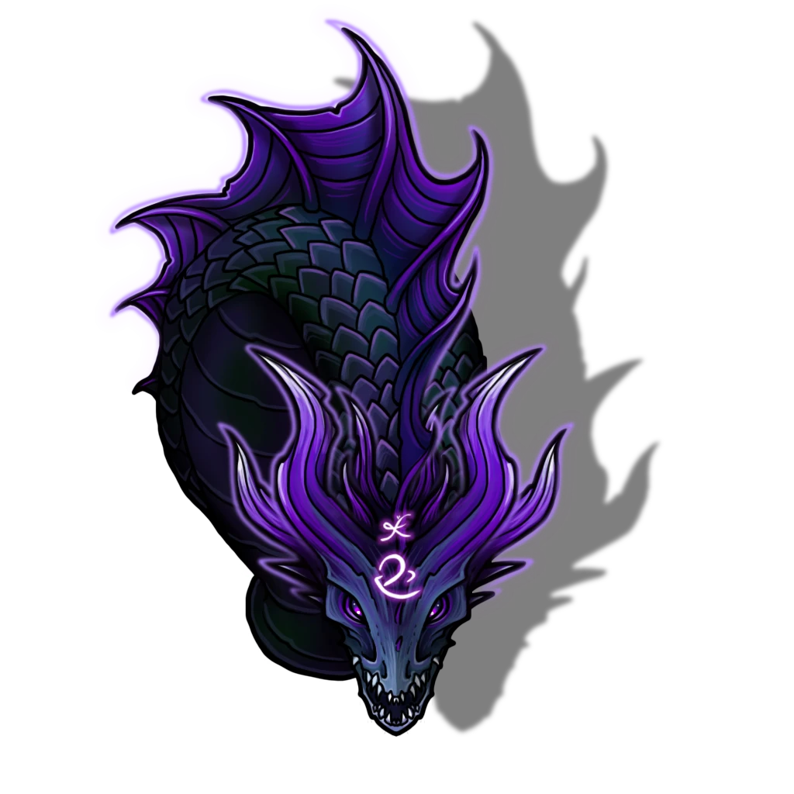

# Main Reservoir

> [!quote] Read Aloud
> As you descend the narrow, worn stairs, the air grows noticeably cooler, and you can hear the faint rippling sounds of water lapping against the stone walls. Standing on a small platform, a vast reservoir of water surrounds you in the gloom. The dim light from distant lamps casts shadows across the room, revealing the expansive water that seems calm and unmoving at first glance. As you look around, you notice several stone platforms jutting out across the water, all covered with a multitude of pipes, ranging from small to average size, and even one so thick someone could stand on it. You also see several large arcane runes glowing faintly at the edges of the outer stone platforms.

> [!warning] Gamemaster
> #### Empty Room?
>
> The final boss encounter with the six heads of the [[Vespian Hydral]] does not happen until they have completed the last challenge in the [[Steam Room]] on the second floor and touched the Ornate Pedestal. Once this occurs, the Hydral is ready to attack, and the encounter in this room can begin. However, the Hydral only attacks once the entire party is standing on the central column in the middle of the reservoir at the bottom of the column, at which point it immediately attacks and combat starts.

> [!tip] Exploration
> #### A Possible Enclosure
>
> Characters who attempt to study the empty reservoir before combat begins must succeed on a `[[/check inv 18]]` check. If they have **Knowledge: Monsters**, they have **+2 Boons** on this check. If successful, they can deduce that this chamber may currently host some creature, or may have done so in the past.

## The Hydral's Ambush

As soon as initiative is rolled, the following actors appear within the scene.

- 6x [[Vespian Hydral]]

These actors are arrayed around the central platform and the bottom of the column. Their movement and positioning throughout the following encounter are covered under their tactics below. None of the individual heads of the Hydral can move onto the platform where the party stands or outside the reservoir due to their arcane nature.

> [!abstract] Vespian Hydral
> **[[Vespian Hydral]]**
>
> Level 1 · Unknown Unknown
>
> 

> [!danger] Hazard
> #### Vespian Hydral Tactics
>
> The [[Vespian Hydral]] fights as a single creature, using its many [[Vespian Hydral Head]] to menace the area it occupies. It acts on one initiative count, and all of its heads share actions, reactions, and resources. The Hydral’s main body lurks near the central column, repositioning its active heads to control nearby platforms, walkways, and swimmers.
>
> The Hydral positions its heads to threaten as many adventurers as possible. It uses [[Arcane Bite]] on any creature that moves within reach of an active head, and constantly shifts head positions to deny enemies a safe approach. When foes cluster or line up on narrow terrain, it unleashes [[Steam Breath]]to catch as many as possible—especially if it can knock them into hazards or off precarious ledges.
>
> If a creature engages the Hydral in the water or strays too close to an active head, the Hydral may use [[Whirlpool]] to grapple and pin that target. As its heads are incapacitated, the Hydral loses flexibility and offensive power, so it spreads its remaining heads to maximize control of the chamber.
>
> #### Water Reservoir
>
> Characters thrown off the central platform and into the water discover that the water appears calm, but it has a strong underwater current just under the surface. At the start of each of the characters' turns while in the water, they must make a `[[/save str 12]]` to resist being pulled into the current. On a failure, they are pulled 15 feet towards the center of the reservoir and back towards the central column.

After the Vespian Hydral reaches zero hit points with its [[Shared Health & Properties]], the creature is defeated, and all the remaining heads disappear.

> [!warning] Gamemaster
> #### Area Map Complete
>
> Once the Vespian Hydral has been defeated, the party can now refer back to the quest event [[The Wayfinder's Gauntlet]] for further details and rewards.
>
> The party can leave the Chamber at this point, or they can attempt to unlock the secret boss [[Matrix of Agaseros]].
