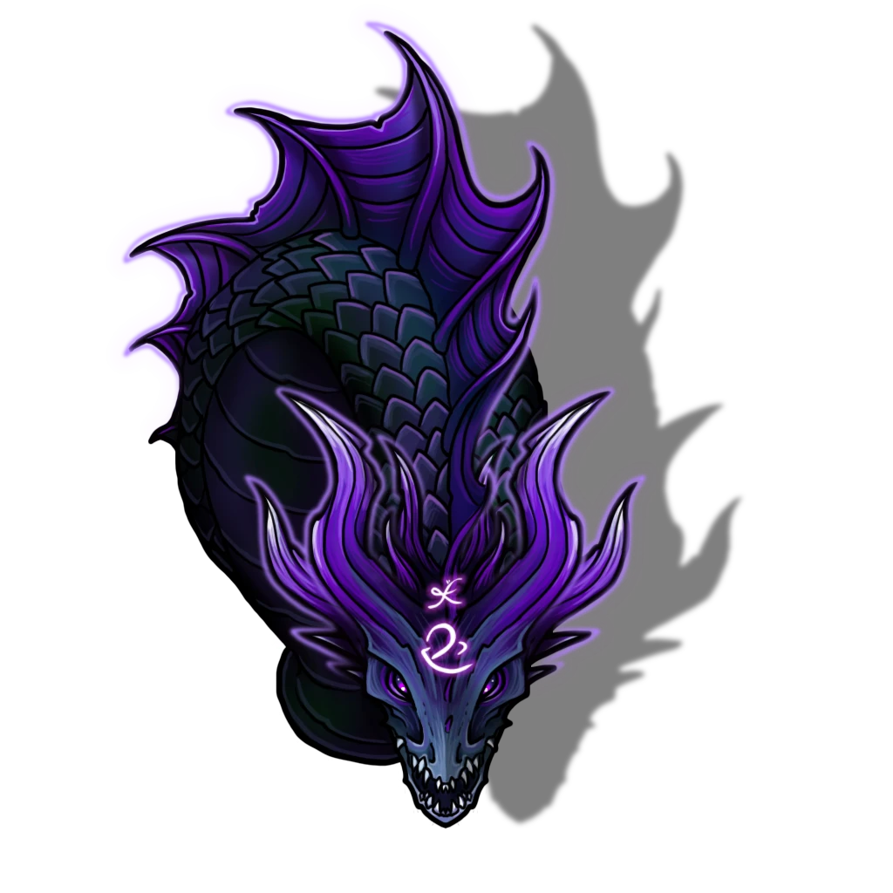

# Main Reservoir

> [!quote] Read Aloud
> As you descend the narrow, worn stairs, the air grows noticeably cooler, and you can hear the faint rippling sounds of water lapping against the stone walls. Standing on a small platform, a vast reservoir of water surrounds you in the gloom. The dim light from distant lamps casts shadows across the room, revealing the expansive water that seems calm and unmoving at first glance. As you look around, you notice several stone platforms jutting out across the water, all covered with a multitude of pipes, ranging from small to average size, and even one so thick someone could stand on it. You also see several large arcane runes glowing faintly at the edges of the outer stone platforms.

This large water basin serves as the stage for the final encounter of the Chamber of Agaseros: a deadly battle with the six heads of a creature known as the [[Vespian Hydral]].

However, the hydral will not be present until the party has completed the last challenge in the [[Steam Room]] and touched the Ornate Pedestal. In the meantime, the characters can take a survey of the reservoir itself.

> [!tip] Exploration
> #### Exploring the Reservoir
>
> Any character who makes a successful `[[/check investigation 18]]` or `[[/check perception 18]]` check is able to deduce that this reservoir might have originally been built to contain something in addition to the water here — like an extremely large, aqueous creature. The character can also notice a subtle vortex of movement beneath the surface of the water, suggesting a circular flow towards the center of the room.
>
> - **Knowledge: Machines**: The character gains **+2 Boons** on this check.
> - **Knowledge: Subterranea**: The character gains **+2 Boons** on this check.

> [!danger] Hazard
> #### Hazardous Waters
>
> Although the water here in the reservoir appears to be calm, a strong underwater current lurks just beneath the surface. This current works as a funnel, with the chamber's circular stairway at the center of the vortex.
>
> When a creature moves or falls into a space containing water for the first time or starts its turn there, the creature must succeed on a `[[/save str 12]]` save to avoid taking `[[/damage 1d4 bludgeoning]]` damage as they're dragged by the current. On a failure, the creature is also moved 15 feet towards the column at the center of the reservoir.

If the party has completed the last challenge in the [[Steam Room]] and touched the Ornate Pedestal, the six heads of [[Vespian Hydral]] appear when one or more characters enter the reservoir.

> [!abstract] Vespian Hydral
> **[[Vespian Hydral]]**
>
> Level 1 · Unknown Unknown
>
> 

> [!danger] Hazard
> #### The Hydral Appears!
>
> When combat begins, six [[Vespian Hydral Head]] appear in a circle around the central stairway platform, emerging from the reservoir water basin. These six heads comprise the [[Vespian Hydral]] itself, a magical monstrosity created by Agaseros to serve as the chamber's final guardian.
>
> The vespian hydral heads cannot move out of the water here in the reservoir.
>
> #### Vespian Hydral Tactics
>
> At the start of combat, all six [[Vespian Hydral Head]] of the [[Vespian Hydral]] will position themselves to threaten as many enemies as possible. The six vespian hydral heads fight as a single creature, and the hydral’s body lurks unseen beneath the central column — the body cannot be targeted and is out of reach, effectively non-existent on the Area Map during the entire course of the encounter.
>
> Over the course of combat, the hydral heads will prioritize the following actions and abilities:
>
> - It uses [[Arcane Bite]] on any creature that moves within reach of an active head, and constantly shifts head positions to deny enemies a safe approach.
> - If a creature engages the hydral in the water or strays too close to an active head, the hydral may use [[Whirlpool]] to grapple and pin that target.
> - When foes cluster or line up on narrow terrain, it unleashes [[Steam Breath]]to catch as many as possible, especially if it can knock them into hazards or off precarious ledges.
> - As its heads are incapacitated, the hydral loses flexibility and offensive power, so it spreads its remaining heads to maximize control of the chamber.
>
> Once the vespian hydral reaches 0 hit points per its [[Shared Health & Properties]] feature, the creature is defeated, and any remaining vespian hydral heads will immediately disappear.

> [!warning] Gamemaster
> #### The Challenge Concludes
>
> Once the [[Vespian Hydral]] has been defeated, the various trials of the Expedition Challenge are effectively complete. Refer to [[The Wayfinder's Gauntlet]] for additional details, final steps, and associated Quest rewards.
