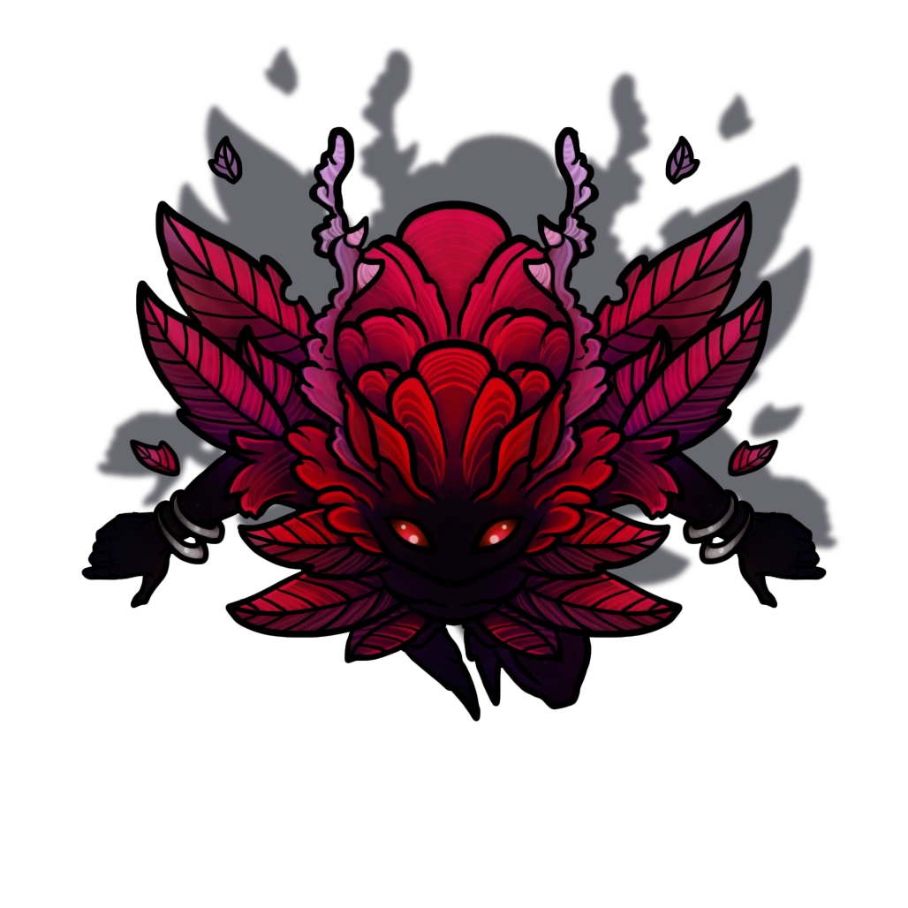

# Meri's Garden

> [!quote] Read Aloud
> Before you even round the corner, you can start to smell a strange, almost otherworldly scent wafting through the air. As you step into the open, you're stunned to discover a vibrant burst of plants deep within the otherwise mysterious stone walls of the chamber. Strange red plants tower above you; their shapes are odd, extreme, and flutter as if being affected by a wind you cannot feel. Some have luminescent petals that pulse gently, while others have tendrils reaching out as if to playfully tease you. The ground is a tapestry of soft moss, fallen red leaves, and dark, hard roots.

This is the garden of the strange Fae entity known as Meri, who was once a friend and advisor of sorts to the mage Agaseros. Once the party steps out into the garden, read the following:

> [!quote] Read Aloud
> One of the large flower bulbs begins opening its big red petals, and a soft, glowing figure emerges, stretching its little arms with a loud yawn. It then turns and gasps softly as it sees you.
>
> > More visitors! Oh, it's so lively here again recently! What fun!
>
> The figure speaks in a voice similar to a small child's, with a touch of utter excitement, and you see it fluttering its little flower wings as if overwhelmed with happiness.
>
> > My name is Meri! I'm from Primordis and... Oh! Yes, that's right! I'm supposed to challenge you. Hmm, let me see... Oh, yes! Here are the rules: you must find the real me within the garden to unlock the door over there. I'll give you a hint: I'm one of the flowers! You have as much time as you like, of course, but wrong answers are punished! Good luck!
>
> With a flash of mist, magical dust, and pollen, the little creature vanishes, leaving you wondering if you perhaps imagined the last few moments. Then, you hear a soft giggle coming from somewhere in the garden in front of you.

> [!abstract] Meri
> **[[Meri]]**
>
> Level 1 · Unknown Unknown
>
> 

> [!warning] Gamemaster
> #### Interactivity
>
> During the exploration of the garden, there are seven plants that could be Meri. The party can walk up to each one and try to decide which one is Meri by interacting with it. However, six of the flowers are traps and will burst into pollen dust and create a magical effect. Meri herself is actually hidden in the far north-western corner.

> [!tip] Exploration
> #### Suspicious Flowers
>
> As the players step into the garden, another soft giggle echoes around them, and it's clear that Meri is somewhere nearby, watching and waiting to test the party's wits.
>
> The party can attempt several different methods to locate Meri by trying to figure out which flower is her. When they approach a suspicious-looking flower, they can investigate to see if it is the real Meri.
>
> - With a successful `[[/check inv 17]]` check, on a suspicious flower, a character realizes that it is glowing and fluttering, but it's not giggling or twitching and therefore likely not the real Meri.
> - Anyone with **Knowledge: Fey** can roll a `[[/check nature 14]]` and upon success, realizes that the flower in front of you is not strange enough to be Meri.
> - With a successful `[[/check arcana 17]]` check on a suspicious flower, will reveal that the magic around it is mostly some kind of Fae illusion designed to make it look more suspicious and magical than it really is.

> [!danger] Hazard
> #### Flower Trap
>
> Anyone who interacts with a suspicious flower that is not Meri, activates a trap instead as the flower bursts into magical pollen.
>
> Each creature within 10 feet must make a `[[/save con 14]]` Constitution saving throw. anyone that fails takes `[[/damage 3d6 poison]]` and is gains the &Reference[poisoned] condition until the end of its next turn.
>
> In addition, each player within a 10-foot radius must also make a `[[/save wis 14]]` saving throw. If they fail, that player is charmed, believing that the flowers and garden around them are the most beautiful thing they have ever seen. They are compelled to defend it, and will target and ally, or party members closest to them, and attack them with a single melee action before snapping out of their confusion.

## A Quick Exit

Once the party finds Meri among the other suscipisus flowers she appears back in her normal form and you can read the following:

> [!quote] Read Aloud
> > Well done! That was quick! It's so lovely to have playthings again down here!
>
> Meri then waves her hand, with a loud clang, you hear the door to the south unlock and slide open.
>
> > Good luck, playthings! I'm sure we will meet again!
>
> With a sound like a flute being blown, Meri begins floating higher, and little petals start flying around her, then with a pop, she disappears.

> [!warning] Gamemaster
> #### Talking or Fighting with Meri
>
> It's not possible within the scope of this event to talk to or fight Meri, at least this is not intended. However, Meri does have a stat block, and the party might try to attack her in some way. If this happens, she will likely simply escape, and the door can then be unlocked. Meri will appear again at a later date!
