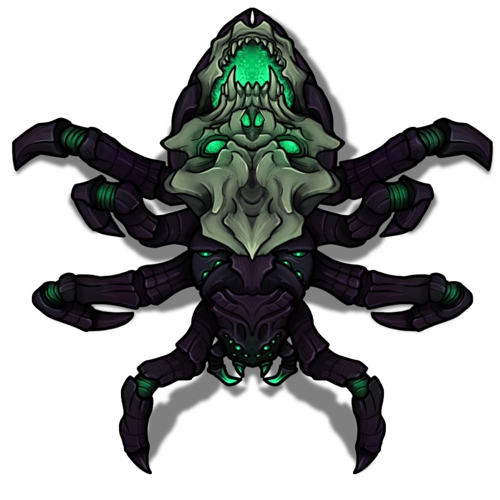

# Skull Spider Lair

> [!quote] Read Aloud
> This dim chamber is suffused with a surreal, otherworldly light that emanates from hundreds of black candles that burn with a soft green flame. A mighty bronze grate covers a deep basin at the center of the chamber, and the entire room is covered in thick webs and large, silky cocoons. As disconcerting as this scene might be, something even more alarming emerges from the shadows at the northern end of the room …

> [!abstract] Ix'erax
> **[[Ix'erax]]**
>
> Level 1 · Unknown Unknown
>
> 

The spider in this room is an ancient creature that was captured hundreds of years ago and trapped in the chamber, but it eventually became accustomed to its new life and became friends with the mage Agaseros.

> [!quote] Read Aloud
> With a series of soft, almost husky clicks and taps of its mouth pincers, the creature begins to speak in a raspy, low voice.
>
> > What an unexpected surprise.. tik tik.. mortals have found my little home again. What can I do for you then.. tik tik..

> [!info] Social
> #### Talking with Ix'erax
>
> The party can converse with Ix'erax, during which time she provides additional information:
>
> - Ix'erax is a Giant Skull Spider, and she calls herself a Child of the Watcher. She reveals that all spiders are children of the Watcher. She doesnt, however, comment on who exactly the Watcher is other than her mother and Goddess.
> - She has been in the Chamber for 241 years, 7 months, and 14 days. She remembers clearly the day she was captured and how much rage, anger, and fear she felt for being humiliated in such a way.
> - These days, she very much enjoys her life in the chamber and spends much of her time using her magic to scry on Ordain and record events in her vast memory. She makes it clear that she can see many events unfolding in the city above and is deeply fascinated by the passage of time and the world.
>
> If the party asks about the mage Agaseros, Ix'erax seems to grow quiet for a moment.
>
> > He was... one of a kind... tik tik... You mortals are often short-sighted and filled with immediate wants and needs. He was far wiser and had such skill with arcane magic. He was also kind, and even though I hated him deeply at first for capturing me, over time, we came to understand each other. I taught him many secrets, and he shared his own knowledge with me.
>
> If asked about Skull Spiders, Ix'erax will slowly respond with the following information
>
> > My kind, or at least my direct kind of spiders, are typically known for their voracious hunger. We tend to be driven by our hunger above all other concerns. I would suggest… that if you ever meet another one of my kind, you run… tik tik…
>
> If the party asks for her help or information on subjects directly related to their ongoing quests, Ix'erax will shudder for a moment and begin to laugh.
>
> > I am a watcher, not someone who gets involved in the affairs of mortals. I see no reason for me to help you other than to say.. be wary of the dark.
>
> #### Ix'erax's Motives
>
> A successful **Deception (DC 14)** check suggests that Ix'erax is completely friendly and unconcerned by the presence of the party. She is a wise character and clearly knows a lot about the world and even recent events in Ordain, but she has no intention of sharing any secrets and comes off as slightly smug and self-assured.
>
> - **Result of 20+**: Ix'erax believes the party is important somehow, and her eyes and tone give away more than her words, and she is watching them with some interest.
>
> Any character who casts the [[Detect Thoughts]] spell on Ix'erax receives nothing back but a vast void of nothing.
>
> > Now now, none of that.. tik.. tik..
>
> #### Making Accusations
>
> If the party accuses Ix'erax of being an agent of evil dark powers or a servant of the Abyss, she will not respond immediately and instead simply reveal that she is connected to the Abyss and monsters in the dark but not evil, and has little interest in the destruction of some fascinating world.

> [!question] Q&A
> **Q:** If the party asks about the Abyss directly.
>
> **A:**
>
> > I lament that you know that term. But it is too late now. It is not the place you believe it to be. These things are always far more complex when you look at them closely. For most, it is a realm of utter evil, and it is true that it has brought many powerful beings low. But I would not cement your minds on its morality just yet.

## Fighting Ix'erax

Combat with Ix'erax is not the *intended* outcome of this event, as Ix'erax does not instigate such conflict and has no intention of seriously fighting the party.

It is not unlikely, however, that the mere presence of Ix'erax, her persona, comments, and appearance will compel the party to attack her as obviously evil or malicious.

> [!danger] Hazard
> #### Ix'erax Tactics
>
> Combat with [[Ix'erax]] will be short, as the party will have only 2 rounds to attack her. During this time Ix'erax will defend herself and she tries not to attack the party. In fact, she will do her best to remove herself from the fight by using her [[Spider Climb]] ability to climb towards the ceiling.
>
> After 2 rounds of combat, unless the party has somehow killed her during this time, she will use her[[Dark Doorway]] to teleport away from the encounter.
>
> It's possible that the party can kill Ix'erax during these two rounds, and should this happen, she will not leave behind any treasures or loot, nor will she appear again.
