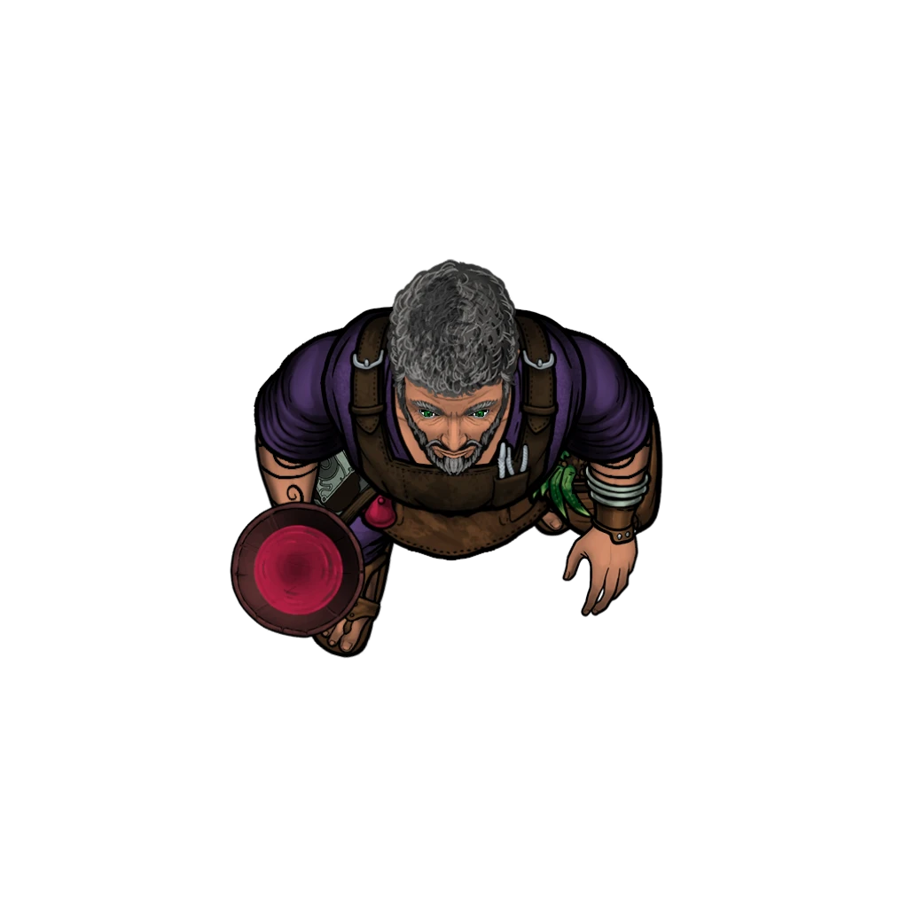

# Falar's Paints

> [!quote] Read Aloud
> This modest, one-room shop obviously caters to patrons in search of high-quality paints and art supplies. Several shelves and cabinets throughout the place have Falar's eponymous wares on display, oils and acrylics with evocative names such as Leviathan Blue and Fey-Fire Red, and the wizened proprietor himself seems busy at the back with a new mixture. The gray-haired shopkeep turns to greet you with a small measure of annoyance, as if new customers are a few and far between.
>
> > Adventurers, eh? Let me guess: you stumbled into a grease trap and need a barrel of mineral spirits to clean up the gunk …
>
> He continues stirring his pigments with the hint of a scowl.

This small Dockside paint shop is owned and operated by the retired adventurer [[Falar]], a wizard-turned-shopkeep who plays a central role in the [[Mixed Media]] and [[A Sketchy Situation]] Events of the [[Local Color]] Side Quest.

Falar's Paints sells higher-end paints of various mediums and colors (including oils, acrylics, and watercolors), along with a modest selection of art supplies, fine wooden easels, and chemical solvents.

If the party visits Falar's Paints during [[Mixed Media]], they will likely have a series of questions to ask Falar to help aid their investigation. The following social and exploration blocks presume the characters are in search of information relevant to the [[Local Color]] Side Quest.

> [!abstract] Falar
> **[[Falar]]**
>
> Level 1 · Unknown Unknown
>
> 

> [!info] Social
> #### Conversation with Falar
>
> **[[Falar]] (Chaotic Neutral, Ordani Human, he/him)**
>
> A retired adventurer and wizard who has become increasingly fed up with Ordain and what he perceives as its numerous failings. Falar is brusque, bitter, and wants to be left alone. He has had a hard life, suffering setbacks, betrayals, and mistreatment at the hands of many people and institutions in the city, and has had people he cared about suffer in similar ways. The ideal of Ordain is a lie as far as he's concerned.
>
> Conversation topics that Falar is willing to discuss include (but are not limited to):
>
> - Varinna, her status as a customer, and potential suspects that might want to ruin her reputation.
> - His disdain for the local Trading Houses.
> - His apparent lack of awareness surrounding the House Salva mural from [[Drawing Attention]].
> - His (flimsy) alibi.
> - His background as a paint retailer, and the qualities of his inventory.
>
> Any character who makes a successful **Deception (DC 15)** check is able to tell that Falar isn't being entirely forthcoming when asked about his alibi or Varinna's reputation.
>
> A few specific dialogue options for Falar are provided below.

> [!question] Q&A
> **Q:** Do you know Varinna?
>
> **A:**
>
> > Name, yeah, story, no. I don’t have time for tea with every painter in Flotsam, and they don't want to spend all day yapping at me. She buys pigments here, yes. Her coin's always good, she always buys what she reserves, and never leaves me holding product too long. Good customer.

> [!question] Q&A
> **Q:** Are you a mage or an adventurer?
>
> **A:**
>
> > I’m a paint monger. I stack jars and argue with suppliers trying to jack up prices on my pigments and oils. Adventurers wear skulls on their belts and tell stories in taverns.
>
> He gestures to himself.
>
> > Do you see any skulls? Me neither.

> [!question] Q&A
> **Q:** What do you think of the trading houses?
>
> **A:**
>
> > Crooked comes in many cuts. Some wear silk while they do it. City would breathe easier without them leaning on every throat that tries to make an honest crown.

> [!question] Q&A
> **Q:** What do you think about the Ordinate / Hallows / Veiled Chain?
>
> **A:**
>
> > Oh, they do their best. I'm sure they do their best. I just can’t tell who “best” is for. Doesn’t always look like it’s the dockhands or the stall-minders who get the benefit.

> [!question] Q&A
> **Q:** Have you seen the mural?
>
> **A:**
>
> > Nope, haven't. I open early, close late, sleep when I can. I don’t have time to gawk at walls.

> [!question] Q&A
> **Q:** Do you have an alibi for the last few days?
>
> **A:**
>
> > Here. Or at home. Here. Or sleeping. Take your pick.

> [!question] Q&A
> **Q:** Are you an artist or painter?
>
> **A:**
>
> > I sell paint. That’s the job. Other folks make the mess and call it art. I have some doodles and examples in the shop here, you can see them yourself, judge if I'm any kind of artist.

> [!question] Q&A
> **Q:** Did you sell any magical or infused paints lately?
>
> **A:**
>
> > I sold a bunch of enchanted paints to Varinna a while ago. Go bother her. I don't decide what people do with my paint. I just make it and sell it.

> [!question] Q&A
> **Q:** Do you carry infused pigments at all?
>
> **A:**
>
> > Yep, sure do. They are costly to make, take special materials and pigments, and sell out fast. I would make and sell more of it if I could, but I'm one person.

> [!question] Q&A
> **Q:** Do you make all of your own paint?
>
> **A:**
>
> > Not all, but most everything here, yes. There are a few makers in the city I also stock when I can, but they don't make me as much money as my own mixes do.

> [!question] Q&A
> **Q:** Can we see your inventory or sales records?
>
> **A:**
>
> > Bring a writ from the Hallows and you can read my ledgers line by line. Until then, no.

> [!question] Q&A
> **Q:** Who would want to harm Varinna's reputation?
>
> **A:**
>
> > Flotsam, all of Ordain really, is full of copycats and bravado. Everyone's painting over everyone in one way or another. For Varinna to succeed someone else had to fail, didn't they?

In addition to speaking with Falar, the characters may examine the shop.

> [!tip] Exploration
> #### Surveying the Scene
>
> Any character who takes a moment to look around is able to discern a few basic details:
>
> - Falar doesn't seem to be a particularly talented artist. His work appears somewhat rushed and predominantly lackluster.
> - Falar's art style is clearly different from Varinna's, which can be seen in [[Varinna's Studio (Lower)]].
> - The paints for sale here are solely made by Falar himself. No products from other makers or manufacturers can be found.
> - One shelf of paints is labeled "Magical Hues." On the wall above it, a painting of a local Ordani street slowly and continually fades from day to night (and back again), simulating the passage of time.
>
> Any character who makes a successful **Arcana (DC 15)** check while examining the so-called Magical Hues is able to discern that subtle and precise illusion magic is being used to supernaturally shift the pigmentation of the paint.
>
> - [[Detect Magic]]: The character automatically succeeds on this check.
> - **Knowledge: Crafts**: The character gains **+2 Boons** on this check.
>
> #### Exploring the Shop
>
> Any character who takes at least 10 minutes to exhaustively search the shop is able to find a few pieces of information pertinent to their investigation into the House Salva mural from [[Drawing Attention]] inside the desk on the southern wall:
>
> - A stack of letters on top of the desk indicate Falar has been in contact with the Hallows. His request to appeal the ruling against House Salva has been denied yet again, and no further appeals will be heard. (This information can also be learned when meeting [[Cherish Ellerie]] and [[Mistress Caberi]]).
> - The desk contains several receipts of the sale and delivery of rare pigments and minerals from [[Redrak]], indicating that Falar's been receiving regular orders. Among these is a letter exchange in which Falar asks if something strange is going on, and the reply notes that Cora was full; some of the pigments are elementally charged.
> - A title deed for this building (Falar's Paints), and another deed for a two-story building just north of here (Falar's Studio).
> - The desk also contains notes about stock. There is not enough room for all of his stock to be here, so he's keeping it elsewhere. This is a hint that he's got another space nearby.
>
> If the party attempts to search the shop outside of normal business hours (10am to 8pm), Falar is located at [[Falar's Studio (Lower)]] across the dock instead, and Falar's Paints is closed for business. If the characters wish to gain entry, the locked door must be picked or bashed in (see below).

> [!danger] Hazard
> #### After Hours: Locked Door
>
> If the party attempts to visit Falar's Paints to investigate outside of normal business hours (10am to 8pm), they'll find the door to be securely locked.
>
> Any character who makes a successful `[[/tool thief 16]]` or **Athletics (DC 20)** check is able to open the locked door. Characters who make a lot of noise during their attempt to bash the door may draw the unwanted attention of other people nearby (and subsequently the ire of local law enforcement or neighborhood watch).
