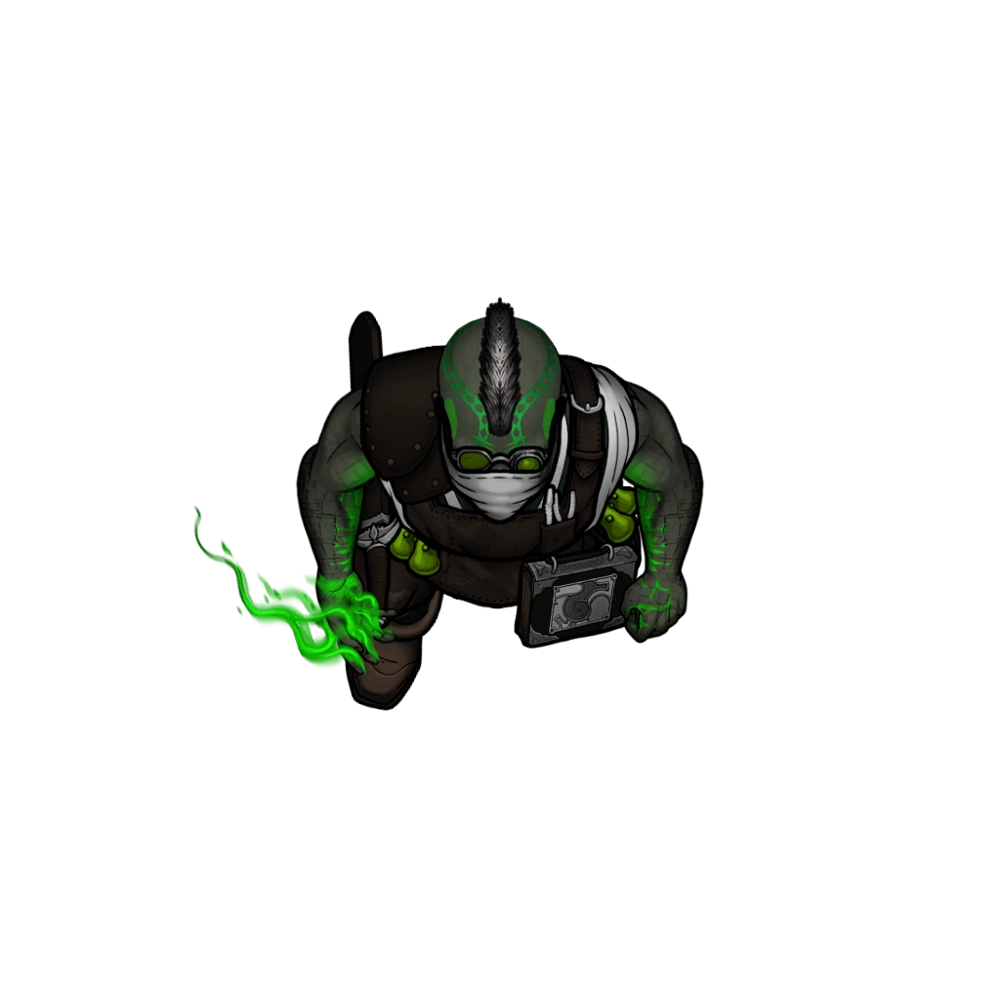

# Refinement Lab

> [!quote] Read Aloud
> Heavy wooden slats shore up the uneven stone floor as this area opens into a intricately arranged and immaculate laboratory, fitted carefully into the ancient space here and overlooking the glimmering waters of the cistern.
>
> Rows of shelves bear books, magical reagents and materials arranged in a determined order. Stacks of crates near the walls overflow with pristine glassware, awaiting use.
>
> Here, two alchemical machines whir quietly, both filled with liquids being processed into glowing compounds that drip into waiting bottles below.
>
> At the center, a large, battered desk is strewn with diagrams and scattered notes. Among the chaos, a single bottle of iridescent, multicolored fluid sits, glimmering with blue and yellow hues.

### Mutagist Contingent

The overseer of this lab can be found here, sitting at his desk, working.

> [!abstract] Kaftor Brenk
> **[[Kaftor Brenk]]**
>
> Level 1 · Unknown Unknown
>
> 

> [!danger] Hazard
> #### Deadly Overseer
>
> For combat with Kaftor and his minions see [[Glowing Cistern]]on the [[Glowing Cistern]] page.

### Searching the Area

> [!tip] Exploration
> #### Supplies Shelves
>
> This cabinet and shelving unit is packed with all sorts of reagents, spell components, and spellcasting materials. No specific list exists for the contents, but a spellcasting character that is looking for a component can probably find it here as long as the component's price is 25 gp or less.
>
> #### Bookshelves
>
> The shelves are packed with a collection of log books, papers, notes, and journals details the ongoing process that the Mutagists have been working on here.
>
> A character with **Knowledge: Alchemy** or **Knowledge: Rituals** recognizes that in the broadest of terms they are trying to develop a method of extracting rare ember energy from humans.
>
> The most recent entries into this collection indicate that they achieved success, and now have a means to extract and refine what they are calling "Blaze Residuum" which can be injected into humanoids to induce an Ember Blaze effect, or Drakes to create a highly resilient mutant with similar powers.
>
> The key articles of this collection can be taken to form a bundle of [[Kaftor's Research Logs]] which can be turned over as evidence later.

> [!tip] Exploration
> #### Examining the Machines
>
> The whirring machines are slowly processing alchemical compounds into a gleaming solution that changes colors seemingly at random. The vials are presently empty but for the barest of drops, and the process seems remarkably slow.
>
> Characters with **Knowledge: Alchemy** or **Knowledge: Machines** recognize that these devices are very delicate, very precise, and likely had to be hand-built for the Mutagists.

### Searching Kaftor's Desk

> [!tip] Exploration
> #### Searching the Desktop
>
> Among all the notes and vials and tools scattered across the desk, the only item of note is a single bottle of some unknown, [[Blaze Residuum]]. Its color appears to primarily be gold, but it changes to red, pink, purple and blue seemingly at random.
>
> The bottle bears a handwritten label:
>
> > Batch #4, Purity: 97%
>
> #### Searching the Chest
>
> The chest under the desk is locked, requiring a `[[/tool thief 18]]` check to successfully open. Inside the chest is 100 GP, a [[Potion of Healing]], [[Kaftor's Spellbook]], and a letter addressed to Kaftor Brenk (see below).
>
> **100**
>
> #### A Worrying Missive
>
> Also in the chest is a [[Letter to Kaftor]]

> [!tip] Exploration
> #### Letter to Kaftor Brenk
>
> The letter reads:
>
> > Overseer,
> >
> > I understand your frustration, you are right: hands are tied for now, and that will not be changing immediately. I expect you to make do with what resources you do have, and would prefer you be prepared for what comes next.
> >
> > Eventually you'll have a fresh supply of test subjects and assistants to work with. The influx of refugees from the west has been beneficial to recruitment efforts being made by our allies in the city.
> >
> > I will be sure you get the resources you need to do your work. You need only be patient.
> >
> > Wisdom and cunning guide you.

> [!warning] Gamemaster
> #### Connection to Serethus
>
> Serethus uses the phrase "Wisdom and cunning guide you." when the party is breaking up after **Ill Tidings**. It's a connection that keen characters (and their players) might notice.
