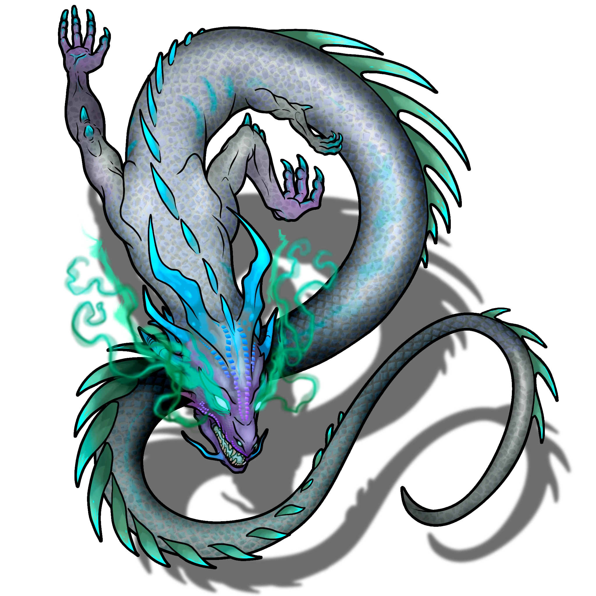

# Sedyri Alcoves

> [!quote] Read Aloud
> Along the far wall of the chamber, four shallow alcoves are set into the deep black basalt, each one crowned by a weathered stone relief depicting an Ashka figure. All four snake-folk extend empty hands upward, as though holding something aloft.
>
> The floor is strewn with the remains of several unfortunate souls, their bones shattered and gnawed, splintered, with not a shred of flesh remaining on them. Deep claw marks run through the dust beneath the alcoves, warning against careless trespass.

> [!abstract] Radiant Ultra Drake
> **[[Radiant Ultra Drake]]**
>
> Level 1 · Unknown Unknown
>
> 

> [!danger] Hazard
> #### Radiant Resident
>
> A nesting [[Radiant Ultra Drake]] can be found here. It immediately notices the party approaching unless they succeed on a group **Stealth (DC 17)** check with at least half the characters succeeding on their checks.
>
> If alerted, it attacks.
>
> #### Blazing Assault
>
> The Radiant drake is incredibly fast, and prefers hit-and-run tactics when possible. Its [[Hyper-Aggressive]] feature helps secure a high initiative score, and its [[Sudden Rush]] legendary action lets it close in on distant targets swiftly.
>
> When enemies are out of sight it can use it [[Blood Sense]] to track wounded prey, setting up for its next attack, preferring to attack from blind spots and flanks.
>
> It uses its [[Speed Burst]] action to relocate and get out of harm's way, and if surrounded, has a [[Radiant Blast]] legendary action to harm everyone nearby, though it can only do this once, and so reserves it until needed.
>
> When reduced to 0 hit points for the first time it also activates its [[Final Blaze]] ability, gaining an immediate turn, and also triggers its [[Sudden Rush]].

### Searching the Area

> [!tip] Exploration
> #### Examining the Remains
>
> A successful **Awareness (DC 16)** or **Medicine (DC 14)** check determines that the bones are relatively new, not more than a few months or weeks old. Given that no shreds of equipment or clothing remain, it's likely the Mutagists were feeding dead bodies to the creatures here.
>
> #### Examining the Reliefs
>
> Around their feet are words in an ancient script. Characters that understand the ancient **Language: Scor** recognize these are the words: fire, water, steam, lava. The rest of the text here indicates these a resonant aspects of the Ashka spirit, and the means by which they move forward.
>
> A successful **Arcana (DC 16)** recognizes foundational magical symbols for divination and transmutation, but they are idle. It's likely that these are part of a magical activation sequence, but what it does is unclear.
>
> #### Examining the Glowing Door
>
> An ornate wall bearing a relief of an ancient Ashka can be found on the southern wall at the top of some stairs. The Ashka's hands are clasped together.
>
> Unlike the wall encountered in the [[Corpse Dump]] area, there is nowhere for an object to be slotted into the door.
>
> A successful **Awareness (DC 15)** check while scrutinizing the relief notes an elemental motif. Their robes have decorative elements that flow like water, but a ball of flame rests in their hands. They stand on cracked, uneven ground that looks like cooled lava, and they are surrounded by billowing clouds.

### Opening the Door

#### Elements Under Development

The alcove puzzle and hidden doorway will have interactive elements and animations in future updates. For now the secret doorway can be manipulated manually.

The party needs to slot the four elemental emblems into the alcoves to activate the door and open the way to the [[Glowing Cistern]] beyond it.

> [!tip] Exploration
> #### Activating the Alcoves
>
> A successful **Awareness (DC 15)** check while scrutinizing the reliefs will notice thematic elements in each of them that hint at what element each figure embodies.
>
> A character that has studied an alcove knows what element should go into it. The alcove elements from north to south are:
>
> - Fire
> - Water
> - Magma
> - Steam
>
> Slotting an emblem into an alcove requires an action if in combat, and the order that they are placed is not important, only that the emblems be placed into the right alcoves.

> [!warning] Gamemaster
> #### Recurring Sequence
>
> This is the same order as the pillars in the marsh, and likely the same order that the emblems were recovered in the ruins. Players that notice this pattern should be allowed to try their hunch, and be rewarded if they are right.

Once the emblems are slotted in, the door will activate, and rise up into the ceiling.

> [!quote] Read Aloud
> The emblems in the alcoves all pulse with energy then a deep thump shakes the ground, causing stones to tumble off of piles along the walls.
>
> Across the room the stone wall bearing the relief of the elemental Ashka rises up into the ceiling, revealing a passage into another area.
