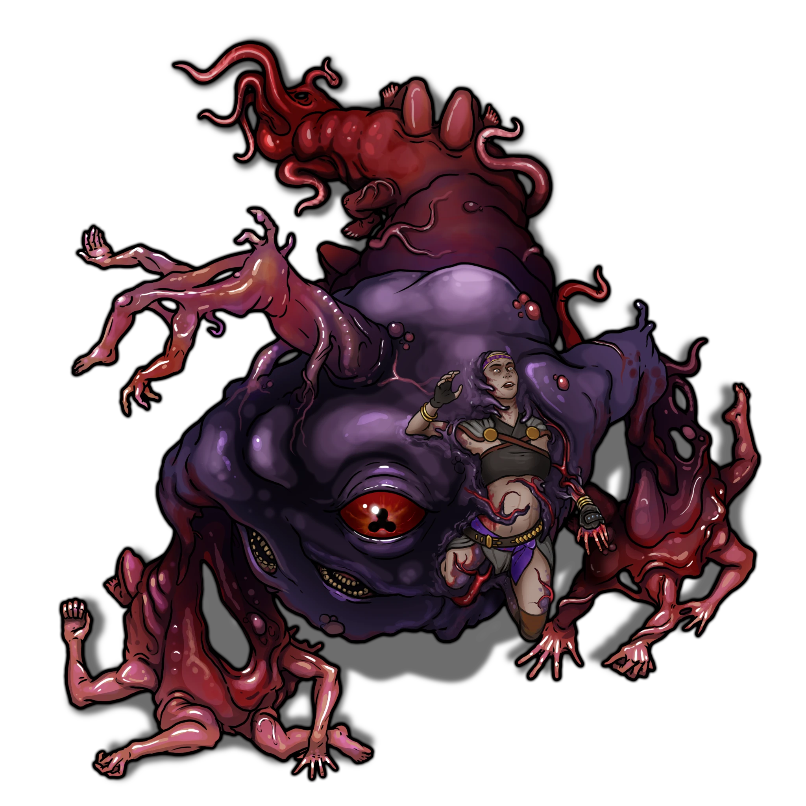
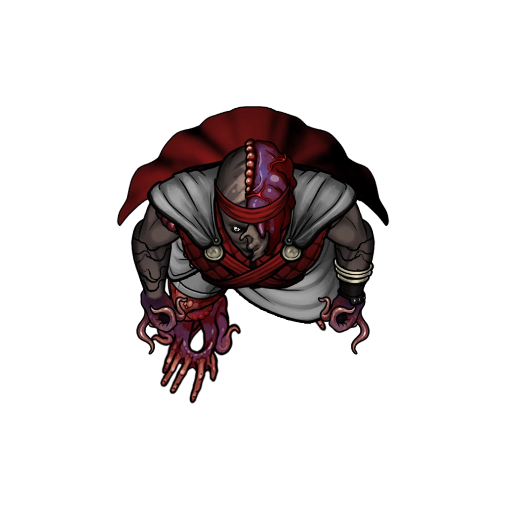

# Temple Sanctum

> [!quote] Read Aloud
> Lit by a scattered array of sconces, this massive oblong chamber reeks of ceremonial incense and the musk of sweat. An altar occupies an alcove at the northern end of the room, sitting atop two tiers of elevated flagstone terrain. Two large runic symbols are emblazoned on the floor here, one at the center of the chamber and one to the south — esoteric signifiers of some arcane purpose or design. Meanwhile, a curiosity sits atop the altar: a large glass jar bearing a crimson orb suspended in some murky fluid.
>
> Eight Undaunted acolytes are gathered in a circle at the center of the room, engaged in a chorus of ritualistic chanting while they each perform a series of esoteric gestures. A few others look on with rapt anticipation, including a notable figure near the altar on the top dais: none other than Zira Hestidero herself, who conducts this macabre symphony while paying heed to the jarred orb behind her. The warlock speaks with a commanding voice to her followers, who manage to retain their concentration on whatever profane ritual is taking place.
>
> > The moment is at hand! Through diligence and the unending defeat of our enemies, we have gained the favor of our lord of suffering. Join me as we beseech the divine favor of this unholy oculus, and bask in the splendor of our becoming!
>
> Zira turns her back to you, engaging with the strange relic on the altar. Her hands begin to perform a complex series of arcane gestures as she chants beneath her breath. All the while, the rest of the Undaunted continue their rites, absorbed by the labored esoterica.

This wedge-shaped chamber serves as the Temple of Ku'arta's unholy Sanctum, and has endured here since the earliest days of Ordain. The ceiling is 45 feet high here.

> [!warning] Gamemaster
> #### Multiphased Encounter
>
> This combat encounter has a total of three segments that should occur during the course of action:
>
> - [[Temple Sanctum]], in which the characters enter the scene. If they remain hidden, the characters will have up to 10 rounds to survey the scene. Otherwise, combat will begin as soon as they become noticed by the enemy.
> - [[Temple Sanctum]], in which Zira's ritual takes its first dramatic turn, as the eight Undaunted acolytes performing the ritual are absorbed into a new aberrant creature, the [[Grim Assembly]].
> - [[Temple Sanctum]], in which the ritual takes yet another dramatic turn, when Zira herself is absorbed into the grotesque melange of the Grim Aseembly's misshapen form.
>
> If the party remains hidden when they arrive, the characters have a total of 10 rounds of gameplay before [[Temple Sanctum]], at which time combat begins. Alternatively, combat begins as soon as one or more of the characters are spotted.

### The Party Arrives

[[Zira Hestidero]] leads the profane conjuration ceremony that is taking place here, with 5 [[Undaunted Adept]], 4 [[Undaunted Trainee]], and [[Jorey Swift]] in attendance.

The characters may wish to examine the scene before they act (a prudent strategy if they wish to navigate the encounter with appropriate safety and efficacy).

> [!danger] Hazard
> #### Staying Hidden
>
> If the party wants to survey the Temple Sanctum without being detected by Zira Hestidero or her allies, the characters must make a **Stealth (DC 15)** group check. Each character gains **+2 Boons** on this check thanks to the distraction of the ritual. If at least half of the characters succeed, they avoid detection. If fewer than half of the characters succeed, they are detected: proceed to [[Temple Sanctum]].

> [!tip] Exploration
> #### Examining the Sanctuary
>
> A simple search reveals the following:
>
> - Even from here, the grotesque relic that accompanies Zira at the altar resembles a large crimson eye in a jar.
> - The circle is actively observed by an Undaunted Adept in the northeast corner of the central section of the room, who chants along with his allies but doesn't perform any gestures.
> - Jorey Swift is situated in the rear northwestern corner of the central section of the room, and observes the ritual with a recognizable amount of tenuous resolve, barely speaking the chant in unison.
>
> Any character who makes a successful **Arcana (DC 15)** or **Arcana (DC 15)** check while searching the room determines that the 8 Undaunted performing the ritual along with Zira are engaged in some kind of arcane conjuration.
>
> - **Knowledge: Gods**: The character gains **+2 Boons** on this check.
> - **Knowledge: Rituals**: The character gains **+2 Boons** on this check.
> - **Critical Success**: The ritual being performed here is markedly different from the ceremonies and rites associated with [[Ku'arta]], the known patron of Zira and her Undaunted cohorts.
>
> Any character who observes the proceedings and makes a successful **Deception (DC 15)** check deduces the following:
>
> - The tenuous resolve on display by Jorey betrays a measurable amount of anxiety, as if he's somewhat in over his head but too stubborn to realize it.
> - There is a slight element of deception to Zira's body language, betraying an amount of insincerity.

> [!abstract] Zira Hestidero
> **[[Zira Hestidero]]**
>
> Level 1 · Unknown Unknown
>
> 

> [!abstract] Undaunted Adept
> **[[Undaunted Adept]]**
>
> Level 1 · Unknown Unknown
>
> 

> [!abstract] Undaunted Trainee
> **[[Undaunted Trainee]]**
>
> Level 1 · Unknown Unknown
>
> 

> [!abstract] Jorey Swift
> **[[Jorey Swift]]**
>
> Level 1 · Unknown Unknown
>
> 

> [!info] Social
> #### Parley with Zira
>
> If the characters blow their cover in an attempt to speak with Zira (for whatever reason), they have one turn to ask her a question before combat begins. Some specific dialogue options for Zira are featured below.
>
> Alternatively, you can choose to allow the characters and Zira to exchange words once combat begins.
>
> Any character who makes a successful **Deception (DC 13)** check can readily tell that Zira is up to something nefarious here today, something illicit masquerading as a traditional ceremony to her patron.
>
> - **Knowledge: Rituals**: The character gains **+2 Boons** on this check.

> [!question] Q&A
> **Q:** What's happening here?
>
> **A:**
>
> Zira regards the throng of acolytes before her and casts a quick glance over her shoulder at the strange artifact on the altar.
>
> > Rejoice! You are the sacred witnesses to a great becoming!

> [!question] Q&A
> **Q:** Jorey Swift?
>
> **A:**
>
> > Jorey is where he belongs. We're the only family he'll ever need.

> [!question] Q&A
> **Q:** Revenge for Agraband?
>
> **A:**
>
> > The old bard is little more than a nuisance. Storytellers should stick to the sidelines, lest they become the subject of stories themselves.

> [!danger] Hazard
> #### Alerting the Enemy
>
> Once the characters have been spotted, they have one bonus round for parley or preparation before combat officially begins.
>
> - Before the end of this round, after the characters have had a chance to act, the lone [[Undaunted Adept]] located outside the summoning circle here will move to engage the party in combat.
> - Alternatively, if one or more of the characters attack Zira or one of the Undaunted acolytes, the bonus round is simply the first round of combat.
>
> No matter how many rounds from the original 10 rounds of [[Temple Sanctum]] remain, combat begins following the bonus round. Proceed to [[Temple Sanctum]] for more details about what happens next.

> [!info] Social
> #### Parley with Jorey
>
> At any point during the encounter, the characters may attempt to convince Jorey Swift to abandon his association with The Undaunted and join the party alongside his uncle Agraband.
>
> If they wish to recruit the young acolyte to their cause, the party must complete a skill challenge by succeeding on a total of 3 skill checks from the following list:
>
> - **Deception (DC 13)** to lie to Jorey in an effort to coerce the youth to change his stance.
> - **Deception (DC 13)** to take advantage of Jorey's inner turmoil or his vulnerable situation.
> - **Intimidation (DC 13)** to convince Jorey of the party's superior might.
> - **Diplomacy (DC 13)** to encourage or cajole Jorey to change his mind.
> - **Arcana (DC 13)** to warn Jorey about the cosmic implications of his participation here.
>
> When making any of the above checks:
>
> - **Knowledge: Abyssals**: The character gains **+2 Boons** on the check.
> - **Knowledge: Gods**: The character gains **+2 Boons** on the check.
> - **Knowledge: Souls**: The character gains **+2 Boons** on the check.
>
> Each time a character succeeds on one of these checks, you should indicate to them that Jorey is growing increasingly sympathetic to what they have to say.
>
> Additionally, any character with a `[[/skill insight 15 passive format=long]]` or who makes a successful **Deception (DC 13)** check knows precisely how many successes are needed to recruit Jorey.
>
> If and when Jorey is successfully recruited, he'll defect to the party, joining the characters as an ally in combat. While technically autonomous, he'll take his lead from Agraband and the other party members; if desired, you can allow the players to take control of his token and character sheet at this time.

### The Assembly Appears

When combat begins, read the following aloud:

> [!quote] Read Aloud
> The heat of battle is upon you, but Zira takes a brief moment to address the congregation.
>
> > The truth is often a terrible thing to behold. I must admit, I've been deceiving you, my friends. Ku'arta's magic could only take us so far. We have a new master now.
>
> She gestures to the large crimson eye in the jar on the altar behind her. With a pulse of magenta light, the glass receptacle shatters outward into a thousand tiny fragments, and the imposing red eye begins to hover above the dais. A wicked grin streaks its way across Zira's face.
>
> > The Red Ruin sees you …
>
> Just then, a shriek of pain from one of the Undaunted adepts gathered in the summoning circle arrests your attention. You look to see a vaporous arcane mist surrounding the panicked warlock, enveloping some of his extremities. Before you know it, the very flesh is torn from the adept's arm and slowly pulled into the center of the circle, where the crimson eye from Zira's relic has somehow found its way above the throng amidst a terrible arcane miasma.
>
> The rest of the Undaunted adepts and trainees in the circle are likewise torn asunder by the strange ritual magic, their flesh and bones and viscera coalescing into a singular mass around the eye at the center of the chamber. In an instant, a new creature lurches to life before you — immeasurably horrible and alien in origin …
>
> Simultaneously, the bodies of the four Undaunted adepts in the circle appear to have undergone a horrible transformation of their own …

> [!warning] Gamemaster
> #### Token Reveals: Grim Assembly & Abyss-Warped Undaunted
>
> At this time, replace the 4 Undaunted Adept tokens in the summoning circle with 4 Abyss-Warped Undaunted tokens.
>
> Additionally, toggle the visibility of the Grim Assembly token on, and assign the Dead status effect to the 4 Undaunted Trainees in the summoning circle.

> [!abstract] Grim Assembly
> **[[Grim Assembly]]**
>
> Level 1 · Unknown Unknown
>
> 

The 4 Undaunted Adepts have also undergone a gruesome transformation, resulting in the creation of 4 Abyss-Warped Undaunted who join the fray beside the Grim Assembly.

> [!abstract] Abyss-Warped Undaunted
> **[[Abyss-Warped Undaunted]]**
>
> Level 1 · Unknown Unknown
>
> 

> [!danger] Hazard
> #### Zira Hestidero Tactics
>
> At the start of combat, [[Zira Hestidero]] will cast either [[Hold Person]] on an enemy spellcaster or [[Black Tentacles]] centered on as many characters as possible, then use her Bonus Action to cast [[Hex]] on an enemy she anticipates to engage in melee on the following round.
>
> Over the course of combat, Zira will prioritize the following actions and abilities:
>
> - In melee, Zira will use her [[Multiattack]] action.
> - From range, Zira will cast [[Eldritch Blast]] to damage enemies or [[Command]] to force an enemy to grovel (especially Jorey, if he defects).
> - Whenever a spell that requires concentration expires, Zira will choose another concentration spell to cast depending on the situation.
> - Whenever able, Zira will position herself within 60 feet of an enemy spellcaster to be able to cast [[Counterspell]].
>
> #### Jorey Tactics
>
> [[Jorey Swift]] will continue to naively support Zira until the characters manage to convince him otherwise (see [[Temple Sanctum]]).
>
> At the start of combat, Jorey will use his [[Reckless Movement]] feature to engage a character in melee combat, prioritizing characters with martial prowess.
>
> Over the course of combat, Jorey will prioritize the following actions and abilities:
>
> - In melee, Jorey will take advantage of his [[Pack Tactics]] feature to maximize damage dealt by his [[Dagger]].
>
> #### Abyss-Warped Undaunted Tactics
>
> At the start of combat, the 4 [[Abyss-Warped Undaunted]] will use their [[Deathless Agility]] Bonus Action to move into a position that affects as many enemies as possible with their [[Fear Aura]] feature.
>
> Over the course of combat, the Abyss-Warped Undaunted will prioritize the following actions and abilities:
>
> - In melee, the Abyss-Warped Undaunted will use their [[Flesh-Warped Tentacle]] action to damage and restrain enemies, relying on their [[Pack Tactics]] feature to reliably hit and grapple.
>
> #### Grim Assembly (Phase 1) Tactics
>
> The [[Grim Assembly]] is an inscrutable creature of Abyssal origin, and its motives are the stuff of unadulterated entropy. Because this encounter is likely to be a very dangerous and challenging one, it is recommended that the Grim Assembly distribute its attacks equally amongst the characters.
>
> At the start of combat, the Grim Assembly will target the most threatening enemy with its [[Eye Blast]] action; it does not care if its allies are caught in the crossfire. [[Dreadful Glare]] action.
>
> Over the course of combat, the Grim Assembly will prioritize the following actions and abilities:
>
> - In melee, the Grim Assembly will use its [[Multiattack]] action, replacing one of its [[Sickening Slam]] attacks with [[Grab]] or — if a creature is already &reference[grappled] —[[Dreadful Glare]].
> - Whenever able, the Grim Assembly will use its [[Eye Blast]] action, with no regard for its allies' safety.
> - Once the Grim Assembly is reduced to under half its maximum Hit Points, the additional abilities of its [[Multiphased]] feature become active just as the [[Temple Sanctum]] segment of the encounter begins (see below).

### Zira Absorbed

As the Grim Assembly's [[Multiphased]] feature activates, read the following aloud:

> [!quote] Read Aloud
> With another fateful blow struck against Zira's horrible conjuration, you notice a peculiar reaction from the loathsome one-eyed monster: its viscous flesh begins to shudder with anticipation as the same arcane mist you saw earlier envelops Zira herself.
>
> A look of panic inches its way across the warlock's face as she comes to the horrible realization of what's happening. As she issues a blood-curdling scream you'll never forget, Zira's body is magically pulled toward the Grim Assembly and subsumed by its awful, misbegotten form.
>
> Without missing a beat, the large mass of flesh continues its reckless assault, Zira's body gruesomely fused to its hideous side.

> [!warning] Gamemaster
> #### Token Reveal: Grim Assembly (Phase 2)
>
> At this time, remove Zira Hestidero's token and replace the Grim Assembly Phase 1 token with the Grim Assembly Phase 2 token.

> [!danger] Hazard
> #### Grim Assembly (Phase 2) Tactics
>
> The Grim Assembly retains its tactics from the previous phase. However, Zira's fleeting consciousness manifests every other round, forcing the Grim Assembly to use Zira's spellcasting tactics instead.

### Aftermath

If the party manages to defeat the Grim Assembly and its minions in combat, read the following aloud:

> [!quote] Read Aloud
> As you strike one final blow against the awful otherworldly creature, a myriad of boils and pustules begins forming on the fleshy surface of its tenebrous skin. Black as the night, these malevolent pocks bubble and pop, and a smoky vapor starts rising from the monster's hideous corpse. In the blink of an eye, the entire creature dissolves into an inky pool of abyssal muck.
>
> The sanctum falls silent for a moment, heavy with grim revelation.

If the party managed to convince Jorey to defect from The Undaunted, this is likely the appropriate time for a conversation between the troubled youth and his uncle Agraband (with the characters serving as mediators).

> [!info] Social
> #### A Conversation with Jorey
>
> Depending on the party's actions during the course of the encounter, Jorey will be open to a variety of conversation points, including (but not limited to) the following:
>
> - How he became affiliated with The Undaunted.
> - Zira Hestidero's clandestine pursuit of eldritch power.
> - Next steps with Agraband.
>
> A successful **Deception (DC 13)** check reveals the honesty behind Jorey's claims, and suggests that he feels a certain amount of fatigue from the day's events that would be served by some rest and relaxation far away from the confines of the Stadium Underworks.

> [!question] Q&A
> **Q:** Your affiliation with The Undaunted?
>
> **A:**
>
> > I never thought it would go this far. They found me at a time in my life when I needed someone, anyone, to show me the way. They just happened to show me the wrong way.
> >
> > There were times when I really felt alive being part of that team. But it was all a lie. And here I am, caught between evil gods and a whole world of misunderstanding.

> [!question] Q&A
> **Q:** Zira's leadership and powers?
>
> **A:**
>
> > I looked up to Zira like a sister. A cruel but capable sister, who could hold the city in the palm of her hand if she wanted to. But it sounds like Zira wanted more than we'll ever know, and more than she could bargain for.

> [!question] Q&A
> **Q:** Agraband's situation?
>
> **A:**
>
> A look of shame crosses Jorey's face, and he regards his uncle with a bashful appeal — attempting to clumsily bridge the gap of a decade of missing moments.
>
> > I'm sorry, uncle. I only wanted to be somebody important. I never wanted to be a villain. I never wanted this.

> [!warning] Gamemaster
> #### Event Outcomes
>
> Due to its social elements, the results of this combat encounter can have an effect on several Event Outcomes from the [[Running the Gauntlet]] Event, including:
>
> - Jorey Redeemed (Heart Attunement)
> - Jorey Undaunted (Cora Attunement)
> - Jorey Slain (no Attunement)
> - Ku'arta's Bargain (Luxarum Attunement)
> - Sha-Xotha's Bargain (Abyss Attunement)
>
> Be sure to check the appropriate Event Outcomes on the Event page at the conclusion of the encounter.
