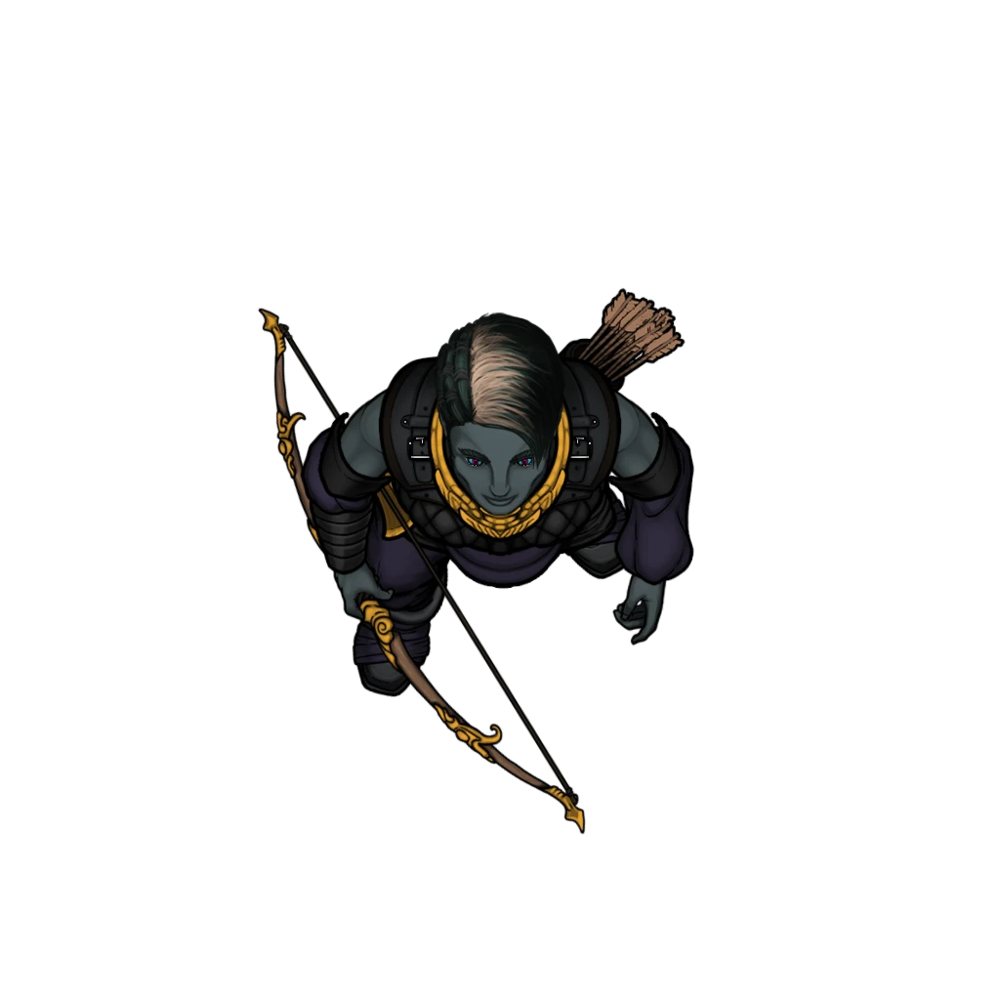

# Area Overview

> [!warning] Gamemaster
> #### Area Map Context
>
> The [[Lantern Roads]] Area Map depicts a subsection of the larger Lantern Roads district. It is featured in the [[Revealed by Lantern]] and [[Not All Who Wandren]] Events of the [[Disgraced House]] Main Quest.
>
> - The Area Map depicts a single Scene Level, and its areas are organized into four sections: Shadowbox Alley, Plaza, Hideout, and Wandren HQ.
> - The characters arrive outside the [[Shadow Players Theater]].

## Gameplay Details

The areas of Lantern Roads have the following features unless specified otherwise in the text.

### Levels & Elevation

The Lantern Roads Scene features a single Level, and its areas are organized into four sections: Shadowbox Alley, Plaza, Hideout, and Wandren HQ.

- **All Sections:** All sections of Lantern Roads are set to an elevation range of 0 to 30, with 0 representing ground level, and 30 representing rooftops and upper walkways. Interior areas have 30-foot-high ceilings.

### Illumination

Outdoor areas are subject to exterior lighting and weather conditions. Interior areas are well lit by candle and torch light.

Within Wandren HQ, the floor has a gentle glow, providing Bright Light.

### Terrain

Treat all terrain as normal terrain.

### Inhabitants

The following characters and creatures inhabit this area:

- Lantern Roads is occupied by an array of [[Ordani]] visitors from the neighboring Marlstone and Coinwealth Heights districts.
- Important characters here include [[Funar Cevher]] and a variety of shopkeepers.

### Enemies

The following enemies are encountered here:

- 2 [[Kynryth]]
- 6 [[Kynryth Husk]]
- 4 [[Skither]]
- 1 [[Aburyx]]
- 4 [[Wandren Guards]]
- 4 [[Wandren Watcher]]
- 5 [[Wandren Patroller]]
- [[Vitt Wandren]]

During the [[Not All Who Wandren]] Event, the following enemies are encountered here:

- [[Hephiss Wandren]]

### The Beacon Brigade

Members of the Beacon Brigade, a gang running a protection and smuggling racket out of Lantern Roads, are scattered throughout the area as guards and sentries. Each time they are encountered, the party has the choice to sneak by the Brigade, persuade members that they are not a threat, or fight them.

> [!tip] Exploration
> #### Avoiding the Beacon Brigade
>
> With a successful Stealth check when out of a Beacon Brigade member's line of sight, characters can use the Hide action to conceal themselves, becoming temporarily Invisible.
>
> - Invisibility ends automatically if characters make a sound, come within the line of sight of an enemy, make an attack roll, or cast a spell with a Verbal component.
> - If a character successfully becomes invisible, the result of their stealth check is the DC of any check to perceive them. When anyone who is invisible comes with 5 feet of a **Patroller** or 10 feet of a **Watcher**, the Brigade member automatically rolls a Perception check against that DC.
>
> Characters can use a spell or a physical effect (throwing an item, projecting their voice) to distract Brigade members as follows:
>
> - Patrollers are distracted by any successful cantrip, a successful `[[/check 17 performance]]` check for a character to throw their voice, a successful `[[/check 17 athletics]]` check to throw an item far enough away to make a sound, or any similar action at the game master's discretion.
> - Watchers are distracted by any successful Level 1 spell, a successful `[[/check 19 performance]]` check, a successful `[[/check 19 athletics]]` check, or any similar action at the game master's discretion.

> [!info] Social
> #### Fooling the Beacon Brigade
>
> Whenever a member of the Beacon Brigade is encountered, the party can try to convince them that they are either lost or should be allowed to pass. The difficulty of the check differs based on the Brigade member's role.
>
> - With a successful `[[/check persuasion 18]]` check, characters can convince a **Patroller** that they're on official Brigade business and can be let through. For a **Watcher**, they must succeed on a `[[/check persuasion 20]]` check.
>   - Any character with **Knowledge: Crime**, or who is carrying a [[Courier Bag]] has **+2 Boons** on the check.
>   - If characters show the Brigade member their [[Brigade Key]], they automatically succeed on the check.
>   - If characters bribe the Brigade member with either  **-10** or an item of Uncommon rarity or rarer, they lower the DC of the check by 3, but the Brigade member keeps the bribe even if the check fails.

> [!abstract] Wandren Patroller
> **[[Wandren Patroller]]**
>
> Level 1 · Unknown Unknown
>
> 

> [!abstract] Wandren Watcher
> **[[Wandren Watcher]]**
>
> Level 1 · Unknown Unknown
>
> 

> [!danger] Hazard
> #### Beacon Brigade Tactics
>
> Beacon Brigade members favor using their items to attack. Patrollers often throw [[Choking Fog Dust]] to incapacitate targets before striking. Once engaged in melee combat, they immediately use an action to fill their Hallowed Dagger with a poison and strike.
>
> Beacon Brigade Watchers help to find hidden enemies and direct Patroller attention by using their [[Spotlight Shot]] to light up areas in the distance. Patrollers who are within range of one of the spotlights will move to subdue any enemies revealed by the light as soon as they can, even if this means disrupting a previously planned action.

## The Guards in Wandren HQ

> [!danger] Hazard
> #### Strange Guards with Strange Torches
>
> All human guards within Wandren HQ are secretly Celestial creatures If hurt or injured, they change shape into the form of strange celestial creatures called [[Kynryth]].
>
> Defeating a Kynryth gives characters access to a lit [[Lit Kynryth Torch]], which is used to activate the switches needed by the party to rotate the make their way into the Central Chamber.
