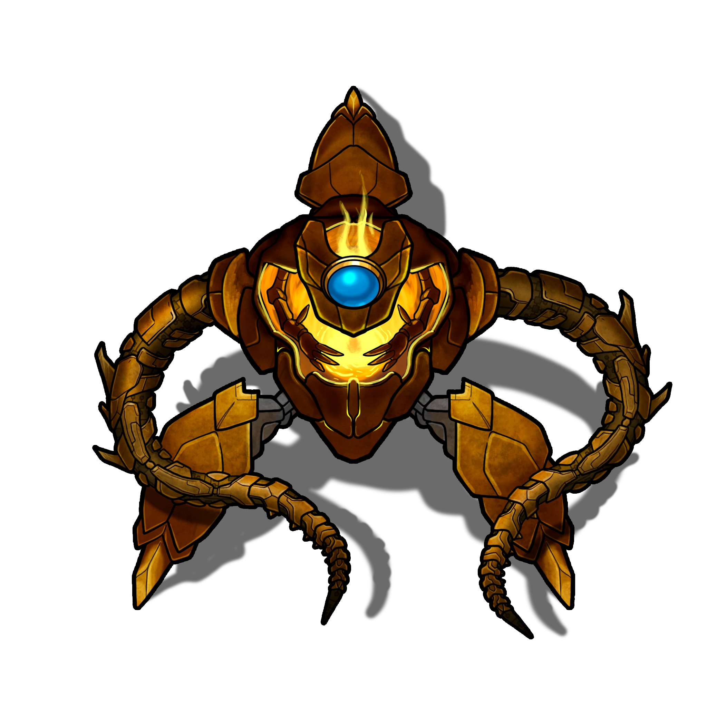

# Blessing Chamber

> [!quote] Read Aloud
> A large flame flickers and dances from its position on the metal platform at the far end of the room, casting light that bounces off of the still metal carapaces in the room's many alcoves, a wheel affixed to a back wall, and the slowly turning metal gears below.

> [!abstract] Kynryth Husk
> **[[Kynryth Husk]]**
>
> Level 1 · Unknown Unknown
>
> 

The husks in the room's alcoves will not move or take action unless a party member comes within 5 feet of them.

> [!tip] Exploration
> #### The Kynryth Husks
>
> If characters previously encountered a Kynryth Husk, they recognize this as the same creature. If they have previously encountered a [[Kynryth]], they recognize that this creature is nearly identical.
>
> - With a `[[/check perception 15]]` check or **Knowledge: Monsters**, characters notice that the husks are missing the flame that is typically found within the center of a Kyrnyth body.
> - With a `[[/check history 16]]` check or **Knowledge: Celestials**, characters are aware that this is a celestial creatures, and that most celestials are a combination of a metal carapace and a radiant flame that provides sentience. Without it, the creature can move and attack, but is limited in its actions.

If the party comes within 5 feet of the Kynryth Husk, it attacks.

> [!danger] Hazard
> #### Kynryth Husk Tactics
>
> Kynryth husks strike at whatever is closest to them, switching targets if their current target moves out of range, They show no real signs of strategy, but can still do damage with their [[Tentacle Grab]] and [[Tentacle Swipe]].
>
> If given Radiant Flame by a Tyraphem or another Celestial Creature (via the Kynryth's [[Share Flame]], for example), they transform via[[Receive Flame]] into full [[Kynryth]].

> [!tip] Exploration
> #### The Wheel on the Wall
>
> This wheel is identical to those found in the [[Training Room]] and [[Construction Room]] and operates in the same fashion. If characters have already operated one of the other wheels, they recognize it immediately.
>
> #### Identifying the Torch Holder
>
> Characters can clearly see the wheel on the wall, and the torch holder above it, without a check.
>
> > The metal wheel juts out of the wall as if molded from the same piece of metal. Directly above it sits a small hoop, jutting out from the same wall.
>
> Characters who examine the hoop and succeed on a `[[/check 15 perception]]` check note the smooth edges, as if something has been routinely used in that slot, wearing down the edges over time.
>
> - With a success of 3 or more, characters also note a small amount of damage around the torch holder slot from whatever was placed in it. It is similar to the damage that would be caused by a large amount of heat.
>
> Characters who succeed on a `[[/check history 17]]` check or have **Knowledge: Celestials** recognize the hoop as a torch holder that is used to hold a source of radiant fire.
>
> #### Using the Torch Holder
>
> Any torches that the characters have on them will fit into the torch holder slot, but nothing happens when they are placed.
>
> > You can hear a slight click as the torch is placed in the torch holder, and it shifts downward slightly, but there is no other effect.
>
> The wheel does not and will not move until characters put a [[Lit Kynryth Torch]] in the torch holder.If characters light their own torches (or any stick of a similar size) in the radiant fire in the bowl, it becomes a [[Lit Kynryth Torch]]. They may also acquire one from a defeated Kynryth in the immediate aftermath of its death.
>
> Once a proper torch has been put in the torch holder, the wheel extends from the wall.
>
> > With an audible echoing click, the wheel in the wall begins to glow, ever-so-slightly, and it extends further from the wall.
>
> #### Turning the Wheel
>
> If the torch holder has not been used, the wheel cannot be turned, but once it has extended from the wall, it is easily turned without a check. Each time the wheel is turned a quarter turn, the Inner Dome in the [[Central Chamber]]r rotates, as noted in [[Not All Who Wandren]], making a deep grinding noise that can be heard throughout the facility without a check.

### The Chamber In Motion

Once the party reaches the center of the room, one of the alcoves activates, bringing the next Kyrnyth forward.

> [!quote] Read Aloud
> At first, the metallic creatures in the alcoves of the room stand still and silent, as if devoid of life or free will - the only movement in the chamber the slow turn of the gears in the channels beneath their feet. Then, slowly, one of the creatures begins inching forward, its legs unmoving as it glides across the room, moving at the same steady pace as the gears beneath it.

> [!warning] Gamemaster
> #### Gamemasters Note: Forward Motion
>
> The Kynryth Husks in the alcove move, one at a time, along the path of exposed gears from their alcoves towards the flame, beginning with the Kynryth to the Southeast and moving counter-clockwise. If combat ensues, on each turn, move the Kynryth that is currently being transported by the gears along its path 10 feet.
>
> - If the husk ends its turn within 5 feet of a party member, it attacks as noted above.
> - If the husk reaches the flame at the far end of the room, its [[Receive Flame]] feature is activated and it transforms into a full Kynryth.

If the party approaches the central platform containing the flame, a Kynryth is revealed behind it.

> [!quote] Read Aloud
> As the otherworldly flame on the platform across the room dances and glows, a shadow on the wall behind it writhes, its many limbs twisting and splaying in impossible directions. After a long moment, the source of the shadow steps out from behind the flames - a metallic creature, filled with the same glowing flame from the platform.

> [!abstract] Kynryth
> **[[Kynryth]]**
>
> Level 1 · Unknown Unknown
>
> 

> [!danger] Hazard
> #### Kynryth Tactics
>
> The Kynryth in this room will attempt to use [[Share Flame]] to activate any Kynryth Husks in the vicinity as its priority, moving towards them while using its[[Tentacle Grab]] and [[Tentacle Swipe]] to clear a path.
>
> While within 20 feet of the flame on the platform, it uses its Inner Light features frequently, returning to the flame to refill and recharge. When further from the platform, or if cut off from its light, it is more hesitant, only using [[Burst of Speed]] in its effort to reach the other Kynryth.
