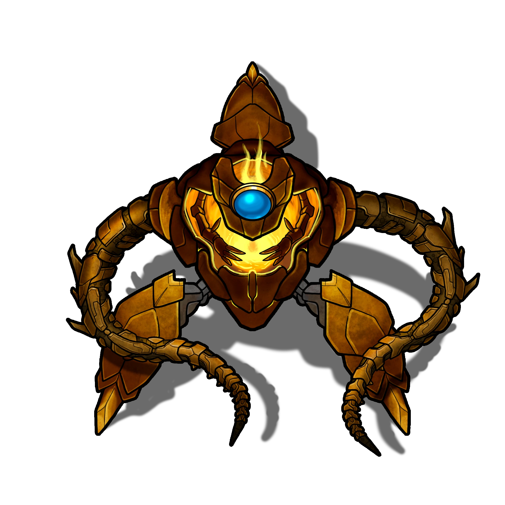

# Blessing Chamber

> [!quote] Read Aloud
> A radiant orb smolders on a metal platform at the west end of this chamber, bright enough to throw hard shadows across the floor. Around it, exposed gears turn beneath glassy panels, forming thick tracks built to transport something heavy.
>
> Three dormant metallic creatures rest in alcoves along the chamber walls, their bodies locked into place by braces and cables. Another stands near the radiant flame, already active, its metal carapace reflecting the light in sharp gold flashes.

The [[Kynryth]] attacks the party as soon as it detects their presence. The dormant [[Kynryth Husk]] will not activate unless a character attacks them or comes within 5 feet of them.

> [!abstract] Kynryth
> **[[Kynryth]]**
>
> Level 1 · Unknown Unknown
>
> 

> [!abstract] Kynryth Husk
> **[[Kynryth Husk]]**
>
> Level 1 · Unknown Unknown
>
> 

> [!danger] Hazard
> #### Radiant Orb
>
> The radiant orb automatically restores a charge of [[The Light Within]] to all [[Kynryth]] and [[Kynryth Husk]] within 10 feet on initiative count 20 of each combat round. This effect can cause a [[Kynryth Husk]] to instantly transform into a fully powered [[Kynryth]].
>
> #### Gear Tracks
>
> The [[Kynryth Husk]] on the east wall begin combat dormant and locked onto a track of gears. Until awakened, a Kynryth Husk will move 20 feet down its track toward the radiant orb. The southeast Kynryth Husk moves first, followed by the northeast Kynryth Husk, then the northwest Kynryth Husk (if it was not already awakened).
>
> #### Kynryth Tactics
>
> At the start of combat, the [[Kynryth]] will move toward the closest [[Kynryth Husk]] and use its [[Share Flame]] Action to awaken it.
>
> Over the course of combat, the Kynryth will prioritize the following actions and abilities:
>
> - In melee, the Kynryth will use its [[Multiattack]] Action.
> - Whenever the Kynryth has at least one creature &reference[grappled] with its [[Tentacle Grab]], it will use [[Heated Tentacles]].
> - From range, the Kynryth will [[Throw Fire]].
>
> #### Kynryth Husk Tactics
>
> At the start of combat, the [[Kynryth Husk]] will use its [[Multiattack]] Action to make one [[Tentacle Swipe]] attack and use [[Tentacle Grab]].
>
> Over the course of combat, the Kynryth Husk will prioritize the following actions and abilities:
>
> - In melee, the Kynryth Husk will use its [[Multiattack]] Action.
> - Whenever able, the Kynryth Husk will [[Unknown]] to transform into a fully powered [[Kynryth]].

Once the Kynryth are defeated, the characters can search the room.

> [!tip] Exploration
> #### Searching the Blessing Chamber
>
> A simple search reveals the following:
>
> - A silver wheel fixed to the north wall.
> - An orb of radiant fire on a metal platform.
>
> #### Using the Radiant Orb
>
> Any [[Unlit Kynryth Torch]] that comes within 5 feet of the radiant orb becomes a [[Lit Kynryth Torch]] for 10 minutes.
>
> Ylith (see [[Unknown]]) can be brought here to be revived. Once revived, they will reveal the [[Secret Exit]].

The characters can interact with the wheel to manipulate the position of the outer ring in the [[Central Chamber]].

> [!tip] Exploration
> #### Using the Wheel
>
> The wheel can be rotated to one of eight positions: 12:00, 1:30, 3:00, 4:30, 6:00, 7:30, 9:00, or 10:30.
>
> When the party first enters, the wheel is positioned at 12:00.
>
> If the inner ring is already at 12:00, the outer ring cannot be turned to 12:00. See the puzzle [[Central Chamber]] for more information.

#### Work in Progress

In a future update, interacting with the wheels within Wandren HQ will visually rotate the nested domes on the Area Map. For now, you must rely on theater of the mind.
