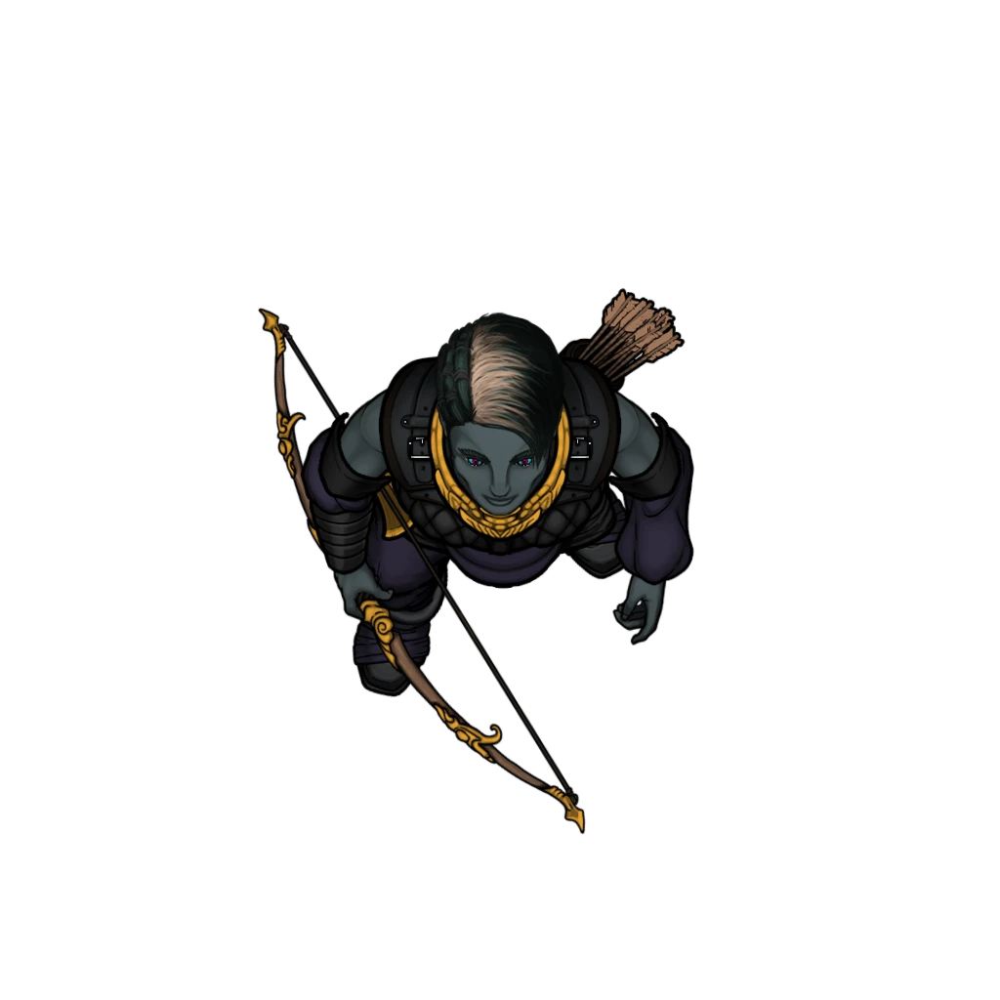

# The Barracks

> [!quote] Read Aloud
> Narrow beds and bedrolls line the walls around a single central table strewn with empty cups, food scraps, and small personal effects. An open coat room and a cramped washroom occupy one side of the building, and the air smells of stale sweat.

> [!danger] Hazard
> #### The Beacon Brigade
>
> 3 [[Wandren Patroller]] are currently stationed inside the barracks. Two sit at the central table, playing a card game, while the third snores heavily.
>
> The party can deal with these Patrollers using the general options described in [[Area Overview]], with the following changes:
>
> - The party cannot convince the Patrollers that they entered the barracks by accident.
> - If a character carries a [[Courier Bag]], the Patrollers do not attack immediately. Instead, they demand that the character turn over their letter and leave.
> - Any character who makes a successful **Deception (DC 15)** check can convince the Patrollers that they are new recruits who were ordered to report to the barracks.

The characters can search the area, but if the Patrollers are present, certain actions (like pulling out the locked footlocker) will rouse their suspicions.

> [!tip] Exploration
> #### Searching the Barracks
>
> A simple search reveals the following:
>
> - A simple coat room filled with spare cloaks, boots, and other outerwear.
> - A cramped washroom.
> - A locked footlocker beneath one of the beds.
>
> Any character who searches the coat room finds a [[Brigade Key]] tucked into the pocket of an old cloak.
>
> The locked footlocker can be opened with a successful `[[/skill sleightofhand 15 tool=thief]]`. Alternatively, the lock can be bashed open with a successful **Athletics (DC 15)** check.
>
> Inside the footlocker, the party finds a sketch of Darius Cevher with a red line drawn through it and a pouch containing  **100**.

> [!abstract] Wandren Patroller
> **[[Wandren Patroller]]**
>
> Level 1 · Unknown Unknown
>
> 

> [!danger] Hazard
> #### Beacon Brigade Patroller Tactics
>
> At the start of combat, the [[Wandren Patroller]] will move to strike an enemy with its [[Hollowed Dagger]], applying either [[Paralyzing Poison]] or [[Slowing Serum]], per the Gamemaster's discretion.
>
> Over the course of combat, the Patroller will prioritize the following actions and abilities:
>
> - In melee, the Patroller will use their [[Multiattack]] feature to apply [[Paralyzing Poison]] or [[Slowing Serum]] to as many enemies as possible.
> - Whenever able, the Patroller will position themselves amongst allies to take advantage of their [[Pack Tactics]] feature.
>
> Once reduced below half their Hit Point maximum, the Patroller will attempt to flee toward the nearest ally.
