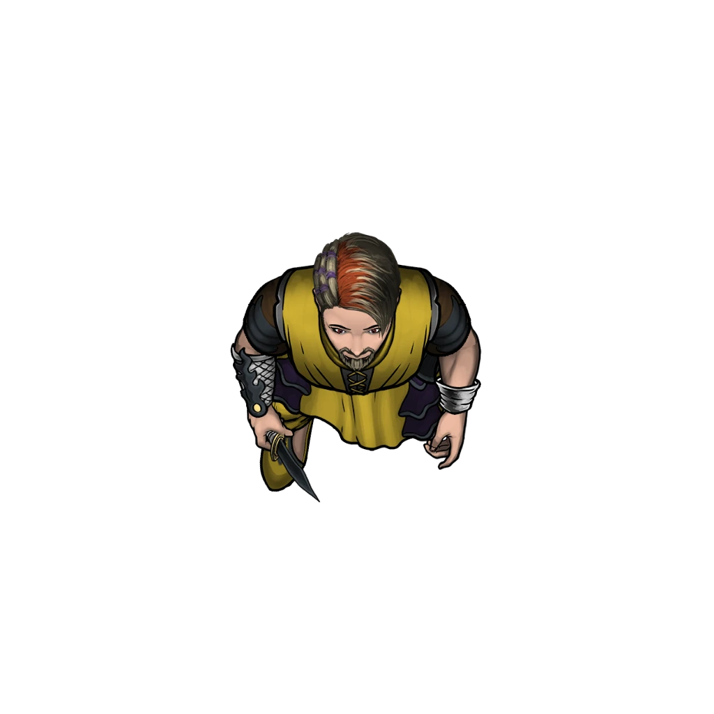

# Vitt's Bedroom

> [!quote] Read Aloud
> A broad bed, recently made, sits against the west wall with a chest at its foot. Across from it stands a large metal safe. The bedding and furnishings are all expensive, but the room has the temporary feeling of a place made comfortable by someone who does not expect to stay forever.

If [[Vitt Wandren]] is here when the party arrives, read the following:

> [!quote] Read Aloud
> Vitt Wandren looks up as you enter, with an expression that borders on surprise and amusement. One hand rests near the weapon at his side, but he does not draw it.
>
> > I assume you have a good reason for entering my home without my invitation?

> [!info] Social
> #### Confronting Vitt Wandren
>
> [[Vitt Wandren]] is arrogant and dangerous, but willing to hear the party out if they have reached his bedroom without causing an obvious disturbance; he assumes the party has been vouched for by someone careless enough to let them this far.
>
> If the party claims to be couriers, new recruits, or Brigade associates, Vitt questions them about who sent them and what business they have with the Wandrens.
>
> Any character who makes a successful **Intimidation (DC 15)** or **Diplomacy (DC 15)** check can convince Vitt that it is in his best interest to cooperate.
>
> - **Found Murder Evidence:** The character gains **+2 Boons** on this check if they present evidence that implicates the Beacon Brigade in Darius Cevher's murder.
> - **Found Skimming Evidence:** The character gains **+2 Boons** on this check if they present evidence that proves Vitt is skimming money from Hephiss Wandren.
>
> If Vitt is successfully blackmailed, he hands over an ornate key, tells them about the hidden door at the end of the back tunnel, and promises them that the Beacon Brigade will no longer be a threat to them. He also warns the party that Hephiss Wandren is more dangerous than anyone in the Beacon Brigade. He then immediately begins preparations to flee Ordain.
>
> If the party fails to force Vitt to cooperate, he activates his [[Gem of Shielding]] and attacks.

> [!abstract] Vitt Wandren
> **[[Vitt Wandren]]**
>
> Level 1 · Unknown Unknown
>
> 

> [!danger] Hazard
> #### Vitt Wandren Tactics
>
> At the start of combat, [[Vitt Wandren]] will activate his [[Gem of Shielding]], protecting himself from the inhaled poisons he uses to control the battlefield. He then tries to catch as many enemies as possible with [[Choking Fog Dust]].
>
> Over the course of combat, Vitt will prioritize the following actions and abilities:
>
> - In melee, Vitt will use his [[Multiattack]] Action to apply [[Paralyzing Poison]] or [[Slowing Serum]] to as many enemies as possible.
>
> Once reduced below half his Hit Point maximum, Vitt will use his [[Slowing Dust]] to hinder his enemies, then attempt to escape through the north tunnel passage and secret door.

> [!tip] Exploration
> #### Searching Vitt's Bedroom
>
> A simple search reveals the following:
>
> - A weapons rack.
> - A locked safe on the east wall.
> - A locked chest at the foot of the bed.
> - A locked door on the north wall.
>
> #### The Weapons Rack
>
> The weapons rack holds a [[Unknown]] and a [[Unknown]].
>
> #### The Safe
>
> The safe can be unlocked with Vitt's ornate key or a successful `[[/skill sleightofhand 30 tool=thief]]`. Alternatively, the lock can be bashed open with a successful **Athletics (DC 30)** check. The safe contains:
>
> - 13 [[Bag of Coins]].
> - A list containing names with initials written beside them. Several names have been crossed off, including Darius Cevher. The initials beside Darius' name read "HW." This list is evidence of the Beacon Brigade's involvement in Darius Cevher's death and can help clear Funar's name. Mark the appropriate Outcome in [[Revealed by Lantern]].
>
> #### The Chest
>
> The chest can be unlocked with Vitt's ornate key or a successful `[[/skill sleightofhand 15 tool=thief]]`. Alternatively, the lock can be bashed open with a successful **Athletics (DC 15)** check. The chest contains:
>
> - 2 sets of [[Fine Clothes]].
> - A plain silver ring worth 15 sp.
> - A bottle of [[Waterborne Whiskey]].
>
> #### The Locked Door
>
> The door on the north wall is locked, but can be opened with Vitt's ornate key or a successful `[[/skill sleightofhand 15 tool=thief]]`. Alternatively, the door can be bashed open with a successful **Athletics (DC 15)** check.
>
> The door opens into a tunnel passage that terminates in a seemingly dead end. Any character who makes a successful **Awareness (DC 14)** check while examining the dead end realizes that an illusion is covering a door. Touching the wall also reveals the illusion, since objects can pass through it.
