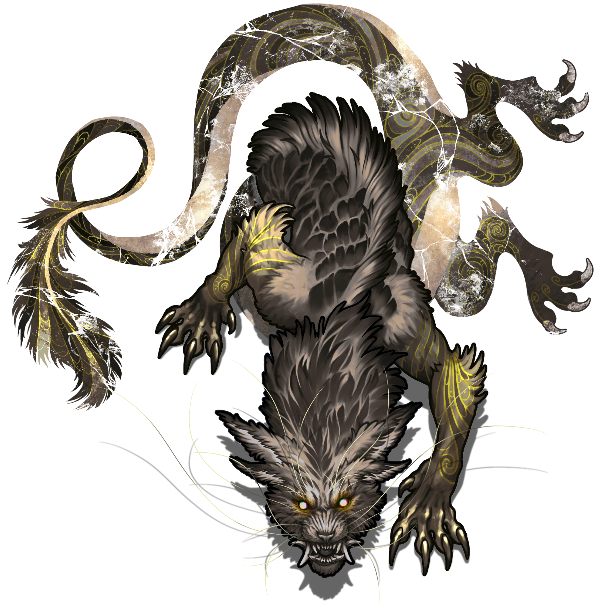

# Lower Plaza

> [!quote] Read Aloud
> The area ahead appears as an unbroken, level plain, its chalky flagstones fitted together as a perfect jigsaw. Its seams are so fine as to be nearly invisible.

This area has been transformed by Falar's illusion magic to conceal a large pit trap beneath the appearance of solid ground.

#### Effect Under Development

This hallucinatory terrain feature may lack a combination of walls, lighting, sounds, and similar effects. These enhancements will be added in a future update, and tied to the interactable object functionality.

> [!danger] Hazard
> #### Hallucinatory Terrain: Pit Trap
>
> In addition to the general rules described on the [[Area Overview]] page, this hazard has the following characteristics:
>
> - The pit trap is 30-feet deep.
> - A character that moves into the hazard falls 30 feet, taking `[[/damage 3d6 Bludgeoning]]` damage and landing &Reference[Prone].
> - A character inside the hazard can climb out using natural handholds with a successful **Athletics (DC 15)** check.
>
> Once the area's [[Chiaroscuran Beast]] is slain, the hazard vanishes; creatures still inside the hazard when this occurs are ejected, landing safely with a soft thump on solid ground.

> [!abstract] Chiaroscuran Beast
> **[[Chiaroscuran Beast]]**
>
> Level 1 · Unknown Unknown
>
> 

> [!danger] Hazard
> #### Magical Anchor
>
> These elemental predators are each anchored to a specific piece of illusory terrain and prefer to remain inside that area, though they can leave it if necessary.
>
> #### Chiaroscuran Beast Tactics
>
> At the start of combat, the Chiaroscuran Beast will enter a flat surface using [[Merge Surface]] and quickly engage a character with their [[Quick Sketch]] ability.
>
> Over the course of combat, the Chiaroscuran Beast will prioritize the following actions and abilities:
>
> - In melee combat, they utilize their [[Scratch]] attack to harm enemies, and prefer to attack isolated, unaware, and vulnerable targets inside the illusory terrain they are tied to.
> - When hurt, they can enter a flat surface using [[Merge Surface]] and recover lost Hit Points with their [[Redraw Form]] ability.
> - When a Chiaroscuran Beast is defeated, the terrain it is linked to dissipates, returning that section of the battlefield to normal.

### On a Normal Day

If the party visits this area outside the [[Matters of Perspective]] Event, read or paraphrase the following:

> [!quote] Read Aloud
> A circle of broad, chalk-white flagstones sits in the shadow of the promontory — the performer to the promontory's audience. A shallow stream of clear water babbles beneath it to pool on the other side.

The lower plaza circle serves as a performance and exhibition space for artists, fashion models, actors, and singers; it is one of many such performance plazas dotting Redwalk Ramble.
