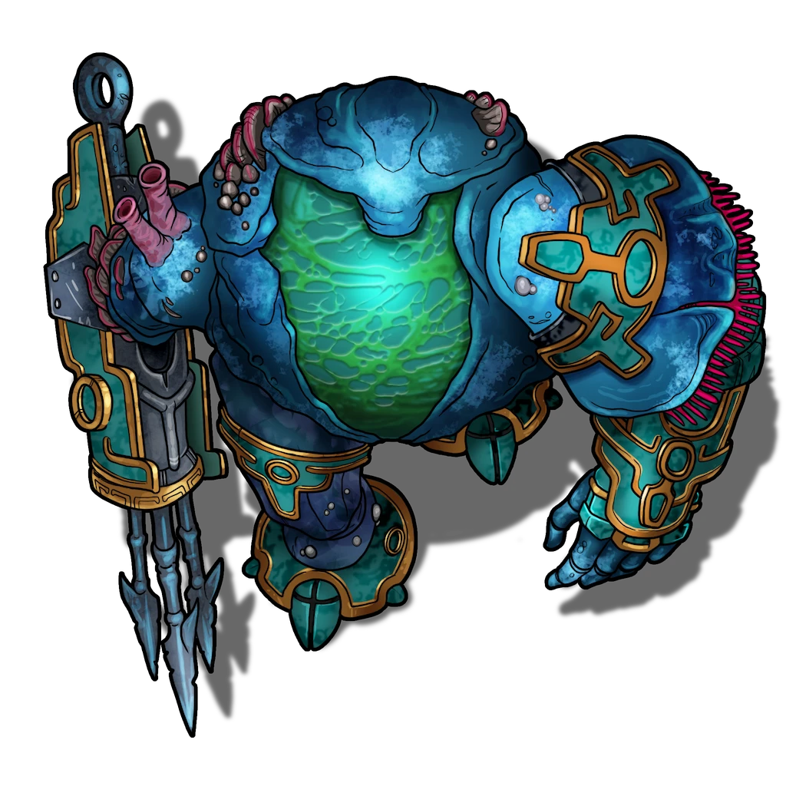

# Surge Walkers

> [!quote] Read Aloud
> A broad metal platform composed of heavily oxidized iron plates covers the area here. The scent of salt water and sea life hangs in the air and between the gaps of the platform and prison floor movement of the lower level can be seen.
>
> Crates and barrels made of teal wood with bronze fittings sit on this platform, each marked with the symbol not typically found in Ordain, and smelling strongly of the sea.

> [!abstract] Surge Walker
> **[[Surge Walker]]**
>
> Level 1 · Unknown Unknown
>
> 

> [!danger] Hazard
> #### Ready and Waiting
>
> A pair of surge walkers wait here on standby. These walkers are active and capable of surveying their surroundings. A successful **Awareness (DC 16)** notices this fact.
>
> These Surge Walkers typically sit and wait for an alarm or directions from a guard to take action, but will respond to inmates that they notice in their area.
>
> #### Surge Walker Tactics
>
> These surge walkers are both configured slightly differently. One has its heavy claw equipped, while the other has a heavy spear gun on its arm. Their stat blocks reflect these differences in equipment, and modify their available tactics.
>
> The harpoon gun surge walker uses its [[Heavy Speargun]] to make ranged attacks and favors fighting from a distance if it can, while the clawed surge walker uses its [[Crushing Claw]] and [[Punch]] to capture and subdue inmates.
>
> In either case they can use their [[Focused Beam]] to blind and injure single targets at range, or [[Blinding Blast]] to disable large groups.
>
> Unless reduced to half hit points, activating their [[Ortarec Core]] feature, the surge walkers to not attempt to kill prison inmates.
>
> #### Fights in Tight Spaces
>
> Being large creatures, surge walkers may come across numerous places in the prison where they lack the room to fight effectively. In hallways and doorways where they lack the space to fight easily they **-2 Banes** on their attacks.
>
> Surge walkers can squeeze through narrow doorways, treating the space as difficult terrain when they do.

The crates sitting next to the Surge Walkers originate from the same country as the walkers themselves. The spear gun wielding Surge Walker can use these crates to rearm itself, and a desperate or opportunistic character could raid the crates for a simple weapon.

> [!tip] Exploration
> #### Foreign Supplies
>
> The crates are marked:
>
> > Munitions: SW-34a Heavy Harpoons
>
> Characters with **Culture: Cascilian** or **Path: Anchorite Marine** recognize the symbol of the Cascilian Republic's Military.
>
> The metal harpoons within are heavy, and expertly made. Clearly meant to be used as ammunition by the Surge Walkers here, they can also be used by any humanoid as a [[Spear]]. A crate holds about 12 heavy harpoons.
