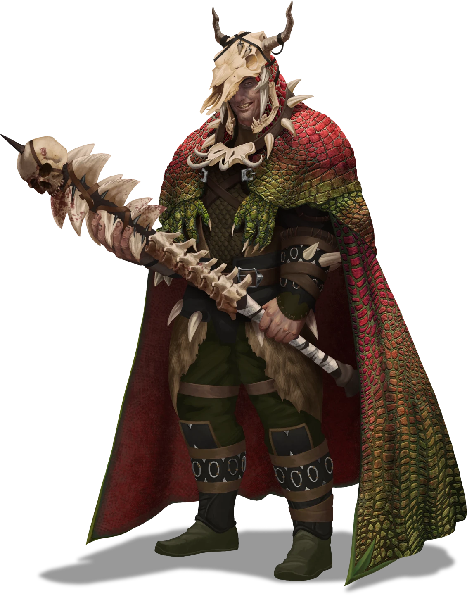

# Cistern Bloodring

> [!quote] Read Aloud
> The grand central atrium of the Concourse Hideout is a huge vaulted chamber, the ceiling is nearly 100 feet overhead whic descends into darkness as water cascades from a concentric ring of waterfalls into the depths of the cistern below. In the center of the chamber, a platform stands upon a column of rock, connected by three bridges.
>
> Upon the platform is built a ramshackle arena, tiered wooden bleachers surrounding an octagonal roped ring. Lights are strung overhead to illuminate the arena. An assortment of Toothbreakers or their guests lounge upon the bleachers, calling out encouragement to the combatants who battle in the ring.

Unless the party has been invited into this area as guests or they are escorted as prisoners, they will be treated as trespassers and immediately attacked. There are a large number of Toothbreakers in this area and the arena is overseen by one of Raster's Scaletamer lieutenants named Ukkfal.

> [!abstract] Toothbreaker Scaletamer
> **[[Toothbreaker Scaletamer]]**
>
> Level 1 · Unknown Unknown
>
> 

> [!tip] Exploration
> #### Ukkfal's Key
>
> Taamsin is in possession of the [[Toothbreaker Prison Key]] which can be taken from his body or pickpicketed during the chaos of a Bloodring fight with a successful **Stealth (DC 20)** check. Failure on this check immediately turns Ukkfal hostile.
>
> If a character is a combatant fighting in the Bloodring, they can attempt a **Performance (DC 15)** check to theatrically distract Ukkfal. If this check is successful, the above pickpocket check can be made with **+2 Boons**.

## Bloodthirsty Spectators

Parties that are invited guests of the Toothbreakers are free to mingle here, spectate on fights, and place bets on their outcomes. Gambling on the Bloodring fights is coordinate in the [[Bar]].

> [!info] Social
> #### Bloodring Spectators
>
> The various Toothbreakers here are largely intent on watching the action, but they can be engaged in conversation. Characters succeeding on a **Diplomacy (DC 14)** check can glean one of the following pieces of information per attempt.
>
> |  | #### Toothbreaker Rumors |
> | --- | --- |
> | 1 | > Sometimes the sound of all this water just drives me insane. I asked if we could shut off the sluices using those old valves up by Vaafo's kennel, but Raster says it's got to stay on. I've no idea why, but it's best not to question the boss. |
> | 2 | > It's great having our own place here, but some parts of this shithole are falling apart. Those old rooms next to Raster's quarters are just rubble now. We're gonna have to move the boss soon. |
> | 3 | > That Hallows scum Eltien is finally getting what's coming to him. He's been picking and choosing which information to pass Raster, probably playing both sides. Well, now he's going to find out that rats are Scalemaw food. |
> | 4 | > This new drink at the bar is wild. You've got to try it while you're here. Humans get the best lift — trust me! But I wouldn't recommend it to Drakons … |
> | 5 | > Turns out one of the Scalemaws went berserk a few days ago. Something caused it to snap, and even Vaafo couldn't manage to calm the thing down. Next thing they knew, the ornery reptile slipped away into the canals. Hell, I even heard it in the water the last time I went to take a shit! |
> | 6 | > A few months back, ol' Raster disappeared for a week or so. Well … you didn't hear this from me, but word has it that he had to stay in one of them Cindaric healing houses for a while because of something that near killed him. No idea what. |
>
> If the party fails this check three times, the Toothbreakers communicate their displeasure to Ukkfal who demands that the party "shut up, or leave".

> [!danger] Hazard
> #### Toothbreakers
>
> If provoked into combat, the Toothbreakers here will follow the tactics described in [[Gameplay Details]].
>
> #### Raising the Alarm
>
> The nearest alarm bells to the Bloodring to the east across the bridge towards the [[Barracks]], in the [[Prison]] to the northwest, or in the [[Sparring Alcove]] to the southeast.

## Forced to Fight

If the party has been taken captive and forced to fight in the Bloodring, the following rules apply.

- The party must fight in a sequence of blood-sport contests within the arena. For each of the following four fights the party may volunteer a fighter otherwise Ukkfal will select combatants at random.
- No character may participate in consecutive rounds unless there is no other option. Each challenge has certain special rules that are clearly explained by Ukkfal at the start of the round. Breaking the rules of the encounter is grounds for disqualification.
- Damage dealt during these fights is not non-lethal and may kill or render unconscious the combatants. The Toothbreakers do not care if fighters lose their lives.
- If disqualified, the combatant is subdued by Ukkfal and the spectating Toothbreakers. This either leads to a full combat encounter or if the combatant does not resist, they are returned to their prison cell with0 Health.
- There is only sufficient time between fights for the party to Recover.

> [!danger] Hazard
> #### Fight 1 - Bareknuckle Scuffle
>
> In this challenge, a combatant must face off against a single [[Toothbreaker Thug]]. Rules for this fight are:
>
> - You may wear no weapons, armor, or other equipment.
> - Use of spells or magical abilities is prohibited.

> [!warning] Gamemaster
> #### Unarmed Strikes
>
> Ensure that the character has the [[Unarmed Strike]] feature added to their character sheet which is likely their only viable means of attacking.

> [!danger] Hazard
> #### Fight 2 - Tag Team
>
> In this challenge, a pair of combatants faces off against a pair of [[Toothbreaker Thug]]. Rules for this fight are:
>
> - Each combatant is provided with a [[Club]] which is their only permitted weapon. No armor or other equipment is permitted.
> - One combatant on each team must remain outside the ropes while the other combatant remains inside the octagon. As a free action on their turn, a combatant may "tag out" enabling their ally to enter the arena at the beginning of their next turn.
> - Combatants outside the ropes may attack enemies they can reach.
> - Use of spells or magical abilities is prohibited.

> [!danger] Hazard
> #### Fight 3 - Burnished Hand to Hand
>
> In this challenge, a single combatant must face off against a captured [[Burnished Hand Protector]]. Rules for this fight are:
>
> - Both combatants may use their full set of equipment.
> - Spells or magical abilities are permitted.

> [!danger] Hazard
> #### Fight 4 - Scalemaw Duo
>
> In this challenge, a pair of combatants must face off against [[Toothbreaker Scaletamer]] and a trained [[Scalemaw]]. Rules for this fight are:
>
> - All characters may use their full set of equipment.
> - Spells or magical abilities are permitted.

If the party was not victorious in all four challenges, Raster does not view them as worthy adversaries and pays them no attention. The party is left in the prison cages to be turned over as test subjects to [[Kaftor Brenk]] and the mutagists. They must devise their own means of escape.

## Challenging Raster

If the party is victorious in all four of these challenges, Raster Thorn himself challenges the strongest — defined as the character with the greatest Strength attribute — among the party to a direct battle. The challenge is scheduled to take place "tomorrow", and the party is afforded time to benefit from a Full Rest.

> [!abstract] Raster Thorn
> **[[Raster Thorn]]**
>
> Level 1 · Unknown Unknown
>
> 

> [!danger] Hazard
> #### Raster Thorn
>
> Raster fights using the tactics described in [[Unknown]].
>
> - The assembled Toothbreakers recognize that this battle is a traditional Waerd contest of might and martial acumen and they do not interfere.
> - If the party interferes with this duel by taking any action, then the Toothbreakers also join the battle, resulting in an all-out skirmish between both sides.
>
> Defeating Raster within the Bloodring constitutes a shocking and legendary victory for the party. The assembled Toothbreakers watch in stunned silence and take no action to retaliate or stop the party from leaving afterwards.
