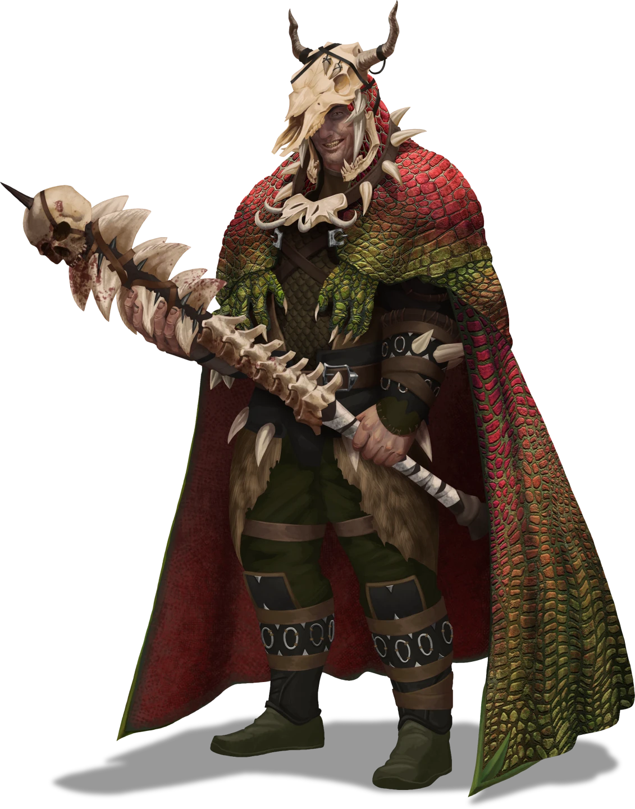

# Raster's Throne Room

> [!quote] Read Aloud
> This large chamber has been turned into a throne room with a large trestle table down its center. Situated at the western end of the table, the throne itself is constructed from several heavy stone slabs and is adorned with bone and leather ornamentation.
>
> On the southern wall, two large windows look out over the rolling Ordain cityscape, its tapestry of crimson rooftops stretching into the horizon.

This room serves as Raster Thorne's administrative chamber, and currently contains [[Raster Thorn]] himself, along with two [[Toothbreaker Thug]] and two [[Scalemaw]] companions. The arrival of any interlopers would prompt quite a stir.

> [!tip] Exploration
> #### Locked Doors
>
> The doors to Raster's Throne Room are locked, and can be opened with a [[Toothbreaker Throne Room Key]].
>
> Two of these particular keys can be found throughout the hideout: one held by Taamsin the Mastermind in the [[Planning Room]], and another in the possession of Raster Thorn himself.
>
> The locks on these doors can also be picked by any character who makes a successful **Stealth (DC 20)** check.

> [!abstract] Raster Thorn
> **[[Raster Thorn]]**
>
> Level 1 · Unknown Unknown
>
> 

> [!abstract] Toothbreaker Thug
> **[[Toothbreaker Thug]]**
>
> Level 1 · Unknown Unknown
>
> 

> [!abstract] Scalemaw
> **[[Scalemaw]]**
>
> Level 1 · Unknown Unknown
>
> 

> [!danger] Hazard
> #### Raster Thorn
>
> Raster is found here at nearly all times. Outsiders are not often invited to this area as guests, so any incursion into the throne room is almost certain to be treated as a hostile act. If attacked, Raster will immediately brandish weapons and welcome the unexpected challenge.
>
> In combat, Raster moves quickly into melee range to deal brutal strikes (using [[Multiattack]]) with his weapon [[Spinebite]], which are especially damaging due to his [[Brutal Blows]] feature. If unable to reach melee range, he is tactically astute enough to switch to his [[Heavy Crossbow]].
>
> Raster is a Scaletamer, so he will use [[Command Scalemaw]] each round to command one of the two Scalemaws which occupy the room. Furthermore, he will be actively on the lookout for one of his Toothbreaker Thug allies to grapple a target so he can exploit his [[Gang Grappler]] feature.
>
> When attacked in melee combat, Raster will utilize [[Trap Weapon]] against any target capable of making multiple attacks per round. Raster's unquenchable pride prevents him from fleeing from combat; he will fight to the death, even if his Morale is **Broken**.
>
> #### Raising the Alarm
>
> There is an **Alarm Bell** on the eastern wall. When combat begins, one of Raster's Toothbreaker Thug allies will move to ring it. See the "Alarm Bells" section of the [[Gameplay Details]] for additional details).

> [!tip] Exploration
> #### Locked Vault
>
> The door to [[Raster's Vault]] on the western wall is locked, and the only key to it can be found on [[Raster's Keyring]].
>
> The lock on the door can also be picked by any character who makes a successful **Stealth (DC 25)** check.
