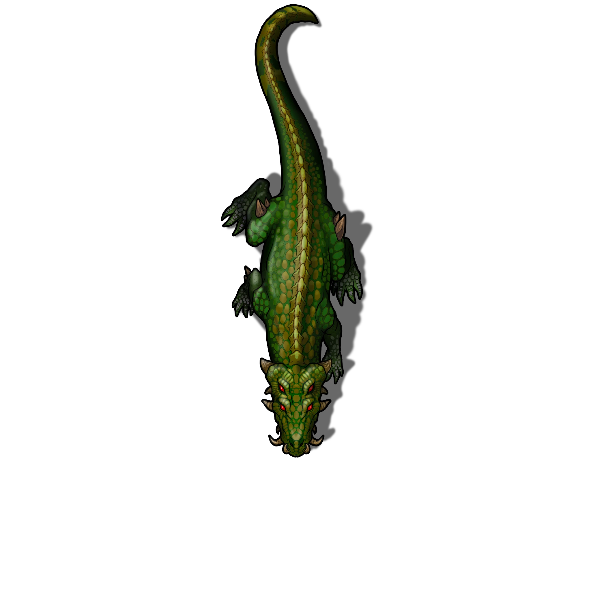

# Scalemaw Kennels

> [!quote] Read Aloud
> This room is dimly lit by a single flickering torch and it is tightly packed with three large cages, each outfitted to contain a single Scalemaw.
>
> Restraints, whips, a feeding trough, and other training implements are scattered around the room.

Each of these two rooms are similarly equipped and each contain a single caged Scalemaw.

> [!abstract] Scalemaw
> **[[Scalemaw]]**
>
> Level 1 · Unknown Unknown
>
> 

> [!danger] Hazard
> #### Scalemaw
>
> If freed or provoked the creature attacks following the tactics described in [[Gameplay Details]].

> [!tip] Exploration
> #### Notable Treasure
>
> There is nothing in these rooms that would be described as treasure, but they do provide an opportunity to inspect the Scalemaws in relative safety.
>
> Characters with **Knowledge: Beasts** or those succeeding on a **Medicine (DC 16)** check know some lore about the Scalemaw and that they were likely captured in the wilds of the Lowland Kingdoms and transported to Ordain by ship.
>
> #### Distillation Warning
>
> Characters with **Awareness (DC 15, Passive)** notice a scrap of paper that has fallen to the ground beside a wooden stool. The paper reads:
>
> > Vaafo — finished my investigation and came to give you the news. Weren't here so I'm leaving a note.
> >
> > Looks like one of the lads took a dare to stick Vesk with that new serum they're serving at the bar. Beast went absolutely berserk and tore the place up. The new kid is dead, good riddance, and Vesk dragged another down into the canals.
> >
> > I've seen her eyes in the water but feck if I know how we'll get her out of there. I don't want to be the one to tell Raster, so I'm letting you have that job!
> >
> > — Fal
>
> Characters with a successful **Awareness (DC 14)** check infer that "Vesk" is a Scalemaw that somehow went berserk from being injected with something. The person who did it is dead and the Scalemaw escaped into the canals.
>
> - Characters with **Path: Crown Apothecary** or **Knowledge: Alchemy** have **+2 Boons** on this check.

> [!danger] Hazard
> #### Berserk Scalemaws
>
> The substance being described is [[Gleaming Distillation]] which can be obtained in the [[Bar]].
>
> If the Scalemaws here or elsewhere in the hideout are injected with the substance, requiring a successful attack roll using an improvised weapon, they will go berserk. While berserk the Scalemaws will attack any creature that is nearby including their own handlers or other Scalemaw.
