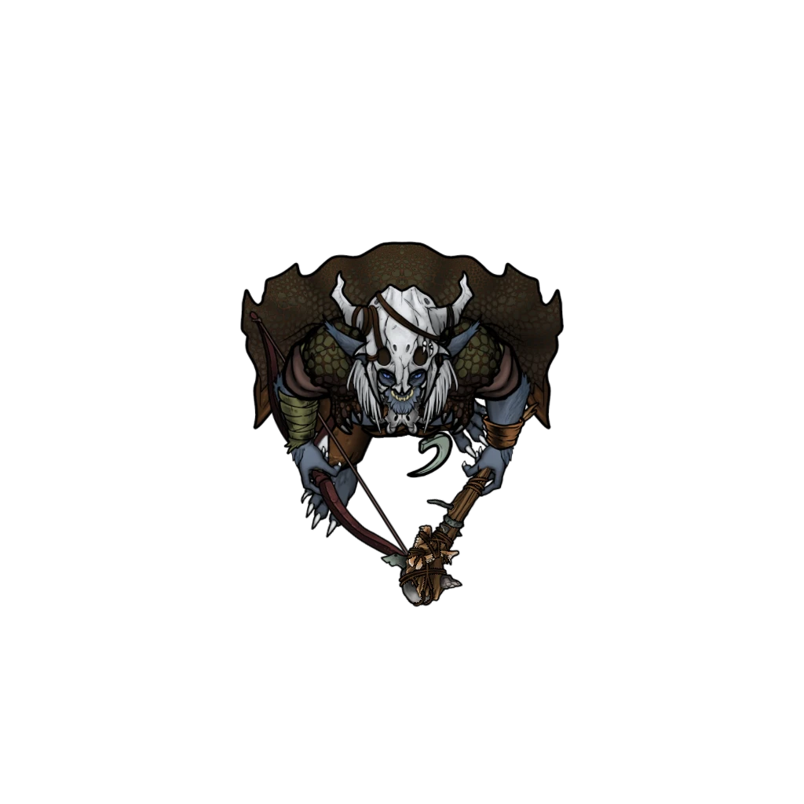

# Scalemaw Training

> [!quote] Read Aloud
> This octagonal room reverberates with the constant churning of water through a sluice beneath its stone floor — a floor covered in matted straw that smells sodden and unclean.
>
> The chamber is decorated with numerous training dummies mounted on pivoting bases, partially suspended from the ceiling by chains. A stout metal cage at the northern end of the room appears large enough to hold a rask, and a feeding trough nearby is nearly full of raw meat and offal. The smell of this fleshy matter is rancid enough to sting your nostrils and turn your stomach.
>
> An alarm bell is mounted on the southern wall, next to an open passage that compliments the closed doors leading east and west.

> [!abstract] Toothbreaker Scaletamer
> **[[Toothbreaker Scaletamer]]**
>
> Level 1 · Unknown Unknown
>
> 

> [!abstract] Toothbreaker Thug
> **[[Toothbreaker Thug]]**
>
> Level 1 · Unknown Unknown
>
> 

> [!abstract] Scalemaw
> **[[Scalemaw]]**
>
> Level 1 · Unknown Unknown
>
> 

> [!info] Social
> #### Fascination With Scalemaws
>
> If the party arrives under escort from the Toothbreaker Thugs serving as the [[Guardroom]] guards, Vaafo will reluctantly interrupt his training activities to speak with the characters and indulge their feigned fascination with Scalemaws.
>
> During the conversation, the party must succeed on a **Deception (DC 15, Group)** check or Vaafo will see through their feigned interest.
>
> - Characters with **Culture: Waerd**, **Knowledge: Beasts**, or **Knowledge: Monsters** have **+2 Boons** on this check.
>
> If the party is successful, Vaafo will demonstrate a few tricks that showcase his rapport with the Scalemaw. Soon enough, Vaafo will suggest that the party feed the beast with a knowing smile in his eye.
>
> - Characters with **Awareness (DC 15, Passive)** can correctly infer that Vaafo expects this feeding to go poorly and is eager to see whether or not the visitors provoke the Scalemaw.
>
> A character who is feeling brave can feed the Scalemaw with a successful **Wilderness (DC 17)** check.
>
> - If successful, Vaafo is impressed and allows the party to linger, eventually losing interest in them as he returns to training the beast. Vaafo suggests they head down to the bar for a drink, but does not escort the group — granting them some momentary freedom to explore.
> - On a failure, Vaafo intervenes before the Scalemaw attacks, but will insist that it's time for the party to leave. If they refuse or resist, Vaafo will immediately doubt their ruse and become hostile.

> [!tip] Exploration
> #### Vaafo's Key
>
> Vaafo is in possession of a [[Toothbreaker Planning Key]], which can be taken from his body or pickpocketed during his Scalemaw training demonstration with a successful **Stealth (DC 20)** check. Failure on this check results in Vaafo immediately becoming hostile to the party.

If the party arrives to this area without a Toothbreaker escort, or if they antagonize Vaafo during conversation, the brash Scaletamer becomes hostile and attacks.

> [!danger] Hazard
> #### Toothbreakers
>
> Vaafo and his allies follow the tactics described in [[Gameplay Details]].
>
> #### Raising the Alarm
>
> An alarm bell is mounted on the southern wall of this room. If provoked, Vaafo or his Toothbreaker Thug ally will move quickly to ring the alarm.
