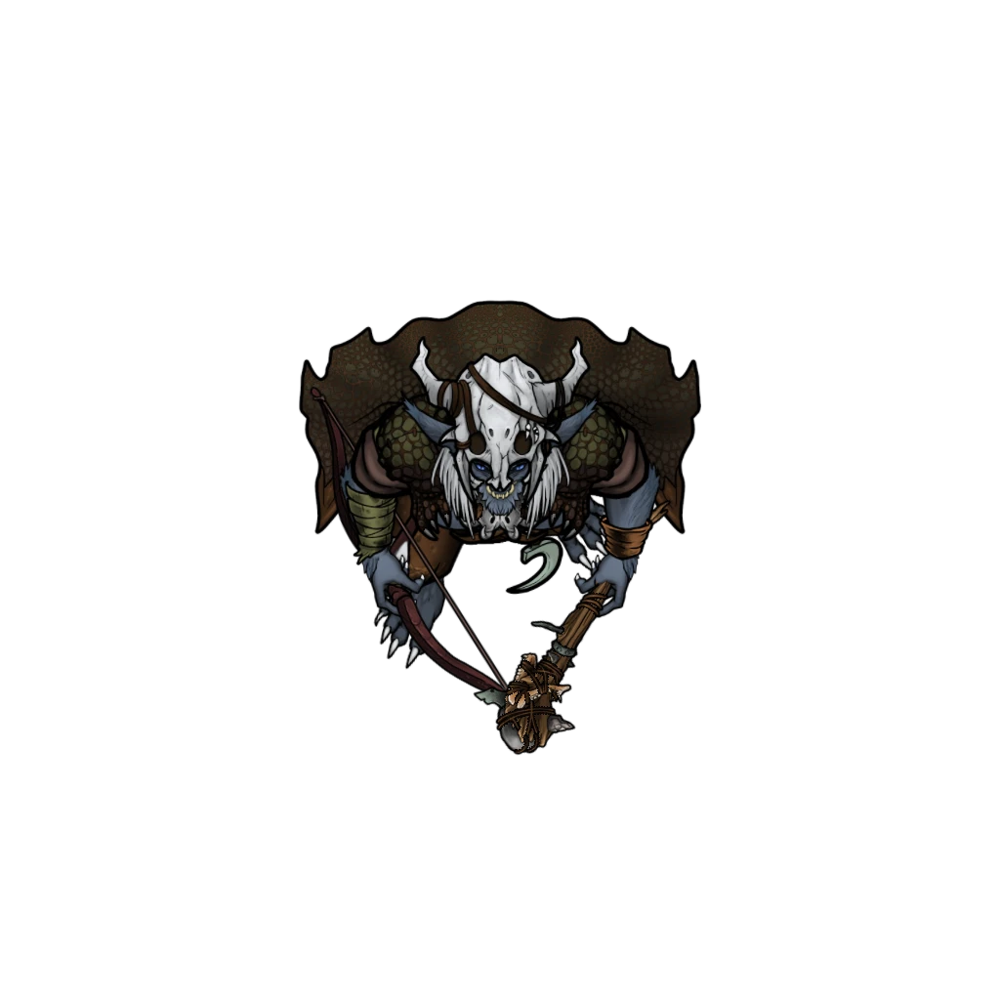

# Toothbreaker Tactics

The Toothbreaker enemies in the hideout typically employ the following tactics in combat.

> [!abstract] Toothbreaker Thug
> **[[Toothbreaker Thug]]**
>
> Level 1 · Unknown Unknown
>
> 

> [!danger] Hazard
> #### Toothbreaker Thug Tactics
>
> In combat, the [[Toothbreaker Thug]] will switch between their [[Greatclub]] and [[Light Crossbow]] depending on the situation, preferring crossbow shots unless their enemy is engaged.
>
> When confronted in melee combat, the Toothbreakers will rely on their strength and athleticism to Grapple their targets, rendering them vulnerable to the [[Gang Grappler]] feature they all share.

> [!abstract] Toothbreaker Scaletamer
> **[[Toothbreaker Scaletamer]]**
>
> Level 1 · Unknown Unknown
>
> 

> [!danger] Hazard
> #### Toothbreaker Scaletamer Tactics
>
> The more powerful [[Toothbreaker Scaletamer]] fight in a similar way to their lesser gang-mates, but are more dangerous because of their superior weaponry and their [[Multiattack]] feature. The Scaletamers will always use [[Command Scalemaw]] on their turn if there is a Scalemaw nearby to direct.
>
> If the tide of combat turns against the Toothbreakers and they become **Broken**, they will tactically retreat and seek out allies to reinforce them or raise the alarm to call for help.

> [!abstract] Scalemaw
> **[[Scalemaw]]**
>
> Level 1 · Unknown Unknown
>
> 

> [!danger] Hazard
> #### Scalemaw Tactics
>
> The Scalemaw here are well trained and will prefer attacking any target that a Scaletamer has designated with their [[Command Scalemaw]] feature. Otherwise they will attack the nearest adversary, particularly favoring any target that is close to water.
>
> The Scalemaw attack viciously with [[Multiattack]], and if succesful with their [[Bite]] attack will immediately utilize [[Abduct]] to retreat with that creature in tow. If they can reach water they will submerge with their grappled foe.
>
> Scalemaw are ferocious and will not retreat from combat even if they become **Broken**.

## Tactical Options

There are a few special tactical options that the party may employ against the Toothbreakers which are useful for Gamemasters to be aware of before playing this area.

### Mutagenic Serum

The Scalemaw react badly to the [[Gleaming Distillation]] which can be obtained from the Bar. If this serum is injected into a Scalemaw via syringe, it will send them into a prolonged berserk state, turning them against their Toothbreaker Scaletamers.

### Raster's Allergy

Raster has a severe allergy to [[Mudflisk]], a bottom-dwelling shelled fish that lives in Ordain's canals. It is possible to learn about this allergy from a healing house document in [[Unknown]].

Mudflisk can be obtained elsewhere in Ordain or by draining the [[Unknown]]. Raster's meal being prepared in the [[Unknown]] can be poisoned with Mudflisk, causing Raster to asphyxiate.

### Raster's Habits

Raster sleeps from 1am to 9am in his locked bedroom. Otherwise he is found in his throne room. While in his chambers he is vulnerable. Chambers can be accessed by picking the lock or breaking down the damaged northern wall.

### Challenging Raster

Raster can be challenged to single combat in the Bloodring if the party is victorious in each of the other Bloodring battles.
