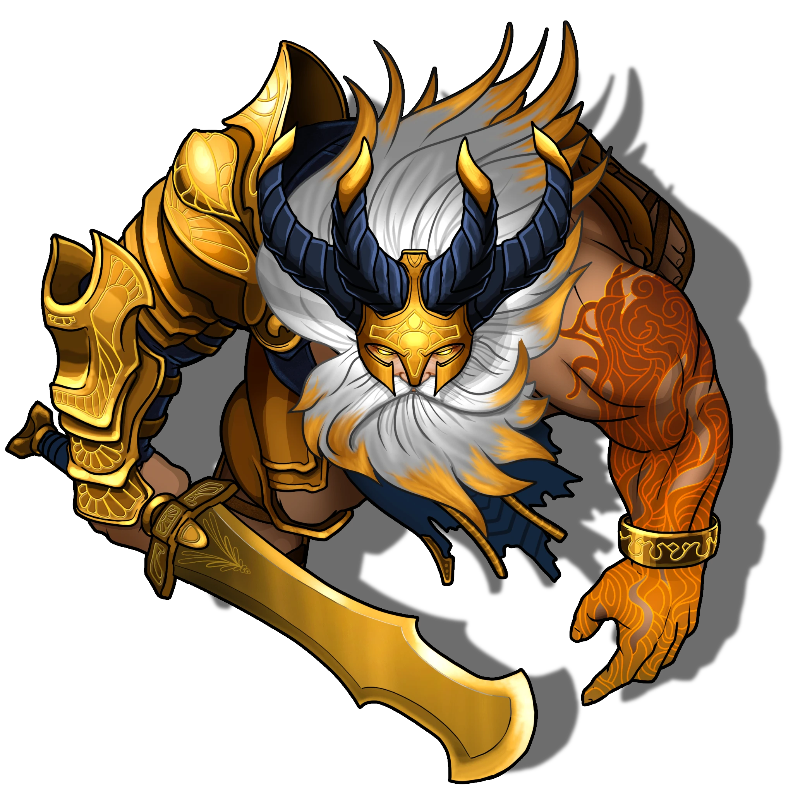

# Apex Summit

> [!warning] Gamemaster
> #### Interactable Objects
>
> This scene has several Interactable Objects. Left click on these elements while **​** Interact With Objects tool (found under Token Controls) is active to open a dialog with options for how to interact with them.
>
> These Interactable Objects can only be controlled by the Gamemaster:
>
> - The Orb of Lantyr
> - 12 Light Barrier Towers
>
> These Interactable Objects can also be controlled by the player:
>
> - 4 Light Crystal Turrets
>
> #### The Orb of Lantyr
>
> The orb has three interactive states:
>
> 1. **Defenses Inactive** (initial state)
> 2. **Defenses Active** (select this state when Luxaroth activates the defenses)
> 3. **Orb Destroyed** (select this state if the orb is destroyed)
>
> When the orb is set to **Defenses Active**:
>
> - The Light Barriers around the arena become active, blocking movement.
> - The Light Crystal Turrets become usable by players.
>
> If the orb is set to **Orb Destroyed**:
>
> - The entire arena goes dark.
> - All Light Barriers come down.
> - All Light Crystal Turrets are no longer operable.
>
> #### Light Barrier Towers
>
> There are twelve Light Barrier Towers surrounding the platform of the Bastion Apex, each powering a Light Barrier.
>
> Each tower has three interactive states:
>
> 1. **Repaired** (initial state)
> 2. **Damaged** (set a Light Barrier Tower to this state if the monsters damage it, as described in [[Bastion Apex]] below)
> 3. **Broken** (set a Light Barrier Tower to this state on the subsequent combat round after a monster damages it)

#### Work In Progress

At this point in Early Access, the interactive elements described above for the Light Crystal Turrets are not yet functional. They will be added in a future update.

## Meeting the First Giant

> [!quote] Read Aloud
> A vast orb of glowing radiant energy hovers thirty feet in the air above the surface of the Apex. The Orb of Lantyr emits light so intensely that looking directly at it for more than a few moments is blinding. All details of the immense structure are washed away in yellow and white light. Before you can take another step, a booming voice rings out, breaking the silence.
>
> > KURAS VUNRUNAC-TAR.

The following characters can understand the booming voice more clearly:

- Anyone holding the [[Sun Star]].
- Characters that understand **Language: Pathward**, who quickly realize that this person is speaking an incredibly archaic and primordial variant of the language.

Such characters instead hear the voice say:

> [!quote] Read Aloud
> > HOLD STRANGERS.

> [!abstract] Luxaroth
> **[[Luxaroth]]**
>
> Level 1 · Unknown Unknown
>
> 

Luxaroth is somewhat wary of the party, having never seen such creatures before and lacking knowledge of their intentions. Moreover, communicating with a being as ancient as Luxaroth can be a difficult endeavor.

> [!info] Social
> #### Communicating with Luxaroth
>
> The following characters can communicate with Luxaroth directly:
>
> - Anyone holding the [[Sun Star]].
> - Characters that understand **Language: Pathward**.
>
> Luxaroth does not necessarily become hostile to parties that cannot communicate with him; however, he remains wary and will not lower his guard.
>
> #### Befriending Luxaroth
>
> Parties can befriend Luxaroth by a variety of methods. Regardless of the party's strategy, keep in mind that Luxaroth possesses the ability
>
> **Followers of Lantyr**
>
> If the party includes a Cleric of Lantyr, or any other sort of follower of Lantyr, Luxaroth immediately recognizes a fellow adherent of the light and immediately becomes friendly and warm towards them, and towards the party as a whole.
>
> **Persuasion**
>
> Any character who is capable of speaking to Luxaroth, attests that the party is here to help him, and makes a successful `[[/check per 13]]` check can convince Luxaroth that they are his allies.
>
> - **Knowledge: Shent**: The character gains **+2 Boons** on this check.
>
> #### Detecting The Abyss
>
> If the party includes anyone with **Attunement: The Abyss** or anyone who possesses Abyssal items, Luxaroth's [[Radiant Sense]] allows him to detect this Abyssal taint, regardless of Deception rolls or other attempts to hide such information. Even if the party succeeds on one of the above strategies to befriend Luxaroth, if the guardian detects such influence, further convincing is required.
>
> In such case, a party member must make a successful `[[/check per 18]]` to explain to Luxaroth that, despite the corruption, they are still here to help. Failing this check does not automatically result in Luxaroth attacking the party; whether he does so is ultimately up to the Gamemaster's discretion, depending on the level of Abyssal influence upon the party, as well as whether any party members are evil or purposely lying to Luxaroth in an effort to later betray him.

> [!info] Social
> #### Talking with Luxaroth
>
> The party can now converse with the Avatar of the First Giants, whose true name is Luxaroth. Luxaroth is an ancient being, a huge and intimidating figure who has no fear of the party. He speaks in a great booming voice and will even laugh as he speaks if he is sufficiently pleased by the party's questions or responses. During the following conversation, he provides additional basic information:
>
> - He will reveal that he is an Avatar and no longer truly corporeal, though he was once made of flesh and bone. He is now tied to the Orb of Lantyr above his head, and if it were to fail, he would fade into nothingness. He is not responsible for his current state; rather, he was bound to the orb by his fellow giants long ago. So long, in fact, that he has no concept of time or what age of the world he currently exists in.
> - He informs the party that he is called a Giant, a follower of a deity called Lantyr. Though he has never seen her true visage, he has followed her through the device above his head, which he calls the Orb of Lantyr. He once had a deep and close relationship with the goddess, but over many thousands of years, the orb's powers have waned, eventually cutting off this connection entirely.
> - He has never seen creatures like the party and has no idea where they came from; he is fascinated to learn about the current cultures if the party tries to explain the world above and the goings-on of the Arctus Plateau and Ordain.
> - He has stood watch over this section of the Pathways since an event he calls the Unveiling among his own people, where they fought each other over knowledge of the Abyss. This is something he will not speak more of as his eyes darken and sorrow flashes across his face for a moment.
> - When the Orb of Lantyr was fully powered, he could roam far from its light as he was still connected through its radiance despite the distance, but now he can't venture far from its light.
>
> If the party asks how they can help repair or protect the Orb of Lantyr:
>
> > "Your heroism and compassion do you credit, young ones; you may have already brought the Orb's salvation with you, though you knew it not. I sense an item within your possession, a relic of the light that once lay below this tower that I could not claim myself. Within it lies enough radiant energy to empower the Orb above; all you have to do is lay it down before the orb or stand close to it so that the absorption can begin."
>
> It should be clear that Luxaroth is fairly removed from current affairs but has some ancient knowledge that he is happy to share, depending on whether the party has convinced him they are friendly. If not, and Luxaroth remains wary, they may attempt to try again using various methods or tactics to convince Luxaroth by rolling a `[[/check per 15]]`. On a failure, nothing happens, but on a success, Luxaroth opens up a little.
>
> If asked for additional information on various topics, Luxaroth has some direct responses for the party, detailed below.

> [!question] Q&A
> **Q:** About the First Giants?
>
> **A:**
>
> > My people called themselves Giants. We built much of what you see before you; beneath the world and within us flowed the energy of creation itself. Long did we labor, shaping the paths, guiding the waters, holding back the lifeblood, and settling the destructive forces of chaos. We were guided by … well, by a being who ultimately abandoned us, but for a long age, he gave us great knowledge and purpose.

> [!question] Q&A
> **Q:** About The Abyss?
>
> **A:**
>
> > DO NOT SPEAK OF IT … it is a terrible and unspeakable evil. My people learned of it long ago, and it caused our entire civilization to collapse upon itself. Do not underestimate the power of knowledge and of learning too much, little ones.

> [!question] Q&A
> **Q:** About the Unveiling?
>
> **A:**
>
> > The end of my people, the end of everything, when darkness broke free and infected my kin, my friends, and my family. Our cities erupted in chaos and death as Giants fought Giants. You would be wise to learn from our mistakes and our failings. I only rest easy with the knowledge that some of my kind fled to the surface to escape the darkness; I hope they found a better world.
>
> Luxaroth pauses for a moment, overcome by emotion.
>
> > So again, my people fall, paying for our ancient folly … I lament the end of my kind, but our fate was written in stone long ago.

> [!question] Q&A
> **Q:** About the Primordial Bastion?
>
> **A:**
>
> > I was told it was once a happy place, filled with laughter and glimmering lights but I came here later, after … after the blood had stained the stone. I lived and grew up in the light of the Heart itself but this bastion of light became my task and my burden. I followed my goddess in life and throughout the ages I will do all that I can to safeguard this world against the evils from beyond.

> [!question] Q&A
> **Q:** About the orb of light?
>
> **A:**
>
> > The only thing holding back the deep darkness, the void of evil, and the monsters with claws and shining eyes. I have been guarding it for so long that I always thought it would shine for eternity, but over time, I began to notice its radiance fading, extremely slowly at first. However, a single drip of water, over a long enough period, will carve its way through a mountain. Restoring its power will not only safeguard this section of the world for another age, but it will also allow me to act freely once again; I will be able to roam and combat distant evils wherever I find them. Which — I have no shame in admitting — would fill my soul with wrathful joy.

Once the party has finished speaking with Luxaroth, read the following:

> [!quote] Read Aloud
> With the horde of Abyssal monstrosities fast approaching, Luxaroth turns to you and readies his massive blade, swinging it around his body with blinding speed and experienced ease.
>
> Shouting above the rising cacophony of monstrous snarls and rending stone, he bellows to those who can understand him:
>
> > READY YOURSELVES LITTLE HEROES, I WILL RAISE THE BARRIER BUT IT WILL NOT HOLD THEM LONG!

If the party did not successfully communicate with Luxaroth, or were unable to convince him that they intended to aid him (but did not turn him explicitly hostile) instead read:

> [!quote] Read Aloud
> With the horde of Abyssal monstrosities fast approaching, Luxaroth turns readies his massive blade, swinging it around his body with blinding speed and experienced ease, and bellows a war cry.

In either case, continue with the following, then begin combat:

> [!quote] Read Aloud
> Luxaroth then raises his arms and clasps his blade with both enormous hands. As he does so, a great burst of power explodes outward, striking the towers at the edges of the Apex. With newfound life and energy, radiant barriers of light springs forth between the towers, expanding upward to envelop the entire area in a dome of protective light, just as the first wave of the monstrous host emerges from below.
>
> The Abyssal creatures pour in from everywhere, springing forth from the stairs, climbing the outer walls of the Bastion tower — even flying upward out of the dense fog and whirling across the air itself. They recoil slightly at the sight of the barrier before throwing themselves into a destructive frenzy, attacking both the barrier and the outer structures of the tower with abandon.

## Repairing the Orb

With the [[Sun Star]] in their possession, the act of repairing the Orb of Lantyr is relatively simple and only requires the presence of the character holding the item. Over time, radiant energy leaks from the Sun Star and is absorbed by the Orb of Lantyr above.

After 10 rounds of combat, the Orb of Lantyr is restored to its full power, radiating powerful energy across the Fogbound Caverns and re-establishing a direct link to the Elder Goddess Lantyr. This is how the combat and encounter on top of the Bastion Apex ends and has nothing to do with the health pool of the Orb of Lantyr itself. The objective for the party in this encounter is too simply hold off the Abyssal host for as long as possible.

The radiant energy transfer begins as soon as the conversation with Luxaroth ends, and the light barrier is raised.

#### Number of Combat Rounds

The number of combat rounds before the Orb of Lantyr is fully repaired is subject to change as playtesting of *Ember* continues.

In the meantime, you are encouraged to tweak the number of rounds up or down to provide a satisfyingly challenging — but still fundamentally possible — combat experience for your players.

Once combat begins, read or paraphrase the following:

> [!quote] Read Aloud
> A wispy, cloud-like beam of pure yellow and orange energy begins to flow from the Sun Star relic, traveling upwards into the orb above. A rhythmic pulsing sound and a deep hum of energy start to ring out simultaneously.
>
> Around the apex there are scattered four defensive emplacements where large golden crystals sits ato ancient and complex mechanisms.

> [!warning] Gamemaster
> #### Radiant Energy & Spells
>
> Any player character with radiant spells may wish to spend their actions during combat to speed up the process of empowering and repairing the Orb of Lantyr.
>
> This is technically feasible, and expending an action to cast a spell would decrease the number of rounds of combat by 1. However, the challenge lies in approaching the Orb of Lantyr while taking intense radiant damage and also being close enough to the Orb itself, which is floating 25 feet in the air above the Apex. Ultimately, it's within the GM's purview to allow any creative actions that would enable characters to reach and empower the orb during the combat encounter in addition to the Sun Star.

## The Flow of Battle

This encounter is large, complex, and potentially challenging to run. There are plenty of fun elements and moving pieces, but the general flow has a tempo that needs some explanation before things begin in earnest. A great deal of this combat revolves around managing the influx of monsters at the edges of the combat as the barriers around the edges of the Apex fail. Ultimately, by the end of the encounter, the party may feel like they are about to be overwhelmed completely, as most of the barriers will have fallen and many monsters will be inside, attacking the orb, Luxaroth, and the party itself. The party can still win even if they are all unconscious, just as long as they held off the Abyssal host from the orb long enough.

- Monsters attack the Light Barrier towers at the end of each round, damaging one at a time. Which tower is damaged is the GM's decision. With a tower damaged, there is a visual indication for the party regarding which barriers will fail in the following round.
- Once a tower is destroyed and a barrier has fallen, all the Abyssal Monsters gathering outside that section of the map move forwards and attack the party, the Light Crystal Turrets, Luxaroth, and the Orb of Lantyr itself.
- Each type of Abyssal monster shares initiative with all others. For example, when it's the Abyssal Eyes' turn in the initiative order, all the Abyssal Eyes move and act. Each type of Abyssal monster has various targets, which are detailed below.
- The overarching objective for the Abyssal host gathered at the Apex is to destroy the Orb of Lantyr before it can be empowered in 10 rounds.

> [!danger] Hazard
> #### Orb of Lantyr Tactics
>
> The Orb of Lanytyr does not have any kind of sentience or sapience and has no tactics other than to float passively 25 feet above the Apex. Its only feature is [[Burning Sun]], which constantly deals damage to anything that moves too close, including those trying to stand under it.
>
> #### Light Energy Turret Tactics
>
> There are four Light Energy Turrets within the scene, each positioned around the [[Orb of Lantyr]]. These ancient defense platforms can be used by the party to protect the Orb during the battle, but they can be destroyed. They are non-sentient and non-sapient constructs and do not act independently; instead, the party can use a bonus action to activate their [Light Beam] features and target a section of the Apex.
>
> Note: The [Light Beam] damage does affect any creature, and thus it will hit the player characters and deal extensive damage.

#### Work In Progress

At this point in Early Access, the interactive elements described above for the energy turrets are not yet functional and will be added in a subsequent update.

> [!warning] Gamemaster
> #### Actors vs. Interactive Elements
>
> The Orb of Lantyr and the four Light Energy Turrets are Actors because they can be targeted and attacked by the Abyssal monsters in the scene. However, the Light Barrier Towers are interactive elements as they are broken and destroyed as part of the flow and tempo of the battle, and cannot be targeted by the Abyssal Monsters specifically.

## Fighting the Host of Monsters

Combat begins as soon as initiative is rolled. During the first round, the Abyssal monster will be outside the barrier and unable to attack directly. This gives the party one round to cast spells and prepare. They will also be able to see where the first tower has been damaged and where the Abyssal host will attack first.

> [!abstract] Abyssal Eel
> **[[Abyssal Eel]]**
>
> Level 1 · Unknown Unknown
>
> 

> [!danger] Hazard
> #### Abyssal Eel Tactics
>
> These small Abyssal Monsters can move forwards quickly and use their 60 feet of fly movement to head directly for the [[Orb of Lantyr]]. On their turn, they will deal damage to the Orb but die in the next turn due to the Orb of Lantyr's [Burning Sun] ability. Most of the Abyssal Eels will not be drawn towards the party or Luxaroth, unless they lie directly in front of their path towards the Orb, in which case, they attack whatever is directly in front of that route.

> [!abstract] Abyssal Echo
> **[[Abyssal Echo]]**
>
> Level 1 · Abyssal Harbinger Echo
>
> 
>
> Emerging from the darkness is a terrifying eldritch apparition composed of dark smoke and malice, with prominent rows of gleaming sharp teeth. Its softly glowing eyes radiate spiteful hatred and cunning as it glides through the air with measured movements. Grasping hands, as if yearning to escape its form, materialize and vanish instantly, while its two enormous clawed hands seem to appear and disappear at will.

> [!danger] Hazard
> #### Abyssal Echo Tactics
>
> The Abyssal Echoes have similar tactics to the Abyssal Eels and will head towards the [[Orb of Lantyr]] using their 40 feet fly speed. However, unlike the Abyssal Eels, the Echoes will purposely target party members in the general area within 30 feet of them, as long as there are at least two echoes near each other. They will try to use [[Pack Tactics]] to their advantage and swarm players or Luxaroth. In addition, if there is a Crystal Light Turret in their path, they will try to destroy that as a priority target as well.

> [!abstract] Abyssal Eye
> **[[Abyssal Eye]]**
>
> Level 1 · Unknown Unknown
>
> 

> [!danger] Hazard
> #### Abyssal Eye Tactics
>
> The Abyssal Eyes will stay as far away from any of the party members as they can while remaining in range of the [[Orb of Lantyr]] with their [[Eye Blast]]. They will not target party members, nor Luxaroth or the Crystal Light Turrets at all, and will focus all their attention on the Orb.

> [!abstract] Vhismara's Claw
> **[[Vhismara's Claw]]**
>
> Level 1 · Unknown Unknown
>
> 

> [!danger] Hazard
> #### Vhismara's Claw Tactics
>
> As every Vhismara's claw claws its way up the stairs, or the outer edge of the tower, they will immediately seek out and target Luxaroth during the encounter. If enemies surround Luxaroth, they will instead try to move towards and attack party members or the Crystal Light Turrets. As these creatures cannot fly, they cannot harm the [[Orb of Lantyr]].

## Orb Restored

After 10 rounds, the Orb drains radiance from the Sun Star and is fully restored. When this occurs, read the following:

> [!quote] Read Aloud
> The rhythmic pulsing sound and deep hum of energy from the orb reach an almost overwhelming peak. With a blast of thunderous sound, a wave of golden yellow light bursts forth and washes over the Apex. As it crashes into the monsters still flowing upwards and around the tower, they explode with dazzling brilliance and fade into nothing. The screeching sounds and noise of battle cease, and a deep, comforting hum now rings out across the fogbound Caverns as the Orb is fully restored.

> [!danger] Hazard
> #### Abyssal Remains
>
> Typically, when Abyssal monsters are defeated, they leave behind a miasmic black ooze with their [[Abyssal Remains]] feature. This does not occur when the orb destroys the host, as the power of the Light is powerful enough to destroy the remains utterly. They simply disappear, and any remains that were left upon the Apex from monsters killed during the course of the battle are also swept away.

## Resting on the Apex

If the Orb was destroyed during the encounter skip the dialogue below and head back to the event page of [[Shining Obelisk]], there is nothing further for them on the Apex. Though no doubt [[Nadin]] will be excited by this outcome. The party can rest upon the now dark Apex, but it is bleak and increasingly cold as the hours roll by.

If the Abyssal host has been defeated, Orb of Lantyr restored, the party can relax and rest. If Luxaroth is still active he will offer to use his renewed powers to teleport the party away the Bastion and back to the edge of the Fogbound Caverns. They may continue to talk with Luxaroth about subjects that still interest them. Luxaroth will be overjoyed by this outcome and will promise to aid the party if they need help in the future. Once the party is ready to depart, read the following.

> [!quote] Read Aloud
> With the light above restored to full power, it shines like a new burning sun above you. Though it is warming and bright, its energy is calming, radiant, and somehow measured, as if held back by an unseen hand. The gigantic avatar that fought alongside you beams with renewed energy and joy, turning to you as you prepare to depart.
>
> > "An auspicious day, little heroes. I have not felt the light this keenly since days long past. Let the evils from beyond despair at my unleashed wrath in the days to come! Go with my blessing and the blessings of my goddess... oh yes, that's right... my goddess sends her own regards and wants me to inform you that you find another friend in the glittering white city above, in a nook hidden behind dusty tomes.
> >
> > Hah, yes, her words, not mine, I have no idea what that means. In any case, as I said, go with my blessing, little heroes. You are champions of the light now, and may it guide your hands in the days to come."

When ready, refer back to [[Shining Obelisk]] for the next steps in the quest event narrative.
